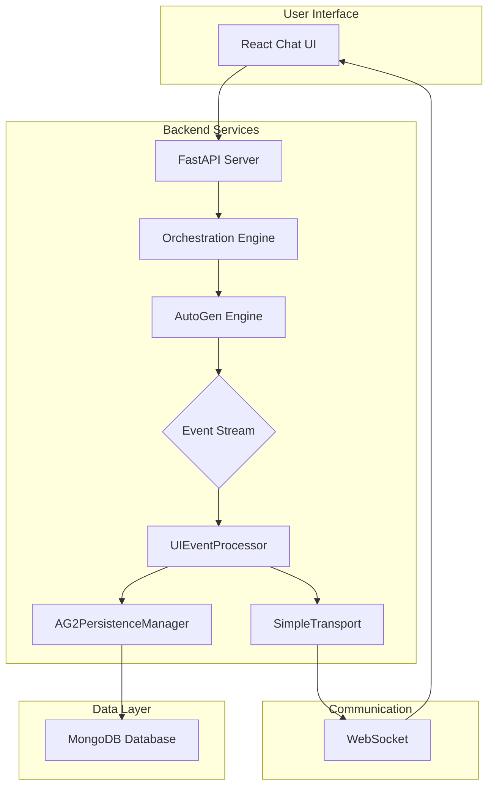

# MozaiksAI System Architecture

This document provides a high-level overview of the MozaiksAI system architecture, which is designed to be event-driven, scalable, and maintainable.

## Architectural Components

### 1. Frontend (React Chat UI)

-   **Responsibilities**: Provides the user interface for interacting with the AI agents. It establishes a WebSocket connection to receive real-time updates.
-   **Technology**: React, Tailwind CSS.
-   **Key Interaction**: The UI is a "dumb" client. It renders data pushed from the backend and sends user input back via API calls. It does not contain any business logic.

### 2. Backend Services

-   **API Server (FastAPI)**: The main entry point for the backend. It handles HTTP requests from the UI, authenticates users, and initiates new workflow sessions.
-   **Orchestration Engine (`orchestration_patterns.py`)**: This is the brain of the system. When a new chat is initiated, it:
    1.  Loads the appropriate workflow configuration from YAML files.
    2.  Initializes the required agents and tools.
    3.  Calls the `AG2PersistenceManager` to resume chat history, if any.
    4.  Starts the AutoGen (AG2) group chat.
-   **AutoGen (AG2) Engine**: The core multi-agent conversation library. It manages the interaction between agents, tool calls, and generates a stream of events.
-   **Event Stream**: A real-time, in-memory stream of `BaseEvent` objects produced by the AG2 engine. This is the raw output of the agent interactions.
-   **UIEventProcessor**: The central hub for all events. It subscribes to the AG2 `EventStream` and performs two critical functions for every event it receives:
    1.  **Delegates to Persistence**: It passes the event to the `AG2PersistenceManager` to be saved to the database.
    2.  **Forwards to UI**: It passes the event to the `SimpleTransport` to be sent to the user interface.
-   **SimpleTransport**: Manages the WebSocket connections to all active clients. It receives events from the `UIEventProcessor` and pushes them to the correct browser session.

### 3. Data Layer

-   **AG2PersistenceManager**: The sole component responsible for database interactions. It receives events from the `UIEventProcessor` and translates them into MongoDB documents. It handles:
    -   Saving chat messages (`TextEvent`).
    -   Updating token counts and costs (`UsageSummaryEvent`).
    -   Creating and updating the main chat session document.
-   **MongoDB**: Our NoSQL database used for storing all persistent data, including:
    -   Chat session metadata.
    -   The complete history of messages for every chat.
    -   Real-time performance and cost metrics.

## Core Principles in Action

-   **Single Responsibility**: Each component has a clearly defined job. The orchestrator starts workflows, the processor routes events, and the persistence manager saves data.
-   **Decoupling**: Components communicate via well-defined interfaces (API calls and events). The AG2 engine doesn't know about the database, and the persistence manager doesn't know about the UI.
-   **Unidirectional Data Flow**: The data flow is predictable and easy to trace: `AG2 Engine -> Event Stream -> UIEventProcessor -> (Persistence & UI)`. This makes debugging and reasoning about the system much simpler.
-   **Strategically Lean**: We have removed redundant layers. There is no separate "Business Logic" layer; instead, logic is encapsulated within the orchestrator and the event processor. Performance tracking is not a separate manager but an integrated part of the persistence logic, triggered by events.
