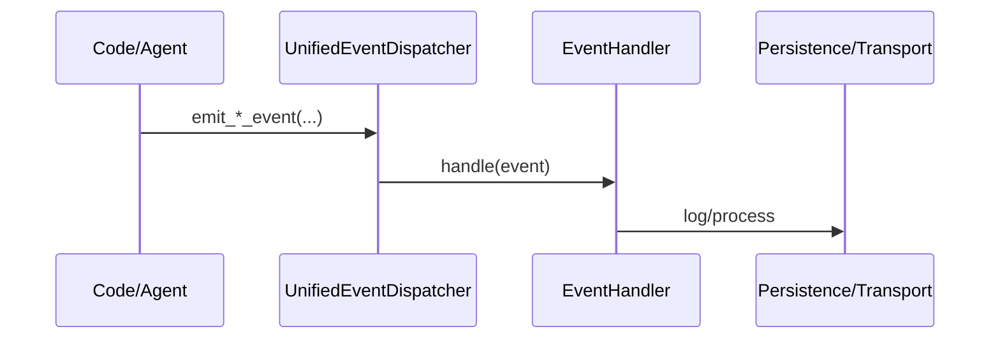

# MozaiksAI - Event-Driven AI Workflow Orchestration

MozaiksAI is a sophisticated, event-driven platform for building, orchestrating, and managing complex AI agent workflows. Built on top of Microsoft's Autogen (AG2), it provides a robust framework for creating production-grade, multi-agent systems with real-time persistence, seamless chat resumption, and comprehensive observability.

Our architecture is designed around a "strategically lean" philosophy, ensuring that every component is efficient, scalable, and serves a clear purpose.

## Key Architectural Pillars

1.  **Event-Driven Core**: At the heart of MozaiksAI is a powerful event bus. Every action—from an agent sending a message to token usage being calculated—is an event. This allows for decoupled components, real-time data processing, and extreme flexibility.
2.  **Centralized Event Processing**: All events generated by the AG2 engine flow through a single event `UIEventProcessor`. This central hub is responsible for delegating tasks like data persistence, UI updates, and logging, ensuring a single, predictable path for all system events.
3.  **Real-Time Persistence**: We've eliminated batch processing. The `AG2PersistenceManager` listens to the event stream and saves every message, token count, and cost metric to our MongoDB database the moment it occurs. This enables live dashboards, accurate cost tracking, and flawless chat session resumption.
4.  **Modular & Composable Workflows**: Workflows, agents, and tools are defined in simple YAML files, allowing for rapid development and easy modification without changing core application code. This "configuration-as-code" approach makes the system highly adaptable.

## Features

-   **Seamless Chat Resumption**: Never lose context. Any chat session can be picked up exactly where it left off, with the full message history loaded instantly.
-   **Live Performance Tracking**: Monitor token usage and costs in real-time as agents work, not after the fact.
-   **Dynamic UI**: The frontend is driven by events, allowing for rich, real-time user experiences that reflect the agent's activities.
-   **Modular Tooling**: Easily add new tools and capabilities to your agents. Our tool registry system makes it simple to extend agent functionality.
-   **Production-Ready**: With built-in logging, error handling, and a scalable architecture, MozaiksAI is designed for real-world deployment.

## Getting Started

### Prerequisites

-   Python 3.10+
-   MongoDB instance
-   Node.js and npm (for the ChatUI)
-   An OpenAI API key (or other LLM provider)

### Installation

1.  **Clone the repository:**
    ```bash
    git clone https://github.com/BlocUnited-LLC/MozaiksAI.git
    cd MozaiksAI
    ```

2.  **Install Python dependencies:**
    ```bash
    pip install -r requirements.txt
    ```

3.  **Configure Environment Variables:**
    Create a `.env` file in the root directory and add your configuration, including your MongoDB connection string and LLM API keys.

    Logging format toggle:
    - Set `LOGS_AS_JSON=true` to write structured JSON lines to the `.log` files (content changes, filenames stay `.log`)
    - Leave it unset or `false` for human-readable pretty text in the `.log` files
    - Console output is always pretty and colorized in development

4.  **Run the ChatUI:**
    ```bash
    cd ChatUI
    npm install
    npm start
    ```

5.  **Run the Backend Server:**
    In the root directory, run:
    ```bash
    python run_server.py
    ```

### Run with Docker (optional)

You can run the backend with Docker Compose:

```powershell
# From repo root (Windows PowerShell)
docker compose -f infra/compose/docker-compose.yml up --build
```

Notes:
- Dockerfile is at `infra/docker/Dockerfile`.
- Compose file only starts the FastAPI app and mounts `logs/logs` so you can tail runtime output.
- AG2 runtime logging (sqlite/file) is enabled by default.

### Metrics & Usage Tracking Quick Reference

Runtime surfaces two data paths:

1. **AG2 runtime logger (sqlite/file)** ? provides per-request start/end timestamps and token usage.
2. **WorkflowStats rollups** ? real-time MongoDB documents with per-chat and per-agent totals (tokens, cost, duration).

HTTP endpoints (no auth in dev):

| Endpoint | Purpose |
|----------|---------|
| `/metrics/perf/aggregate` | JSON aggregate (turns, tool calls, tokens, cost) |
| `/metrics/perf/chats` | JSON array of per-chat snapshots |
| `/metrics/perf/chats/{chat_id}` | Single chat snapshot |
| `/metrics/prometheus` | Minimal Prometheus exposition for quick scrapes |

Minimal local verification (PowerShell):
```powershell
Invoke-RestMethod http://localhost:8000/metrics/perf/aggregate | ConvertTo-Json -Depth 4
Invoke-WebRequest http://localhost:8000/metrics/prometheus | Select -Expand Content
```

Cost, token, and duration fields are accumulated live in the WorkflowStats document (`mon_<enterprise>_<workflow>`).
Duration per agent/chat is derived from the AG2 runtime logger start/end timestamps captured by the realtime logger shim.

### Viewing Logs

- Files: `logs/logs/*.log` (filenames are constant)
- Content format:
    - Pretty text (default)
    - JSON Lines (when `LOGS_AS_JSON=true`)
- Console: pretty, emoji-enhanced output with file and line context

Example (Windows PowerShell):

```powershell
$env:LOGS_AS_JSON = "1"; python run_server.py
# or
Remove-Item Env:LOGS_AS_JSON; python run_server.py
```

### Logging quickstart

- Two file sinks only:
    - `mozaiks.log` — operational workflow/runtime logs (no chat transcripts)
- Filenames are fixed; content switches between pretty text and JSON via `LOGS_AS_JSON`.
- Override the logs folder with `LOGS_BASE_DIR` (default is `logs/logs` relative to this repo).

Windows PowerShell examples:

```powershell
# Write JSONL to the default location
$env:LOGS_AS_JSON = "true"; python run_server.py

# Write pretty text logs to a custom folder
$env:LOGS_AS_JSON = "false"; $env:LOGS_BASE_DIR = "C:\MozaiksLogs"; python run_server.py
```

Docker Compose volume mapping tips:

- If you do not set `LOGS_BASE_DIR`, map the container folder `/app/logs/logs` to a host folder.
- If you set `LOGS_BASE_DIR` (for example `/data/logs` inside the container), map that path instead.

Examples (compose snippet):

```yaml
services:
    app:
        environment:
            - LOGS_AS_JSON=true
```

### Frontend/Backend Cache Seed Alignment

The backend assigns a deterministic per-chat `cache_seed` (stored in the `ChatSessions` doc and derived from the first 32 bits of SHA-256 of `enterprise_id:chat_id`). This value:

1. Is returned in the `/api/chats/{enterprise}/{workflow}/start` response under `cache_seed`.
2. Is emitted immediately after WebSocket connection as a `chat_meta` event (kind `chat_meta`).
3. Is persisted client-side in `localStorage` under `mozaiks.current_chat_id.cache_seed.<chatId>`.
4. Is included in dynamic UI component cache keys: `<chatId>:<cache_seed>:<workflow>:<component>` to prevent cross-chat component state bleed.

Process-wide defaults:
- `LLM_DEFAULT_CACHE_SEED` → hard override for the default (used only if per-chat seed not provided).
- `RANDOMIZE_DEFAULT_CACHE_SEED=1` → randomizes the process default seed (does not affect per-chat seeds).

Why this matters:
- Ensures reproducibility when resuming a chat (same seed regenerates identical deterministic behaviors beneath AG2 caching layers).
- Prevents UI component instances from leaking across chats that share workflow/component names.
- Provides a single seed you can thread through future caching or memoization layers (LLM adapters, vector lookups, layout decisions) for consistent variance control.

Implementation notes:
- Backend emits via `send_event_to_ui` with `kind: 'chat_meta'`.
- Frontend listens in `ChatPage.js` and stores/applies the seed before loading workflow components.
- `WorkflowUIRouter` incorporates the seed into its internal `componentCache` key.

If you add additional caches, prefer reusing the existing `cache_seed` rather than introducing new entropy variables.
            # Optional: redirect logs inside the container
            # - LOGS_BASE_DIR=/data/logs
        volumes:
            # Default location (no LOGS_BASE_DIR):
            - ./logs/logs:/app/logs/logs
            # Or, when using LOGS_BASE_DIR=/data/logs
            # - ./logs/logs:/data/logs
```

## Documentation

For a deeper dive into the architecture, please see the following documents:

-   `ARCHITECTURE.md`: A detailed overview of the system's design.
-   `EVENT_FLOW.md`: An explanation of how events move through the system.
-   `PERSISTENCE.md`: Details on the database schema and persistence logic.

#### 5. 🔔 Event Architecture
- Unified Event Dispatcher (`core/events/unified_event_dispatcher.py`) centralizes event routing for Business, Runtime, and UI Tool events.
- Events are defined by dataclasses (`BusinessLogEvent`, `RuntimeEvent`, `UIToolEvent`) and processed by default handlers (`BusinessLogHandler`, `RuntimeEventHandler`, `UIToolHandler`).
- Dispatcher metrics track processed, failed, and categorized events.
- Emit events via convenience methods: `emit_business_event()`, `emit_runtime_event()`, `emit_ui_tool_event()`.



---

## 🧩 Key Features

### Dynamic Agent-UI Integration
- **Real-Time Component Control:** Agents can dynamically render, update, and control React components based on conversation context
- **Bidirectional Communication:** UI components can trigger backend handlers, creating interactive workflows
- **Context Variable Synchronization:** Seamless state sharing between agents and frontend components

### Unified Transport System
- **Protocol Flexibility:** Automatic WebSocket/SSE negotiation with graceful fallback
- **Message Filtering:** Smart filtering ensures users only see relevant agent communications
- **Event-Driven Architecture:** Six standardized event types for consistent frontend-backend communication

### Manifest-Driven Development
- **Tool Registration:** JSON-based tool manifests for dynamic agent capability extension
- **Workflow Configuration:** Complete workflow definitions in `workflow.json` with UI component integration
- **Hot-Reload Support:** Add or modify agents, tools, and components without server restart

### Enterprise-Grade Persistence
- **Conversation Continuity:** Full groupchat state persistence across server restarts
- **AG2 Resume:** Official AutoGen resume patterns for seamless conversation restoration
- **Data Isolation:** Secure enterprise and chat ID validation for multi-tenant deployments

### 📊 Real-Time Analytics & Performance Monitoring
- **Chat-Level Aggregation:** Comprehensive analytics across all workflow uses with session-by-session tracking
- **Agent Performance Metrics:** Response time analysis, token usage patterns, and efficiency monitoring
- **Live Cost Intelligence:** Real-time threshold monitoring with automated alerts and budget management
- **Workflow Optimization:** Historical performance comparison and optimization recommendations
- **Business Intelligence:** Enterprise-level insights for resource planning and cost forecasting

---

## 📂 Project Structure

```
MozaiksAI/
├── 📁 workflows/          # Modular agent workflows and configurations
│   └── Generator/         # Example workflow with tool manifests
├── 📁 core/              # Core platform backend systems
│   ├── transport/        # SimpleTransport and event handling
│   ├── ui/              # Dynamic UI tools and artifact systems
│   ├── data/            # Persistence and database management
│   └── workflow/        # Workflow loading and tool registry
├── 📁 ChatUI/           # React frontend application
│   ├── src/components/  # Dynamic UI components
│   ├── src/services/    # Transport and API integration
│   └── src/context/     # Frontend state management
└── 📁 docs/             # Technical documentation and guides
```

### Key Directories

- **`workflows/`** – Self-contained agent workflows with tool manifests and UI component definitions
- **`core/`** – Platform backend including transport, persistence, and workflow systems
- **`ChatUI/`** – React frontend with dynamic component system and real-time transport integration  
- **`docs/`** – Comprehensive technical documentation covering all system components

---

## 📖 Technical Documentation

### Core System Documentation
- **[Transport & Events](docs/TRANSPORT_AND_EVENTS.md)** – Unified transport system with SSE/WebSocket support and event filtering
- **[Dynamic UI System](docs/DYNAMIC_UI_SYSTEM.md)** – How agents dynamically control frontend components with visual flowcharts
- **[Tool Manifest System](docs/TOOL_MANIFEST_SYSTEM.md)** – JSON-based tool registration and agent capability extension
- **[Workflow Configuration](docs/WORKFLOW_CONFIG.md)** – Complete workflow.json configuration with UI component integration
- **[Persistence & Resume](docs/PERSISTENCE_AND_RESUME.md)** – MongoDB integration and AG2 groupchat state restoration
- **[Workflow Analytics System](docs/WORKFLOW_ANALYTICS_SYSTEM.md)** – Real-time performance monitoring, cost analysis, and chat-level aggregation
- **[Token Architecture Mapping](docs/TOKEN_ARCHITECTURE_MAPPING.md)** – Billing architecture integration with analytics capabilities
- **[Event Architecture](docs/EVENT_ARCHITECTURE.md)** – Overview of unified event system, dispatcher, events, and handlers

### Development Guides
- **[Unified Tool and UI System](docs/UNIFIED_TOOL_AND_UI_SYSTEM.md)** – How backend tools and frontend components work together through workflow.json
- **[Workflow Development Framework](docs/WORKFLOW_DEVELOPMENT_FRAMEWORK.md)** – Plugin contracts, templates, and best practices for modular workflows
- **[Frontend-Backend Alignment](docs/FRONTEND_BACKEND_ALIGNMENT.md)** – Ensuring seamless data flow and UI rendering between systems

### Architecture Principles
- **Modularity:** Each component is self-contained and replaceable
- **Protocol-Agnostic:** Transport layer abstracts away communication details  
- **AG2 Integration:** Full support for AutoGen groupchat and IOStream patterns
- **Manifest-Driven:** Tools and components registered via configuration files
- **Event-Filtered:** Only user-appropriate messages reach the frontend

---

## 🚀 Quick Start

### Prerequisites
- Python 3.9+ with pip
- Node.js 16+ with npm
- MongoDB (local or remote)

### Backend Setup
```bash
# Install Python dependencies
pip install -r requirements.txt

# Start the MozaiksAI backend
python run_server.py
```

### Frontend Setup
```bash
# Navigate to React frontend
cd ChatUI

# Install dependencies
npm install

# Start development server
npm start
```

### Access MozaiksAI
Visit [http://localhost:3000](http://localhost:3000) to interact with your AI agents through the dynamic UI system.

### Configuration
- **Workflow Configuration:** Edit `workflows/{workflow_name}/workflow.json` to customize agent behavior and define components
- **Transport Settings:** Configure WebSocket/SSE preferences in `core/transport/simple_transport.py`

---

## 🤝 Contributing

We welcome contributions to MozaiksAI! Whether you're interested in:

- **Agent Development:** Creating new AI workflows and agent behaviors
- **UI Components:** Building dynamic React components for agent interaction  
- **Transport Enhancements:** Improving real-time communication protocols
- **Documentation:** Helping others understand and use the platform
- **Bug Fixes:** Identifying and resolving issues

### Getting Involved
1. **Fork the repository** and create a feature branch
2. **Review the documentation** in the `docs/` folder for architecture guidelines
3. **Follow the manifest-driven patterns** for adding tools and components
4. **Test your changes** with both backend and frontend systems
5. **Submit a pull request** with clear description of your contributions

For detailed development guidelines, see our [Workflow Development Framework](docs/WORKFLOW_DEVELOPMENT_FRAMEWORK.md).

---

## 🏆 Credits

Developed with ❤️ by **BlocUnited LLC** - Advancing the future of modular AI agent platforms.

Special thanks to the AutoGen (AG2) community for foundational patterns in agent orchestration and groupchat systems.

---

## 📄 License

**EXCLUSIVE LICENSE AGREEMENT**

This software is proprietary and confidential. All rights reserved by BlocUnited LLC.