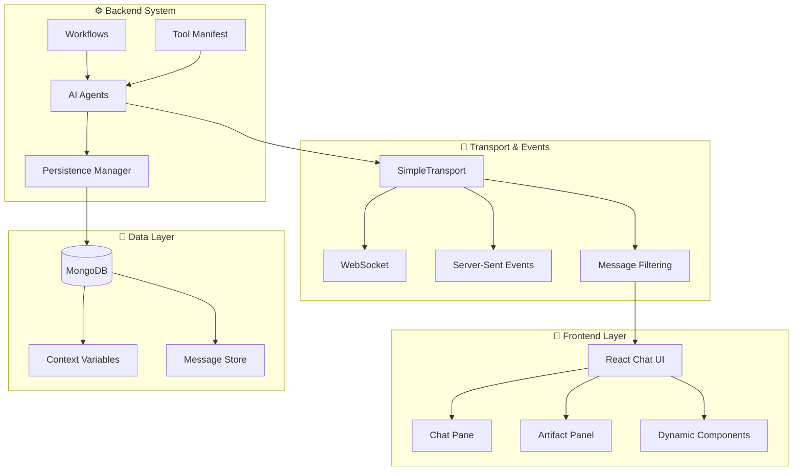

# 🌟 MozaiksAI: Modular AI Agent Platform

Welcome to **MozaiksAI**, a next-generation platform for building, orchestrating, and deploying modular AI agents with dynamic user interfaces. MozaiksAI bridges advanced AI agents with real-world applications through a unified backend-frontend system that enables intelligent, extensible workflows and rich user experiences.

---

## 🧭 Vision

MozaiksAI transforms how teams build and deploy AI-driven applications by providing a seamless integration between intelligent agents and dynamic user interfaces. Our platform enables developers to create sophisticated AI workflows that can dynamically control frontend components, persist state across sessions, and interact with users through multiple transport protocols in real time.

---

## 🏛️ Core Principles

- **Backend Single Source of Truth:** All component definitions, agent configurations, and workflows controlled by backend workflow.json
- **Clean Architecture:** Frontend eliminated registries and hardcoded logic - connects via clean APIs only
- **Protocol-Agnostic Transport:** Robust communication via WebSocket, SSE, or HTTP with automatic fallback and enterprise context
- **Dynamic UI Control:** Agents request and control frontend React components loaded from workflow folders
- **Manifest-Driven Workflows:** Tools, workflows, and components defined in JSON manifests for extensibility
- **AG2 Compatibility:** Full support for AutoGen groupchat patterns with persistent state and resume functionality
- **Production Ready:** React.StrictMode enabled, ESLint compliant, enterprise-ready multi-tenant architecture

---

## 🏗️ System Architecture

MozaiksAI is built as an integrated backend-frontend platform where AI agents can dynamically control user interfaces through a sophisticated transport and event system.



### Core System Components

#### 1. 🎨 Frontend Layer (React UI)
- **Dynamic Component System:** Agents can render custom React components in real-time
- **Chat & Artifact Panes:** Dual-pane interface for conversations and generated content
- **Callback Integration:** UI components can trigger backend handlers through `onAction` callbacks
- **Context Awareness:** Components receive and update context variables seamlessly

#### 2. 🚀 Transport & Events (SimpleTransport)
- **Unified Communication:** Single transport layer supporting WebSocket and SSE protocols
- **Message Filtering:** Intelligent filtering ensures only appropriate messages reach the frontend
- **Event Types:** Six core event types (chat, artifact, UI tool, status, error, custom)
- **AG2 Integration:** Direct support for AutoGen groupchat resume and persistence

#### 3. ⚙️ Backend System (AI Agents & Workflows)
- **Workflow Configuration:** JSON-based workflow definitions with agent orchestration
- **Manifest-Based Tools:** Dynamic tool registration through `tool_manifest.json`
- **Context Management:** Persistent context variables across agent interactions
- **Groupchat Support:** Full AG2/AutoGen compatibility with message persistence

#### 4. 💾 Data Layer (MongoDB Persistence)
- **State Persistence:** Complete groupchat state and agent context storage
- **Resume Functionality:** Restore conversations and agent state across server restarts
- **Enterprise Isolation:** Secure data separation with enterprise and chat ID validation
- **Message History:** AG2-format message storage with full conversation reconstruction

---

## 🧩 Key Features

### Dynamic Agent-UI Integration
- **Real-Time Component Control:** Agents can dynamically render, update, and control React components based on conversation context
- **Bidirectional Communication:** UI components can trigger backend handlers, creating interactive workflows
- **Context Variable Synchronization:** Seamless state sharing between agents and frontend components

### Unified Transport System
- **Protocol Flexibility:** Automatic WebSocket/SSE negotiation with graceful fallback
- **Message Filtering:** Smart filtering ensures users only see relevant agent communications
- **Event-Driven Architecture:** Six standardized event types for consistent frontend-backend communication

### Manifest-Driven Development
- **Tool Registration:** JSON-based tool manifests for dynamic agent capability extension
- **Workflow Configuration:** Complete workflow definitions in `workflow.json` with UI component integration
- **Hot-Reload Support:** Add or modify agents, tools, and components without server restart

### Enterprise-Grade Persistence
- **Conversation Continuity:** Full groupchat state persistence across server restarts
- **AG2 Resume:** Official AutoGen resume patterns for seamless conversation restoration
- **Data Isolation:** Secure enterprise and chat ID validation for multi-tenant deployments

---

## 📂 Project Structure

```
MozaiksAI/
├── 📁 workflows/          # Modular agent workflows and configurations
│   └── Generator/         # Example workflow with tool manifests
├── 📁 core/              # Core platform backend systems
│   ├── transport/        # SimpleTransport and event handling
│   ├── ui/              # Dynamic UI tools and artifact systems
│   ├── data/            # Persistence and database management
│   └── workflow/        # Workflow loading and tool registry
├── 📁 ChatUI/           # React frontend application
│   ├── src/components/  # Dynamic UI components
│   ├── src/services/    # Transport and API integration
│   └── src/context/     # Frontend state management
└── 📁 docs/             # Technical documentation and guides
```

### Key Directories

- **`workflows/`** – Self-contained agent workflows with tool manifests and UI component definitions
- **`core/`** – Platform backend including transport, persistence, and workflow systems
- **`ChatUI/`** – React frontend with dynamic component system and real-time transport integration  
- **`docs/`** – Comprehensive technical documentation covering all system components

---

## 📖 Technical Documentation

### Core System Documentation
- **[Transport & Events](docs/TRANSPORT_AND_EVENTS.md)** – Unified transport system with SSE/WebSocket support and event filtering
- **[Dynamic UI System](docs/DYNAMIC_UI_SYSTEM.md)** – How agents dynamically control frontend components with visual flowcharts
- **[Tool Manifest System](docs/TOOL_MANIFEST_SYSTEM.md)** – JSON-based tool registration and agent capability extension
- **[Workflow Configuration](docs/WORKFLOW_CONFIG.md)** – Complete workflow.json configuration with UI component integration
- **[Persistence & Resume](docs/PERSISTENCE_AND_RESUME.md)** – MongoDB integration and AG2 groupchat state restoration

### Development Guides
- **[Unified Tool and UI System](docs/UNIFIED_TOOL_AND_UI_SYSTEM.md)** – How backend tools and frontend components work together through workflow.json
- **[Workflow Development Framework](docs/WORKFLOW_DEVELOPMENT_FRAMEWORK.md)** – Plugin contracts, templates, and best practices for modular workflows
- **[Frontend-Backend Alignment](docs/FRONTEND_BACKEND_ALIGNMENT.md)** – Ensuring seamless data flow and UI rendering between systems

### Architecture Principles
- **Modularity:** Each component is self-contained and replaceable
- **Protocol-Agnostic:** Transport layer abstracts away communication details  
- **AG2 Compatibility:** Full support for AutoGen groupchat and IOStream patterns
- **Manifest-Driven:** Tools and components registered via configuration files
- **Event-Filtered:** Only user-appropriate messages reach the frontend

---

## 🚀 Quick Start

### Prerequisites
- Python 3.9+ with pip
- Node.js 16+ with npm
- MongoDB (local or remote)

### Backend Setup
```bash
# Install Python dependencies
pip install -r requirements.txt

# Start the MozaiksAI backend
python run_server.py
```

### Frontend Setup
```bash
# Navigate to React frontend
cd ChatUI

# Install dependencies
npm install

# Start development server
npm start
```

### Access MozaiksAI
Visit [http://localhost:3000](http://localhost:3000) to interact with your AI agents through the dynamic UI system.

### Configuration
- **Workflow Configuration:** Edit `workflows/{workflow_name}/workflow.json` to customize agent behavior and define components
- **Transport Settings:** Configure WebSocket/SSE preferences in `core/transport/simple_transport.py`

---

## 🤝 Contributing

We welcome contributions to MozaiksAI! Whether you're interested in:

- **Agent Development:** Creating new AI workflows and agent behaviors
- **UI Components:** Building dynamic React components for agent interaction  
- **Transport Enhancements:** Improving real-time communication protocols
- **Documentation:** Helping others understand and use the platform
- **Bug Fixes:** Identifying and resolving issues

### Getting Involved
1. **Fork the repository** and create a feature branch
2. **Review the documentation** in the `docs/` folder for architecture guidelines
3. **Follow the manifest-driven patterns** for adding tools and components
4. **Test your changes** with both backend and frontend systems
5. **Submit a pull request** with clear description of your contributions

For detailed development guidelines, see our [Workflow Development Framework](docs/WORKFLOW_DEVELOPMENT_FRAMEWORK.md).

---

## 🏆 Credits

Developed with ❤️ by **BlocUnited LLC** - Advancing the future of modular AI agent platforms.

Special thanks to the AutoGen (AG2) community for foundational patterns in agent orchestration and groupchat systems.

---

## 📄 License

**EXCLUSIVE LICENSE AGREEMENT**

This software is proprietary and confidential. All rights reserved by BlocUnited LLC.