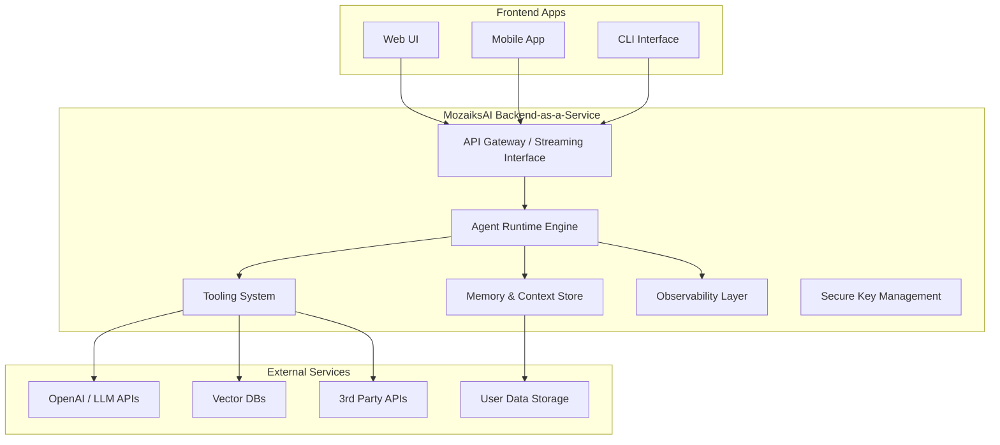

# 🌟 MozaiksAI: Modular AI Agent Platform

Welcome to **MozaiksAI**, a next-generation platform for building, orchestrating, and deploying modular AI agents. MozaiksAI is designed for teams and developers who want to create intelligent, extensible workflows and dynamic user experiences powered by the latest in LLM and agent technology.

---

## 🧭 Vision

MozaiksAI aims to bridge the gap between advanced AI agents and real-world applications by providing a unified, extensible, and developer-friendly platform. Our goal is to make it easy to compose, manage, and scale AI-driven workflows that can interact with users, tools, and data in real time.

---

## 🏛️ Core Principles

- **Modularity:** Everything is a module—agents, tools, UI components, and workflows can be plugged in, swapped, or extended without touching the core.
- **Dynamic UI:** Agents can request and control frontend React components on the fly, enabling rich, context-aware user experiences.
- **Unified Transport:** Robust, real-time communication via WebSocket, SSE, or HTTP, with automatic fallback for reliability.
- **Hot-Reload & Discovery:** Add, update, or remove agents and tools without downtime or restarts.
- **LLM-Driven Routing:** Leverage large language models to intelligently route between chat, artifacts, and custom UI.

---

## 🏗️ Architecture Overview



**Legend:**
- **Frontend Apps:** User interfaces (web, mobile, CLI) that interact with MozaiksAI.
- **MozaiksAI Backend-as-a-Service:** Core engine, tools, memory/context, API gateway, observability, and secure key management.
- **External Services:** LLM APIs, vector databases, third-party APIs, and user data storage.

---

## 🧩 Key Features

- **Dynamic UI System:** Agents can render and control custom React components in real time.
- **Plugin Contracts:** Standardized interfaces for all workflow components, making extension and integration easy.
- **Component Registry:** Auto-discovers and registers new UI components and tools from workflow directories.
- **Seamless Frontend-Backend Alignment:** Structured outputs from agents map directly to frontend component props for a smooth UX.

---

## 📂 Project Structure

- `workflows/` – Modular agent workflows, tools, and UI components.
- `core/` – Core platform logic, transport, and event systems.
- `ChatUI/` – React frontend for dynamic agent interaction.
- `docs/` – In-depth technical documentation and guides.

---

## 📖 Documentation Highlights

- **[Dynamic UI System](docs/DYNAMIC_UI_SYSTEM.md):**  
  How agents dynamically control frontend components.

- **[Workflow Development Framework](docs/WORKFLOW_DEVELOPMENT_FRAMEWORK.md):**  
  Plugin contracts, templates, and best practices for modular workflows.

- **[Frontend-Backend Alignment](docs/FRONTEND_BACKEND_ALIGNMENT.md):**  
  Ensuring seamless data flow and UI rendering between backend and frontend.

---

## 🚀 Getting Started

**Backend:**
```bash
pip install -r requirements.txt
python run_server.py
```

**Frontend:**
```bash
cd ChatUI
npm install
npm start
```
Visit [http://localhost:3000](http://localhost:3000) to explore MozaiksAI.

---

## 🤝 Contributing

We welcome issues, feature requests, and pull requests!  
See the `docs/` folder for architecture and contribution guidelines.

---

## 🏆 Credits

Developed with ❤️ by BlocUnited LLC.

---

## 📄 License

EXCLUSIVE LICENSE AGREEMENT

---


