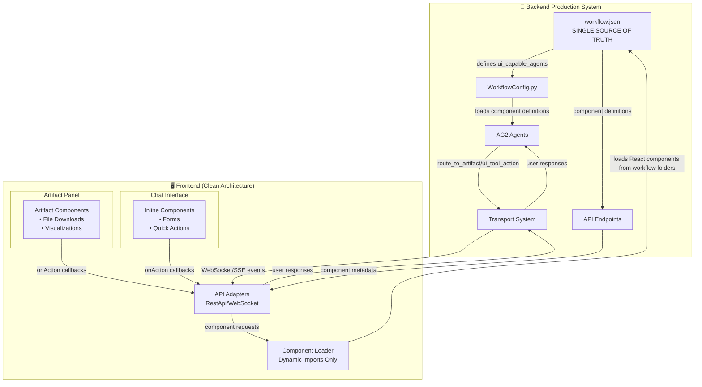

# Dynamic UI System - Production Architecture

## Overview
The Dynamic UI System allows AG2 backend agents to dynamically load and control React components in the frontend. **The backend workflow.json serves as the single source of truth** for all component definitions, eliminating frontend duplication of backend logic.

## Production Architecture Changes
- ✅ **Added:** Backend workflow.json as single source of truth
- ✅ **Added:** API-driven component discovery
- ✅ **Added:** Clean separation between frontend and backend

## Architecture



## How It Works

### 1. Component Definition (Backend)
Components are defined in `workflows/{WorkflowName}/workflow.json`:

```json
{
  "ui_capable_agents": [
    {
      "name": "UserFeedbackAgent",
      "components": [
        {
          "name": "FileDownloadCenter",
          "type": "artifact",
          "description": "Download generated files",
          "actions": ["download", "download_all"],
          "backend_handler": "file_manager.handle_download"
        }
      ]
    }
  ]
}
```

### 2. Frontend Component Loading (Production)
Components are dynamically loaded from the backend workflow system:

```javascript
// Frontend API calls backend for component definitions
import { getComponent } from '../agents/components';

// Component loader gets definitions from backend workflow.json
const component = await getComponent('FileDownloadCenter');

// No frontend registries - backend is single source of truth
// Components stored in: workflows/{WorkflowName}/Components/
```

### 3. Component Implementation (React)
React components are stored in `workflows/{WorkflowName}/Components/`:

```javascript
// workflows/Generator/Components/Artifacts/FileDownloadCenter.js
import React, { useState } from 'react';

const FileDownloadCenter = ({ 
  files = [], 
  onAction,      // System-provided callback
  componentId    // System-provided ID
}) => {
  const handleDownload = async (fileId, filename) => {
    // Send action back to backend via transport
    await onAction({
      type: 'download_file',
      data: { fileId, filename }
    });
  };

  return (
    <div className="file-download-center">
      {files.map(file => (
        <button 
          key={file.id}
          onClick={() => handleDownload(file.id, file.name)}
        >
          Download {file.name}
        </button>
      ))}
    </div>
  );
};

export default FileDownloadCenter;
```

### 4. Agent Triggers Component (Backend)
AG2 agents request UI components through transport events:

```python
# In your AG2 agent
def show_file_downloads(self, files):
    """Show file download component to user"""
    self.transport.send_ui_event({
        "type": "route_to_artifact", 
        "data": {
            "componentName": "FileDownloadCenter",
            "props": {
                "files": files,
                "title": "Generated Files"
            }
        }
    })
```

### 4. User Interaction Flow
```
User clicks download → Component calls onAction() → Transport sends to backend → Agent handles response
```

## Component Types

### Inline Components
- **Location**: `workflows/{Workflow}/Components/Inline/`
- **Purpose**: Small UI elements embedded in chat
- **Examples**: API key inputs, quick forms, confirmations

### Artifact Components  
- **Location**: `workflows/{Workflow}/Components/Artifacts/`
- **Purpose**: Full-featured components in dedicated panel
- **Examples**: File downloads, code editors, data visualizations

## Production Benefits

### ✅ Clean Architecture
- **Single Source of Truth**: Backend `workflow.json` defines all components
- **No Frontend Duplication**: Eliminated frontend registries and hardcoded lists
- **API-Driven Discovery**: Frontend gets component definitions via REST/WebSocket APIs
- **Clean Separation**: Frontend focuses on presentation, backend controls logic

### ✅ Workflow-Specific Components
- Each workflow has its own component set in `workflows/{Name}/Components/`
- Components automatically match workflow requirements
- No global component pollution or registry conflicts

### ✅ Enterprise-Ready Transport  
- **WebSocket/SSE transport** for real-time bi-directional communication
- **Enterprise context** support for multi-tenant deployments
- **Session management** with proper connection lifecycle
- **Error handling** and reconnection logic

### ✅ Production-Ready Frontend
- **React.StrictMode enabled** for development best practices
- **Dynamic imports** for code splitting and performance
- **ESLint compliant** code with proper error handling
- **No backward compatibility** code (clean production build)

### ✅ Developer Experience
- Standard React component development
- Clear separation: backend logic vs frontend UI
- Automatic component discovery and loading

## Key Concepts

### Component Loading
Components are loaded dynamically from the filesystem based on workflow configuration:

```javascript
// Frontend automatically loads from:
workflows/Generator/Components/Artifacts/FileDownloadCenter.js
workflows/Generator/Components/Inline/AgentAPIKeyInput.js

// Based on workflow.json configuration
```

### Action System
All user interactions flow through the `onAction` callback:

```javascript
// Component sends data back to agent
onAction({
  type: 'user_action_type',    // What the user did
  data: { /* action data */ }  // User's input/selection
})
```

### Transport Integration
The transport system automatically:
- Routes UI events from backend to frontend
- Provides `onAction` callbacks to components  
- Handles enterprise context and session management
- Manages WebSocket/SSE connections

## Development Workflow

1. **Define component in workflow.json** (backend)
2. **Create React component file** (frontend)
3. **Agent triggers component** (backend)
4. **User interacts with component** (frontend)
5. **Component sends data back** (via onAction)
6. **Agent processes response** (backend)

This creates a seamless, production-ready dynamic UI system that scales with your workflow requirements while maintaining clean separation between backend logic and frontend presentation.

- ✅ **API-Driven Component Discovery** (RestApiAdapter, WebSocketApiAdapter)
- ✅ **enterpriseApi Instance** (default API instance with enterprise context)
- ✅ **Clean Agent System** (simplified agents/index.js without registry dependencies)
- ✅ **Production-Ready Config** (React.StrictMode enabled, ESLint compliant)

### Breaking Changes
If you have custom components, ensure they are:
1. **Located in workflow folders**: `workflows/{Name}/Components/Artifacts/` or `workflows/{Name}/Components/Inline/`
2. **Defined in workflow.json**: Component metadata must be in backend workflow configuration
3. **Using standard props**: `onAction`, `componentId`, and workflow-specific props

### Migration Path
1. Move custom components to appropriate workflow folders
2. Update workflow.json to include component definitions  
3. Remove any frontend registry references
4. Use backend APIs for component discovery
5. Test with React.StrictMode enabled
