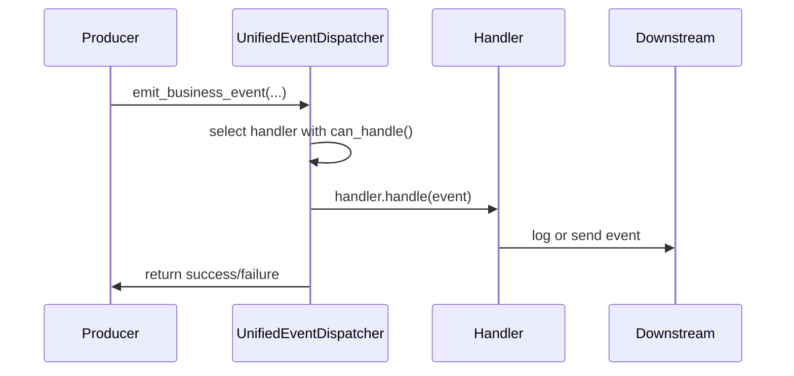

# 📧 Event Architecture

This document describes MozaiksAI's unified event system for routing and handling internal events.

## Overview

MozaiksAI uses a single **Unified Event Dispatcher** for business and UI tool events, and handles AG2 runtime events directly in the orchestrator. Three categories of events:

- **Business Events**: Application lifecycle and monitoring (e.g., session start, billing events)
- **Runtime Events**: AG2 agent workflow execution logs and metrics
- **UI Tool Events**: Dynamic UI interactions and tool component actions

Business and UI tool events are routed through the central dispatcher which invokes a matching handler implementation based on the event category. AG2 runtime events are iterated in the orchestrator and forwarded to the transport; token accounting and metrics are handled by PerformanceManager.

## Event Definitions

```python
@dataclass
class BusinessLogEvent:
    log_event_type: str
    description: str
    context: Dict[str, Any]
    level: str
    timestamp: datetime
    event_id: str
    category: str = "business"

@dataclass
class RuntimeEvent:
    ag2_event_type: str
    agent_name: str
    content: str
    metadata: Dict[str, Any]
    timestamp: datetime
    event_id: str
    category: str = "runtime"

@dataclass
class UIToolEvent:
    ui_tool_id: str
    payload: Dict[str, Any]
    workflow_name: str
    display: str
    chat_id: Optional[str]
    timestamp: datetime
    event_id: str
    category: str = "ui_tool"
```

## Handlers

All handlers implement the `EventHandler` interface:

```python
class EventHandler(ABC):
    async def handle(self, event: EventType) -> bool: ...
    def can_handle(self, event: EventType) -> bool: ...
```

Default handlers:

- `BusinessLogHandler` logs business events via the workflow logger (through `BusinessLogHandler`)
- `RuntimeEventHandler` persists AG2 runtime events via `AG2PersistenceManager`
- `UIToolHandler` forwards UI tool events to the transport layer via `SimpleTransport`

AG2 runtime events (from `a_run_group_chat`) are processed in the orchestrator (see `core/workflow/orchestration_patterns.py`), which now:
– Tracks agent turns from `TextEvent` and records latency via `PerformanceManager.record_agent_turn`.
– On turn boundary, calls `print_usage_summary()` then `PerformanceManager.bill_usage_from_print_summary()` for incremental delta billing.
– At workflow end, calls `gather_usage_summary()` then `PerformanceManager.record_final_usage_from_agents()` to reconcile any residual and persist final_* fields.
– Sends UI-visible events through `core/transport/simple_transport.py:SimpleTransport`.
Legacy per-`UsageSummaryEvent` delta processing has been removed along with websocket token_update emissions.

## Dispatcher Flow



## Usage

Obtain the global dispatcher and emit events:

```python
from core.events.unified_event_dispatcher import get_event_dispatcher

dispatcher = get_event_dispatcher()
await dispatcher.emit_business_event(
    log_event_type="session_start",
    description="User session started",
    context={"user_id": "abc"}
)
```

Or use convenience functions:

```python
from core.events.unified_event_dispatcher import emit_runtime_event
await emit_runtime_event(
    ag2_event_type="agent_response",
    agent_name="gpt-4o",
    content="Hello",
)

For AG2 execution, the orchestrator uses `a_run_group_chat`, iterates `response.events`, persists with `AG2PersistenceManager`, forwards UI-visible events via `SimpleTransport`, and handles usage accounting with `PerformanceManager`.
```
