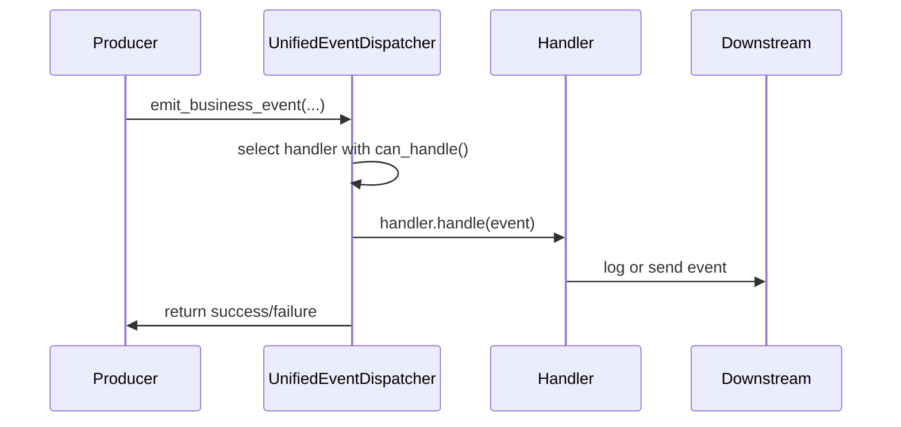

# 📧 Event Architecture

This document describes MozaiksAI's unified event system for routing and handling internal events.

## Overview

MozaiksAI uses a single **Unified Event Dispatcher** to process three categories of events:

- **Business Events**: Application lifecycle and monitoring (e.g., session start, billing events)
- **Runtime Events**: AG2 agent workflow execution logs and metrics
- **UI Tool Events**: Dynamic UI interactions and tool component actions

All events are routed through a central dispatcher which invokes a matching handler implementation based on the event category.

## Event Definitions

```python
@dataclass
class BusinessLogEvent:
    log_event_type: str
    description: str
    context: Dict[str, Any]
    level: str
    timestamp: datetime
    event_id: str
    category: str = "business"

@dataclass
class RuntimeEvent:
    ag2_event_type: str
    agent_name: str
    content: str
    metadata: Dict[str, Any]
    timestamp: datetime
    event_id: str
    category: str = "runtime"

@dataclass
class UIToolEvent:
    ui_tool_id: str
    payload: Dict[str, Any]
    workflow_name: str
    display: str
    chat_id: Optional[str]
    timestamp: datetime
    event_id: str
    category: str = "ui_tool"
```

## Handlers

All handlers implement the `EventHandler` interface:

```python
class EventHandler(ABC):
    async def handle(self, event: EventType) -> bool: ...
    def can_handle(self, event: EventType) -> bool: ...
```

Default handlers:

- `BusinessLogHandler` logs business events via `log_business_event()`
- `RuntimeEventHandler` persists AG2 runtime events via `AG2PersistenceExtensions`
- `UIToolHandler` forwards UI tool events to the transport layer via `SimpleTransport`

## Dispatcher Flow



## Usage

Obtain the global dispatcher and emit events:

```python
from core.events.unified_event_dispatcher import get_event_dispatcher

dispatcher = get_event_dispatcher()
await dispatcher.emit_business_event(
    log_event_type="session_start",
    description="User session started",
    context={"user_id": "abc"}
)
```

Or use convenience functions:

```python
from core.events.unified_event_dispatcher import emit_runtime_event
await emit_runtime_event(
    ag2_event_type="agent_response",
    agent_name="gpt-4o",
    content="Hello",
)
```
