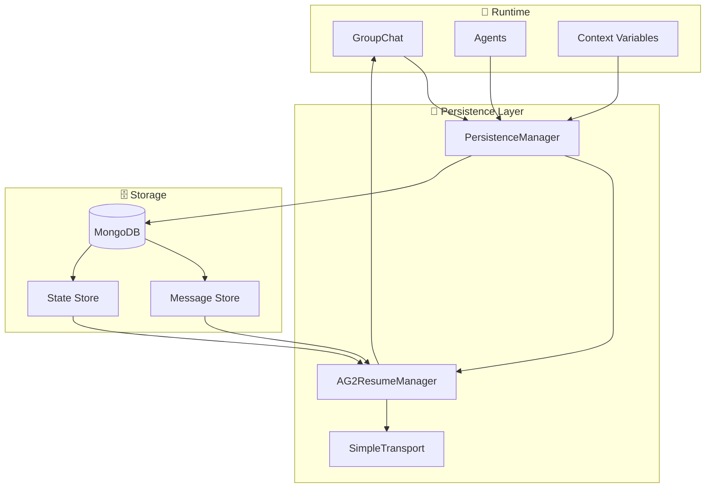

# Persistence & Resume System

## Purpose
This document explains MozaiksAI's groupchat state persistence and AG2 resume functionality, including MongoDB integration, state restoration, and error handling across server restarts.

---

## System Architecture



---

## Core Components

### PersistenceManager
- **Location**: `core/data/persistence_manager.py`
- **Role**: Handles all data persistence operations
- **Features**:
  - AG2-format message storage
  - Agent configuration persistence
  - Context variable state management
  - Enterprise and chat ID validation

### AG2ResumeManager
- **Location**: Integrated in `core/transport/simple_transport.py`
- **Role**: Manages groupchat state restoration
- **Features**:
  - Official AG2 resume patterns
  - Message history reconstruction
  - Agent state restoration
  - Connection recovery

---

## Persistence Flow

### During Groupchat Execution
1. **Message Capture**: All agent messages are captured in AG2 format
2. **State Storage**: Agent configurations and context variables are stored
3. **Incremental Updates**: Changes are persisted as they occur
4. **Transport Tracking**: Connection states are monitored

### During Resume Operation
1. **State Query**: System queries MongoDB for chat history
2. **Message Reconstruction**: AG2-format messages are loaded
3. **Agent Restoration**: Agent states and configurations are restored
4. **Context Recovery**: Context variables are reloaded
5. **Groupchat Resume**: AG2 groupchat is resumed with full state

---

## MongoDB Integration

### Collections Structure
```javascript
// Chat messages collection
{
  "_id": ObjectId,
  "chat_id": "chat_12345",
  "enterprise_id": "enterprise_abc",
  "timestamp": ISODate,
  "sender": "ContextVariablesAgent",
  "content": "Agent message content",
  "message_type": "agent_message",
  "ag2_format": {
    "role": "assistant",
    "content": "Agent message content",
    "name": "ContextVariablesAgent"
  }
}

// Groupchat state collection
{
  "_id": ObjectId,
  "chat_id": "chat_12345",
  "enterprise_id": "enterprise_abc",
  "agent_configs": [...],
  "context_variables": {...},
  "workflow_name": "Generator",
  "last_updated": ISODate
}
```

### Database Operations
- **save_ag2_message()**: Store individual messages in AG2 format
- **load_ag2_groupchat_state()**: Restore complete groupchat state
- **find_latest_concept_for_enterprise()**: Query enterprise-specific data
- **update_context_variables()**: Persist context changes

---

## Resume Implementation

### AG2ResumeManager
```python
class AG2ResumeManager:
    async def resume_groupchat(self, chat_id: str, enterprise_id: str, 
                             agents: List, manager: GroupChatManager) -> dict:
        """Resume AG2 groupchat with full state restoration"""
        
        # 1. Load message history
        messages = await self.persistence.load_ag2_groupchat_state(
            chat_id, enterprise_id
        )
        
        # 2. Restore agent configurations
        for agent in agents:
            agent_state = await self.load_agent_state(agent.name, chat_id)
            if agent_state:
                self.restore_agent_config(agent, agent_state)
        
        # 3. Reconstruct conversation history
        manager.groupchat.messages = messages
        
        # 4. Resume groupchat execution
        return {"status": "success", "messages": len(messages)}
```

### Transport Integration
```python
# In SimpleTransport
async def resume_ag2_groupchat(self, chat_id: str, enterprise_id: str, 
                             agents: List, manager: GroupChatManager):
    """Resume groupchat through transport layer"""
    resume_manager = AG2ResumeManager(self.persistence)
    return await resume_manager.resume_groupchat(
        chat_id, enterprise_id, agents, manager
    )
```

---

## Error Handling & Recovery

### Connection Issues
- **MongoDB Disconnection**: Graceful degradation with local caching
- **Network Failures**: Retry logic with exponential backoff
- **Invalid Data**: Validation and sanitization before storage

### State Corruption
- **Message Validation**: AG2 format validation before storage
- **State Consistency**: Cross-reference checks between collections
- **Rollback Support**: Ability to restore to previous known good state

### Enterprise Validation
- **Invalid Enterprise ID**: Clear error messages and validation
- **Permission Checks**: Ensure users can only access their data
- **Data Isolation**: Strict separation between enterprise data

---

## Current Implementation Status

### ✅ Working Features
- Complete AG2 message persistence in MongoDB
- Groupchat state restoration across server restarts
- Context variable persistence and recovery
- Transport-agnostic resume (works with SSE/WebSocket)
- Enterprise and chat ID validation
- Error handling and graceful degradation

### 🔧 Active Components
- **PersistenceManager**: Full MongoDB integration
- **AG2ResumeManager**: Official AG2 resume patterns
- **SimpleTransport**: Transport layer integration
- **Enterprise Validation**: Data isolation and security

---

## Performance Considerations

### Database Optimization
- **Indexing**: Chat ID and enterprise ID indexes for fast queries
- **Pagination**: Large message histories are paginated
- **Compression**: Message content compression for storage efficiency
- **Cleanup**: Automated cleanup of old conversation data

### Memory Management
- **Lazy Loading**: Messages loaded on-demand during resume
- **State Caching**: Frequently accessed state cached in memory
- **Connection Pooling**: MongoDB connection pooling for efficiency

---

## Suggestions & Future Enhancements

- **Backup & Recovery**: Automated backup system for critical conversation data
- **Multi-Database Support**: Support for additional databases (PostgreSQL, Redis)
- **Data Encryption**: Encrypt sensitive conversation data at rest
- **Audit Logging**: Track all persistence operations for compliance
- **Performance Monitoring**: Real-time monitoring of database operations
- **Data Analytics**: Query interface for conversation analytics and insights

---

## Status
This document reflects the current Persistence & Resume system as implemented in July 2025. All groupchat state is properly persisted in MongoDB with full AG2 resume capability across all transport protocols.
