# Sequence Diagram Examples for Workflow Visualization

## Why Sequence Diagrams?

Sequence diagrams are **superior to flowcharts** for multi-agent workflow visualization because they:

1. **Show Time Progression** - Read top-to-bottom like a timeline
2. **Clarify Handoffs** - See exactly when control passes between agents
3. **Highlight Human Checkpoints** - Notes make review points obvious
4. **Scale Beautifully** - Add more participants without cluttering
5. **Tool Interactions** - Clear request/response patterns

---

## Example 1: Simple 3-Phase Workflow

### Scenario: Content Creation Pipeline

**Key Features:**
- ✅ Clear phase progression
- ✅ Human review point highlighted with Note
- ✅ Tool (content_api) interaction shown
- ✅ Activation boxes show when each phase is "working"

---

## Example 2: Complex Multi-Agent Workflow

### Scenario: Social Media Automation

**Advanced Features:**
- ✅ Multiple agents within a phase (P2Plan, P2Sched)
- ✅ Loop construct for repeated actions
- ✅ Multiple tool integrations (twitter_api, analytics_db)
- ✅ Two human checkpoints (calendar + content review)

---

## Example 3: Human-in-Loop Workflow

### Scenario: Legal Document Review

```mermaid
sequenceDiagram
    participant User
    participant P1 as Phase 1: Intake
    participant P2 as Phase 2: Analysis
    participant P3 as Phase 3: Review
    participant legal_db
    participant compliance_checker

    User->>P1: Upload document
    activate P1
    P1->>legal_db: Check document type
    legal_db-->>P1: Type confirmed
    P1-->>User: Document accepted
    deactivate P1
    
    P1->>P2: Analyze document
    activate P2
    P2->>compliance_checker: Scan for risks
    compliance_checker-->>P2: Risk report
    alt High Risk Detected
        P2-->>User: ⚠️ Critical review required
        Note over P2,User: Legal team must approve
        User->>P2: Legal team approval
    else Low Risk
        Note over P2: Auto-approved
    end
    deactivate P2
    
    P2->>P3: Finalize document
    activate P3
    P3->>legal_db: Store reviewed doc
    P3-->>User: ✅ Document processed
    deactivate P3
```

**Conditional Features:**
- ✅ `alt/else` blocks for conditional logic
- ✅ Critical human checkpoints emphasized with emoji
- ✅ Notes explain business rules
- ✅ Clear escalation path

---

## Example 4: Feedback Loop Workflow

### Scenario: AI Model Training Pipeline

```mermaid
sequenceDiagram
    participant User
    participant P1 as Phase 1: Data Prep
    participant P2 as Phase 2: Training
    participant P3 as Phase 3: Evaluation
    participant P4 as Phase 4: Deployment
    participant model_registry
    participant metrics_db

    User->>P1: Upload training data
    activate P1
    P1->>P1: Clean & validate
    P1-->>User: Data ready
    deactivate P1
    
    P1->>P2: Start training
    activate P2
    P2->>P2: Train model
    P2->>model_registry: Save checkpoint
    deactivate P2
    
    P2->>P3: Evaluate model
    activate P3
    P3->>metrics_db: Run benchmarks
    metrics_db-->>P3: Performance metrics
    
    alt Metrics Below Threshold
        Note over P3,P2: 🔄 Retrain required
        P3->>P2: Adjust hyperparameters
        activate P2
        P2->>P2: Retrain
        deactivate P2
        P2->>P3: Re-evaluate
    else Metrics Pass
        P3-->>User: Model approved
    end
    deactivate P3
    
    P3->>P4: Deploy model
    activate P4
    P4->>model_registry: Promote to production
    P4-->>User: ✅ Model deployed
    deactivate P4
```

**Loop Features:**
- ✅ Feedback loop shown with alt block
- ✅ Iterative refinement visualized
- ✅ Clear exit conditions
- ✅ Checkpoint persistence (model_registry)

---

## Comparison to Flowcharts

### Flowchart Version (Old)

**Problems:**
- No time dimension
- Hard to see execution order
- Tool relationships unclear
- Can't show loops or conditionals well
- No human checkpoint visibility

### Sequence Diagram Version (New)

**Benefits:**
- Clear temporal flow
- Execution order explicit
- Tool call/response obvious
- Notes for human interaction
- Scales to complexity

---

## Best Practices for Workflow Sequence Diagrams

### 1. Participant Naming
- ✅ **Good**: `P1Intake`, `P2Plan`, `ContentGen`
- ❌ **Bad**: `Phase1IntakeAndValidationAgent` (too long)

### 2. Message Labels
- ✅ **Good**: `"Submit request"`, `"Validate input"`
- ❌ **Bad**: `"The user submits a request to the system"` (verbose)

### 3. Notes for Context
- Use `Note over Agent,User: Human review required`
- Add emoji for emphasis: ⚠️ ✅ 🔄 ⏰

### 4. Activation Boxes
- Always `activate` when agent starts work
- Always `deactivate` when agent finishes
- Shows clear execution context

### 5. Tool Interactions
- Use sync arrows: `Agent->>Tool`
- Use async arrows for responses: `Tool-->>Agent`
- Makes request/response pattern obvious

---

## When to Use Each Diagram Type

| Diagram Type | Best For | Example Use Case |
|--------------|----------|------------------|
| **Sequence** | Temporal workflows, agent interactions, tool calls | Multi-phase pipelines, approval workflows |
| **Flowchart** | Decision trees, branching logic | Simple state machines, routing logic |
| **Gantt** | Timeline/scheduling | Project planning, resource allocation |
| **State** | Lifecycle management | Order status, user journey stages |

**For MozaiksAI workflows: Sequence diagrams are the clear winner! 🏆**
