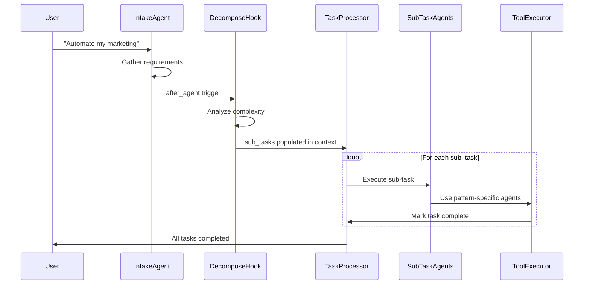
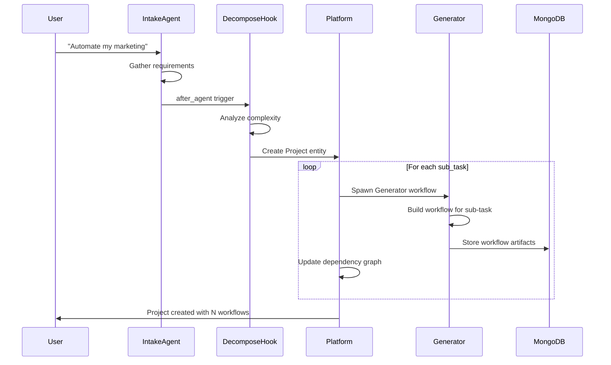

# Task Decomposition Architecture

## Overview

This document describes the architecture for handling complex user requests that require decomposition into sub-tasks. This is the "OpenRouter" concept - a modular, declarative capability that can break down complex requests and orchestrate their execution.

---

## The Problem

When a user says something like:
- "Automate my marketing"
- "Build me a customer support system"
- "Create a content creation pipeline with review and publishing"

These are **compound requests** that can't be handled by a single workflow pattern. They require:
1. **Decomposition** - Breaking the request into discrete sub-tasks
2. **Pattern Selection** - Choosing the right pattern for each sub-task
3. **Orchestration** - Executing sub-tasks in the right order with dependencies
4. **Context Sharing** - Passing outputs from one sub-task to the next

---

## Key Questions

### Can a workflow have multiple patterns?

**Short answer:** It depends on what you mean by "workflow."

**Scenario A: Single AG2 Session = One Pattern**

In AG2's native model, a single `initiate_group_chat()` call uses ONE pattern (DefaultPattern, AutoPattern, etc.). The pattern defines:
- How agents are selected to speak
- How handoffs work
- The overall topology

You can't mix topologies in one session. A Pipeline can't suddenly become a Star mid-execution.

**Scenario B: Sequential Patterns via Modules**

However, a workflow could have **multiple modules**, each with its own pattern, executed **sequentially**:

```
┌─────────────────────────────────────────────────────────────┐
│  Customer Onboarding Workflow                               │
├─────────────────────────────────────────────────────────────┤
│                                                             │
│  Module 1: Data Collection        Pattern 6 (Pipeline)     │
│  ┌─────────┐ → ┌──────────┐ → ┌────────────┐               │
│  │ Intake  │   │ Validate │   │ Enrich     │               │
│  └─────────┘   └──────────┘   └────────────┘               │
│                       │                                     │
│                       ▼                                     │
│  Module 2: Account Setup          Pattern 8 (Star)         │
│            ┌──────────────┐                                 │
│            │ Coordinator  │                                 │
│       ┌────┴──────┬───────┴────┐                           │
│       ▼           ▼            ▼                           │
│  ┌─────────┐ ┌─────────┐ ┌─────────┐                       │
│  │ CRM     │ │ Billing │ │ Email   │                       │
│  │ Setup   │ │ Setup   │ │ Setup   │                       │
│  └─────────┘ └─────────┘ └─────────┘                       │
│                       │                                     │
│                       ▼                                     │
│  Module 3: Welcome Flow           Pattern 3 (Feedback)     │
│  ┌─────────┐ → ┌──────────┐ ⟷ ┌────────────┐              │
│  │ Draft   │   │ Review   │   │ Revise     │               │
│  │ Welcome │   │ Content  │   │ Content    │               │
│  └─────────┘   └──────────┘   └────────────┘               │
│                                                             │
└─────────────────────────────────────────────────────────────┘
```

**Implementation Options:**

| Approach | How It Works | Pros | Cons |
|----------|--------------|------|------|
| **Nested Chats** | AG2's `NestedChatTarget` runs sub-conversations | Native AG2, isolated context | Complex handoff management |
| **Sequential Sessions** | End one session, start another | Clean separation | Loses conversation context |
| **Module Handoffs** | Custom runtime logic between modules | Full control | More runtime code |

### Can patterns have multiple modules?

**Answer: No, but a module IS the pattern instantiation.**

Think of it this way:
- A **pattern** is a topology template (e.g., "Hub and Spoke")
- A **module** is an instance of that pattern with specific agents

So:
- Pattern 8 (Star) = one coordinator + N spokes
- Module "Account Setup" = Coordinator + CRM/Billing/Email (3 spokes)

You could have **multiple modules using the same pattern** in one workflow:

```
Module 1: Initial Routing    → Pattern 1 (Context-Aware Routing)
Module 2: Specialist Routing → Pattern 1 (Context-Aware Routing)  // Same pattern, different agents
Module 3: Final Review       → Pattern 3 (Feedback Loop)
```

---

## Architecture Layers

### Layer 1: Single Pattern Workflow (V1)
```
1 Workflow = 1 Pattern = 1 Module = N Agents
```

The simplest case. What we're building first.

### Layer 2: Multi-Module Workflow (V1.5)
```
1 Workflow = N Modules (sequential) = N Patterns = M Agents
```

Modules execute in sequence. Each module has one pattern. Context flows between modules.

### Layer 3: Multi-Workflow Projects (V2)
```
1 Project = N Workflows (with dependencies) = N Patterns = M Agents
```

Complex requests spawn multiple independent workflows. Dependency graph determines execution order.

---

## Task Decomposition Hook

### Concept

A **lifecycle hook** that can be attached to any agent to analyze the conversation and determine if decomposition is needed.

```
User Request
     ↓
┌─────────────────┐
│  IntakeAgent    │  ← Gathers requirements
└─────────────────┘
     ↓
     │ after_agent: decompose_request
     ↓
┌─────────────────────────────────────────┐
│  Task Decomposition Engine              │
│                                         │
│  Input: Conversation history            │
│  Output: Sub-task list with patterns    │
└─────────────────────────────────────────┘
     ↓
┌─────────────────────────────────────────┐
│  Decomposition Result (Context Vars)    │
│                                         │
│  is_complex: true                       │
│  execution_mode: sequential|parallel    │
│  sub_tasks: [...]                       │
└─────────────────────────────────────────┘
```

### Declarative Configuration

```json
{
  "agent_name": "IntakeAgent",
  "agent_type": "intake",
  "lifecycle_tools": [
    {
      "name": "decompose_request",
      "trigger": "after_agent",
      "integration": null,
      "purpose": "Analyze conversation and break complex requests into sub-tasks",
      "config": {
        "enabled": true,
        "complexity_threshold": "medium",
        "max_subtasks": 5,
        "execution_mode": "sequential",
        "spawn_mode": "session"
      }
    }
  ]
}
```

### Configuration Options

| Option | Values | Description |
|--------|--------|-------------|
| `enabled` | boolean | Whether decomposition is active |
| `complexity_threshold` | simple \| medium \| complex | Minimum complexity to trigger decomposition |
| `max_subtasks` | int | Maximum sub-tasks to generate |
| `execution_mode` | sequential \| parallel \| dependency_graph | How to execute sub-tasks |
| `spawn_mode` | session \| workflow \| hybrid | Where sub-tasks execute |

### Spawn Modes

| Mode | Behavior | Use Case |
|------|----------|----------|
| `session` | Sub-tasks execute in same chat session using handoffs | Simple decomposition, maintains context |
| `workflow` | Each sub-task spawns a new Generator workflow | Complex, independent workflows needed |
| `hybrid` | First sub-task in session, rest spawn workflows | Gradual complexity handling |

---

## Context Variable Contract

When `decompose_request` executes, it populates standardized context variables:

```python
{
  "decomposition": {
    "triggered": True,
    "timestamp": "2025-11-26T10:30:00Z",
    "original_request": "Automate my marketing",
    
    "analysis": {
      "is_complex": True,
      "complexity_score": 0.85,
      "reasoning": "Request involves multiple domains: content creation, scheduling, analytics, A/B testing"
    },
    
    "sub_tasks": [
      {
        "id": 1,
        "name": "Content Calendar Generator",
        "description": "Create a system to generate and manage content calendars",
        "suggested_pattern_id": 6,
        "suggested_pattern_name": "Pipeline",
        "suggested_agents": ["CalendarIntake", "ContentPlanner", "ScheduleOptimizer"],
        "dependencies": [],
        "priority": 1,
        "status": "pending",
        "estimated_complexity": "medium"
      },
      {
        "id": 2,
        "name": "Social Media Post Writer",
        "description": "Write and refine social media posts with review cycles",
        "suggested_pattern_id": 3,
        "suggested_pattern_name": "Feedback Loop",
        "suggested_agents": ["PostDrafter", "ContentReviewer", "PostReviser"],
        "dependencies": [1],
        "priority": 2,
        "status": "pending",
        "estimated_complexity": "medium"
      },
      {
        "id": 3,
        "name": "Campaign Performance Analyzer",
        "description": "Analyze marketing campaign performance across channels",
        "suggested_pattern_id": 1,
        "suggested_pattern_name": "Context-Aware Routing",
        "suggested_agents": ["AnalyticsRouter", "SocialAnalyst", "EmailAnalyst", "AdAnalyst"],
        "dependencies": [2],
        "priority": 3,
        "status": "pending",
        "estimated_complexity": "high"
      }
    ],
    
    "execution_plan": {
      "mode": "sequential",
      "spawn_mode": "workflow",
      "total_tasks": 3,
      "current_task_index": 0
    }
  }
}
```

---

## Execution Flow

### Session Mode (Same Chat Session)



### Workflow Mode (Spawn New Workflows)



---

## Example: Multi-Pattern Workflow

### Use Case: "Build a Customer Support System"

This requires multiple patterns working together:

```json
{
  "workflow_name": "Customer Support System",
  "modules": [
    {
      "module_index": 0,
      "module_name": "Ticket Intake & Triage",
      "pattern_id": 9,
      "pattern_name": "Triage with Tasks",
      "agents_needed": ["TriageAgent", "TaskManager", "CategoryRouter"],
      "description": "Receive tickets, categorize, and create task queue"
    },
    {
      "module_index": 1,
      "module_name": "Specialist Routing",
      "pattern_id": 1,
      "pattern_name": "Context-Aware Routing",
      "agents_needed": ["RouterAgent", "BillingSpecialist", "TechSpecialist", "GeneralSpecialist"],
      "description": "Route tickets to appropriate specialists based on category"
    },
    {
      "module_index": 2,
      "module_name": "Escalation Handling",
      "pattern_id": 2,
      "pattern_name": "Escalation",
      "agents_needed": ["Tier1Agent", "Tier2Agent", "Tier3Agent"],
      "description": "Handle complex tickets with tiered escalation"
    },
    {
      "module_index": 3,
      "module_name": "Response Quality",
      "pattern_id": 3,
      "pattern_name": "Feedback Loop",
      "agents_needed": ["ResponseDrafter", "QAReviewer", "ResponseReviser"],
      "description": "Draft, review, and refine customer responses"
    }
  ],
  "module_flow": [
    {"from": 0, "to": 1, "condition": "ticket_categorized == true"},
    {"from": 1, "to": 2, "condition": "needs_escalation == true"},
    {"from": 1, "to": 3, "condition": "needs_escalation == false"},
    {"from": 2, "to": 3, "condition": "escalation_resolved == true"}
  ]
}
```

### Visual Flow

```
┌─────────────────────────────────────────────────────────────────────┐
│  Customer Support System                                            │
├─────────────────────────────────────────────────────────────────────┤
│                                                                     │
│  ┌─────────────────────────────────────────┐                        │
│  │  Module 0: Ticket Intake & Triage       │                        │
│  │  Pattern 9: Triage with Tasks           │                        │
│  │  ┌─────────┐ → ┌─────────────┐          │                        │
│  │  │ Triage  │   │ TaskManager │          │                        │
│  │  └─────────┘   └─────────────┘          │                        │
│  └─────────────────────────────────────────┘                        │
│                        │                                            │
│                        ▼                                            │
│  ┌─────────────────────────────────────────┐                        │
│  │  Module 1: Specialist Routing           │                        │
│  │  Pattern 1: Context-Aware Routing       │                        │
│  │           ┌──────────┐                  │                        │
│  │           │  Router  │                  │                        │
│  │      ┌────┴────┬─────┴────┐             │                        │
│  │      ▼         ▼          ▼             │                        │
│  │  ┌───────┐ ┌───────┐ ┌─────────┐        │                        │
│  │  │Billing│ │ Tech  │ │ General │        │                        │
│  │  └───────┘ └───────┘ └─────────┘        │                        │
│  └─────────────────────────────────────────┘                        │
│           │                    │                                    │
│           │ needs_escalation   │ !needs_escalation                  │
│           ▼                    │                                    │
│  ┌────────────────────────┐    │                                    │
│  │  Module 2: Escalation  │    │                                    │
│  │  Pattern 2: Escalation │    │                                    │
│  │  Tier1 → Tier2 → Tier3 │    │                                    │
│  └────────────────────────┘    │                                    │
│           │                    │                                    │
│           └──────────┬─────────┘                                    │
│                      ▼                                              │
│  ┌─────────────────────────────────────────┐                        │
│  │  Module 3: Response Quality             │                        │
│  │  Pattern 3: Feedback Loop               │                        │
│  │  Draft → Review ⟷ Revise → Final       │                        │
│  └─────────────────────────────────────────┘                        │
│                                                                     │
└─────────────────────────────────────────────────────────────────────┘
```

---

## Implementation Phases

### Phase 1: Single Module (V1)
- 1 workflow = 1 pattern = 1 module
- Pattern templates in `docs/patterns/N_*/`
- Clean Action Plan schema
- **This is what we build first**

### Phase 2: Task Decomposition Hook (V1.5)
- `decompose_request` lifecycle hook
- Standardized context variable contract
- `session` spawn mode only
- Can be attached to any agent

### Phase 3: Multi-Module Workflows (V1.5+)
- `modules[]` array in WorkflowStrategy
- `module_flow[]` for inter-module handoffs
- NestedChatTarget for module isolation
- Sequential/conditional module execution

### Phase 4: Multi-Workflow Projects (V2)
- Project entity (groups related workflows)
- `workflow` spawn mode
- Dependency graph execution
- Cross-workflow context sharing
- Project dashboard UI

---

## Schema Evolution

### V1: Single Module
```json
{
  "WorkflowStrategy": {
    "pattern_id": 1,
    "pattern_name": "Context-Aware Routing",
    "module": { ... }  // Single module object
  }
}
```

### V1.5+: Multi-Module
```json
{
  "WorkflowStrategy": {
    "modules": [
      { "pattern_id": 1, ... },
      { "pattern_id": 2, ... }
    ],
    "module_flow": [...]
  }
}
```

### V2: Project-Level
```json
{
  "Project": {
    "project_id": "...",
    "workflows": [
      { "workflow_id": "...", "depends_on": [...] }
    ]
  }
}
```

---

## Open Questions

1. **Should decomposition be opt-in or automatic?**
   - Opt-in: User/workflow explicitly enables it
   - Automatic: Runtime detects complexity and offers decomposition

2. **How do we handle context between modules?**
   - Full context passthrough (large)
   - Explicit context contract (what each module needs/produces)
   - Summary context (LLM summarizes relevant context)

3. **How do we visualize multi-module workflows in the Action Plan UI?**
   - Separate cards per module
   - Single card with module tabs
   - Flow diagram with expandable modules

4. **Should users be able to reorder/skip modules?**
   - Strict ordering (simpler)
   - User-controlled ordering (flexible but complex)

---

## Next Steps

1. ✅ Document architecture (this file)
2. ⬜ Finalize V1 schema (single module)
3. ⬜ Build pattern templates
4. ⬜ Design decomposition hook interface
5. ⬜ Implement multi-module support
6. ⬜ Build project-level orchestration

---

## Comprehensive Implementation Task List

This is the detailed, actionable checklist to achieve the complete V1/V1.5/V2 system.

---

### PHASE 1: Schema Refactoring (V1 Foundation)

#### 1.1 Update `structured_outputs.json`

**File:** `workflows/Generator/structured_outputs.json`

- [ ] **1.1.1** Rename `WorkflowPhase` → `WorkflowModule`
  - Change model name
  - Update all references

- [ ] **1.1.2** Update `WorkflowModule` fields:
  - `name` → `module_name`
  - `description` → `module_description`
  - Add `module_index` (int)
  - Add `pattern_id` (int, 1-9)
  - Add `pattern_name` (string)
  - Add `agents_needed` (list of strings)

- [ ] **1.1.3** Update `WorkflowSpec.phases` → `WorkflowSpec.modules`
  - Change field name
  - Update type to `list[WorkflowModule]`

- [ ] **1.1.4** Update `WorkflowAgent` model:
  - Add `agent_type` enum: `router | worker | evaluator | orchestrator | intake | generator`
  - Update `human_interaction` enum: `none | context | approval | feedback | single`
  - Add `generation_mode` (optional): `text | image | video | audio | null`
  - Rename `description` → `objective` (per V2 schema)

- [ ] **1.1.5** Rename `PhaseAgents` → `ModuleAgents`
  - Update model name
  - Update `phase_index` → `module_index`
  - Update `phase_agents` → `module_agents`

- [ ] **1.1.6** Update `ActionPlan` model:
  - Ensure `phases` → `modules` naming propagates

- [ ] **1.1.7** Update `TechnicalBlueprint.ui_components`:
  - `phase_name` → `module_name`

---

#### 1.2 Update Generator Agents

**Files in `workflows/Generator/agents.json`**

- [ ] **1.2.1** Update `WorkflowStrategyAgent`:
  - Change output schema references: `phases` → `modules`
  - Update [INSTRUCTIONS] Step 5 "Create Phase Scaffold" → "Create Module Scaffold"
  - Update pattern guidance injection to reference modules
  - Update output format section

- [ ] **1.2.2** Reorder agent execution (per V2):
  - `WorkflowImplementationAgent` now runs BEFORE `WorkflowArchitectAgent`
  - Update handoffs.json accordingly (next task)

- [ ] **1.2.3** Update `WorkflowArchitectAgent`:
  - Change `phase_name` → `module_name` references in [CONTEXT]
  - Update extraction patterns for ModuleAgents
  - Update validation checks

- [ ] **1.2.4** Update `WorkflowImplementationAgent`:
  - Update to receive WorkflowStrategy (modules) instead of TechnicalBlueprint
  - Change `phase_index` → `module_index` references
  - Add new `agent_type` values in output schema
  - Add new `human_interaction` values
  - Add `generation_mode` field logic

- [ ] **1.2.5** Update `ProjectOverviewAgent`:
  - Update extraction patterns for `modules` instead of `phases`
  - Update Mermaid generation to use module terminology
  - Update validation checks

- [ ] **1.2.6** Update `ContextVariablesAgent`:
  - Update extraction patterns for ModuleAgents
  - Change phase references to module references

- [ ] **1.2.7** Update `ToolsManagerAgent`:
  - Update extraction patterns for ModuleAgents
  - Change phase references to module references

- [ ] **1.2.8** Update `UIFileGenerator`:
  - Update extraction patterns for ModuleAgents
  - Change phase references to module references

- [ ] **1.2.9** Update remaining generator agents:
  - `AgentToolsFileGenerator`
  - `AgentsAgent`
  - `StructuredOutputsAgent`
  - `HookAgent`
  - `HandoffsAgent`
  - `OrchestratorAgent`
  - `DownloadAgent`

---

#### 1.3 Update Handoffs

**File:** `workflows/Generator/handoffs.json`

- [ ] **1.3.1** Reorder agent execution sequence:
  ```
  InterviewAgent → PatternAgent → WorkflowStrategyAgent → 
  WorkflowImplementationAgent → WorkflowArchitectAgent → 
  ProjectOverviewAgent → user approval → file generation
  ```

- [ ] **1.3.2** Update handoff conditions mentioning phases → modules

---

#### 1.4 Update Tools

**Files in `workflows/Generator/tools/`**

- [ ] **1.4.1** Update `action_plan.py`:
  - Change any `phases` references to `modules`

- [ ] **1.4.2** Update `phase_agents_plan.py`:
  - Rename file to `module_agents_plan.py`
  - Update function name
  - Update all references

- [ ] **1.4.3** Update `workflow_strategy.py`:
  - Change output references from phases to modules

- [ ] **1.4.4** Update `technical_blueprint.py`:
  - Change phase_name references to module_name

- [ ] **1.4.5** Update `pattern_selection.py`:
  - Verify module terminology

- [ ] **1.4.6** Update `mermaid_sequence_diagram.py`:
  - Change phase references to module references

---

### PHASE 2: Pattern Guidance & Examples

#### 2.1 Consolidated Pattern Guidance

**File:** `docs/pattern_guidance.md`

- [ ] **2.1.1** Create single consolidated pattern guidance document:
  - All 9 AG2 patterns in one file
  - When to use each pattern
  - Common agent roles per pattern
  - Typical tool requirements per pattern
  - Handoff structure per pattern
  - Context variable patterns

---

#### 2.2 Pattern Example JSON Files

**Files in `docs/pattern_examples/`**

Single-module workflow examples showing complete structure for each pattern.
These connect to `update_agent_state_pattern.py` for injection during generation.

- [ ] **2.2.1** Create `docs/pattern_examples/context_aware_routing.json`:
  - Complete single-module workflow example
  - agents, context_variables, handoffs, tools, hooks, orchestrator

- [ ] **2.2.2** Create `docs/pattern_examples/escalation.json`:
  - Complete single-module workflow example

- [ ] **2.2.3** Create `docs/pattern_examples/feedback_loop.json`:
  - Complete single-module workflow example

- [ ] **2.2.4** Create `docs/pattern_examples/hierarchical.json`:
  - Complete single-module workflow example

- [ ] **2.2.5** Create `docs/pattern_examples/organic.json`:
  - Complete single-module workflow example

- [ ] **2.2.6** Create `docs/pattern_examples/pipeline.json`:
  - Complete single-module workflow example

- [ ] **2.2.7** Create `docs/pattern_examples/redundant.json`:
  - Complete single-module workflow example

- [ ] **2.2.8** Create `docs/pattern_examples/star.json`:
  - Complete single-module workflow example

- [ ] **2.2.9** Create `docs/pattern_examples/triage_with_tasks.json`:
  - Complete single-module workflow example

---

#### 2.3 Update Pattern Guidance Injection Hook

**File:** `workflows/Generator/tools/update_agent_state_pattern.py`

- [ ] **2.3.1** Update to load from `docs/pattern_examples/*.json`

- [ ] **2.3.2** Update to reference `docs/pattern_guidance.md` for agent guidance

- [ ] **2.3.3** Ensure pattern examples use module terminology throughout

---

### PHASE 3: Runtime Integration

#### 3.1 Core Workflow Updates

**Files in `core/workflow/`**

- [ ] **3.1.1** Update `orchestration_patterns.py`:
  - Ensure module terminology is used
  - Verify pattern loading from new locations

- [ ] **3.1.2** Update `workflow_manager.py`:
  - Change phase references to module references

- [ ] **3.1.3** Update `handoffs.py`:
  - Update any phase-specific logic to module

- [ ] **3.1.4** Update `session_manager.py`:
  - Verify module terminology in session state

---

#### 3.2 Execution Layer Updates

**Files in `core/workflow/execution/`**

- [ ] **3.2.1** Update `lifecycle.py`:
  - Change phase lifecycle to module lifecycle

- [ ] **3.2.2** Update any other execution files:
  - Verify module terminology throughout

---

### PHASE 4: UI Updates

#### 4.1 Action Plan Component

**Files in `ChatUI/src/components/`**

- [ ] **4.1.1** Update Action Plan rendering:
  - Change phase cards to module cards
  - Update collapse/expand terminology

- [ ] **4.1.2** Update Mermaid diagram parsing:
  - Change phase legends to module legends

---

### PHASE 5: V1.5 - Task Decomposition Hook

#### 5.1 Implement Decomposition Hook

**New file:** `workflows/Generator/tools/decompose_request.py`

- [ ] **5.1.1** Create `decompose_request` lifecycle hook:
  - Input: Conversation history from IntakeAgent
  - Output: `decomposition` context variable with sub_tasks

- [ ] **5.1.2** Define complexity detection logic:
  - Keyword analysis
  - Domain detection
  - Complexity scoring

- [ ] **5.1.3** Define sub-task generation:
  - Pattern recommendation per sub-task
  - Agent suggestions
  - Dependency graph

---

#### 5.2 Update IntakeAgent

**File:** `workflows/Generator/agents.json` → `InterviewAgent`

- [ ] **5.2.1** Add optional `decompose_request` lifecycle hook:
  ```json
  {
    "lifecycle_tools": [
      {
        "name": "decompose_request",
        "trigger": "after_agent",
        "integration": null,
        "purpose": "Analyze conversation and break complex requests into sub-tasks"
      }
    ]
  }
  ```

---

#### 5.3 Session Spawn Mode

**File:** `core/workflow/execution/`

- [ ] **5.3.1** Implement session spawn mode:
  - Execute sub-tasks in same chat session
  - Use handoffs between sub-task agents

- [ ] **5.3.2** Update context variable handling:
  - Pass decomposition results to sub-task agents

---

### PHASE 6: V1.5+ Multi-Module Workflows

#### 6.1 Schema Updates

**File:** `workflows/Generator/structured_outputs.json`

- [ ] **6.1.1** Add `module_flow` array to WorkflowStrategy:
  ```json
  "module_flow": [
    {"from": 0, "to": 1, "condition": "..."}
  ]
  ```

---

#### 6.2 Runtime Updates

**Files in `core/workflow/`**

- [ ] **6.2.1** Implement module flow execution:
  - Sequential module execution
  - Conditional module branching

- [ ] **6.2.2** Implement NestedChatTarget for module isolation

---

### PHASE 7: V2 - Multi-Workflow Projects

#### 7.1 Project Entity

**New schema in `structured_outputs.json`**

- [ ] **7.1.1** Define Project model:
  ```json
  {
    "Project": {
      "project_id": "string",
      "project_name": "string",
      "workflows": [...]
    }
  }
  ```

---

#### 7.2 Workflow Spawn Mode

- [ ] **7.2.1** Implement `workflow` spawn mode:
  - Spawn new Generator workflow per sub-task
  - Store workflow artifacts in MongoDB

- [ ] **7.2.2** Implement dependency graph execution

---

#### 7.3 Project Dashboard UI

**New file:** `ChatUI/src/components/projects/`

- [ ] **7.3.1** Create Project dashboard component

- [ ] **7.3.2** Create workflow dependency visualization

---

### PHASE 1.5: Additional Generator Config Files (MISSING FROM ORIGINAL)

#### 1.5.1 Update `tools.json` (Tool Manifest)

**File:** `workflows/Generator/tools.json`

- [ ] **1.5.1.1** Update tool references mentioning phases → modules
- [ ] **1.5.1.2** Rename `phase_agents_plan` tool → `module_agents_plan`
- [ ] **1.5.1.3** Update tool descriptions with module terminology

---

#### 1.5.2 Update `context_variables.json`

**File:** `workflows/Generator/context_variables.json`

- [ ] **1.5.2.1** Update any phase-related context variables
- [ ] **1.5.2.2** Update variable descriptions with module terminology

---

#### 1.5.3 Update `hooks.json`

**File:** `workflows/Generator/hooks.json`

- [ ] **1.5.3.1** Update any phase-related hook references
- [ ] **1.5.3.2** Ensure hooks work with new agent order (Implementation before Architect)

---

#### 1.5.4 Update `orchestrator.json`

**File:** `workflows/Generator/orchestrator.json`

- [ ] **1.5.4.1** Update orchestration references for module terminology
- [ ] **1.5.4.2** Verify agent execution order matches new sequence

---

#### 1.5.5 Update `ui_config.json`

**File:** `workflows/Generator/ui_config.json`

- [ ] **1.5.5.1** Update UI labels mentioning phases → modules
- [ ] **1.5.5.2** Update Action Plan card headings

---

#### 1.5.6 Update Agent Registry (Structured Outputs)

**File:** `workflows/Generator/structured_outputs.json`

- [ ] **1.5.6.1** Verify agent-to-output mapping:
  ```json
  {
    "InterviewAgent": null,
    "PatternAgent": "PatternSelectionOutput",
    "WorkflowStrategyAgent": "WorkflowStrategyOutput",
    "WorkflowImplementationAgent": "ModuleAgentsOutput",
    "WorkflowArchitectAgent": "TechnicalBlueprintOutput",
    "ProjectOverviewAgent": "MermaidSequenceDiagramOutput"
  }
  ```

---

### VERIFICATION CHECKLIST

After completing each phase, verify:

- [ ] Generator workflow runs end-to-end without errors
- [ ] Pattern guidance injection works correctly
- [ ] Action Plan displays with new module terminology
- [ ] Mermaid diagrams render correctly with `M1:` legend format
- [ ] File generation produces valid workflow configs
- [ ] All tests pass (if applicable)
- [ ] Agent execution order is correct (Implementation before Architect)

---

### FILE REFERENCE QUICK LOOKUP

| Category | Files |
|----------|-------|
| **Schema** | `workflows/Generator/structured_outputs.json` |
| **Agents** | `workflows/Generator/agents.json` |
| **Handoffs** | `workflows/Generator/handoffs.json` |
| **Tools (manifest)** | `workflows/Generator/tools.json` |
| **Tools (code)** | `workflows/Generator/tools/*.py` |
| **Context Vars** | `workflows/Generator/context_variables.json` |
| **Hooks** | `workflows/Generator/hooks.json` |
| **Orchestrator** | `workflows/Generator/orchestrator.json` |
| **UI Config** | `workflows/Generator/ui_config.json` |
| **Patterns** | `docs/patterns/N_*/*.json` |
| **Runtime** | `workflows/{workflow}/*.py`, `core/*.py` |
| **UI** | `ChatUI/src/core/workflows/`, `ChatUI/src/components/layout/` |

---

### TERMINOLOGY REFERENCE (from ACTION_PLAN_SCHEMA_V2.md)

| Old Term | New Term |
|----------|----------|
| `phases` | `modules` |
| `phase_index` | `module_index` |
| `phase_name` | `module_name` |
| `phase_description` | `module_description` |
| `PhaseAgents` | `ModuleAgents` |
| `WorkflowPhase` | `WorkflowModule` |
| `WorkflowStrategyPhase` | `WorkflowStrategyModule` |
| `phase_agents_plan` | `module_agents_plan` |
| `per_phase` | `per_module` |
| `on_phase_transition` | `on_module_transition` |
| `phase_specific` | `module_specific` |
| `PhaseAgentsOutput` | `ModuleAgentsOutput` |
| Legend `P1:` | Legend `M1:` |

---

### ESTIMATED EFFORT

| Phase | Tasks | Effort |
|-------|-------|--------|
| Phase 1: Schema | 35 | High (core changes) |
| Phase 1.5: Config Files | 12 | Medium (supporting files) |
| Phase 2: Patterns | 28 | Medium (template work) |
| Phase 3: Runtime | 6 | Medium |
| Phase 4: UI | 2 | Low |
| Phase 5: V1.5 | 5 | High (new feature) |
| Phase 6: V1.5+ | 3 | High (new feature) |
| Phase 7: V2 | 4 | High (new feature) |
| **Total** | **95** | |

---

### PRIORITY ORDER

**Must Do First (Blockers):**
1. 1.1.1-1.1.7 (structured_outputs.json schema)
2. 1.3.1-1.3.2 (handoffs reordering)
3. 1.2.1-1.2.9 (agent prompt updates)
4. 1.5.1-1.5.6 (config file updates) ← NEW

**Should Do Next:**
5. 1.4.1-1.4.6 (tool code updates)
6. 2.1.1-2.1.7 (pattern templates)
7. 2.2.1-2.2.2 (pattern injection)

**Can Do Later:**
8. Phase 3-4 (runtime/UI)
9. Phase 5-7 (V1.5/V2 features)
