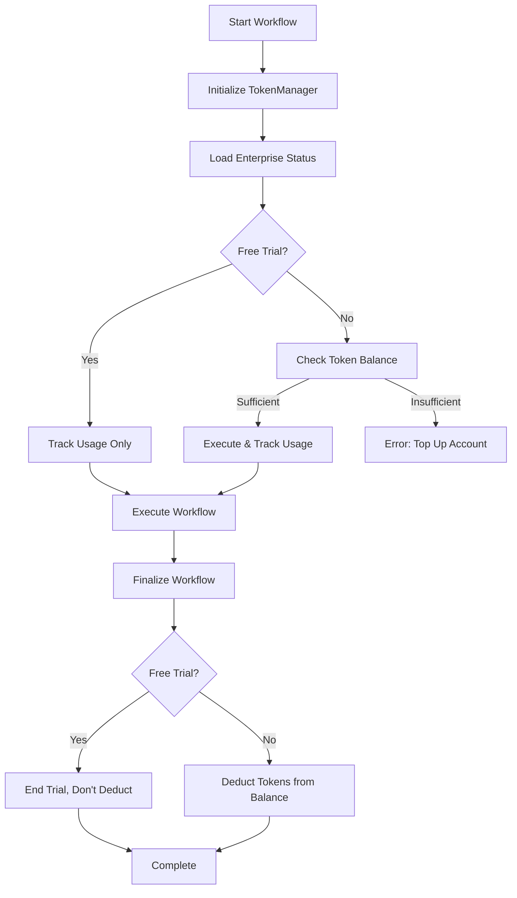

# MozaiksAI Token Management System

## Overview

MozaiksAI uses a **simplified usage-based token system** with **free trial support** for managing workflow executions. This system is designed to be integrated into any application that uses MozaiksAI workflows.

## Core Principles

### 🎯 **Simple & Flexible**
- **Always tracks token usage** for analytics and monitoring
- **One flag controls billing**: `free_trial` (true/false)
- **Usage-based pricing**: Pay only for tokens consumed
- **Clear error messages**: "You're out of tokens. Please top up your account."

### 💰 **Billing Model**
- **Free Trial**: Tracks usage but doesn't deduct tokens
- **Post-Trial**: Deducts tokens from `available_tokens` balance
- **No complex tiers** or loop counting
- **Scales automatically** with usage

---

## How It Works

### 1. Enterprise Setup

Each enterprise (organization) has:
```json
{
  "enterprise_id": "unique_id",
  "free_trial": true,           // Controls billing behavior
  "available_tokens": 0,        // Token balance for paid usage
  "total_tokens_used": 0,       // Analytics: lifetime usage
  "total_cost_incurred": 0.0    // Analytics: lifetime cost
}
```

### 2. Workflow Execution Flow



### 3. Token Tracking

**Always Tracked (regardless of trial status):**
- Prompt tokens consumed
- Completion tokens consumed  
- Total cost incurred
- Per-agent token breakdown
- Session-level analytics

**Database Schema:**
```json
{
  "Sessions": [{
    "session_id": "uuid",
    "PromptTokens": 150,
    "CompletionTokens": 75,
    "TotalCost": 0.0045,
    "agents": {
      "Agent1": {"PromptTokens": 100, "CompletionTokens": 50, "TotalCost": 0.003},
      "Agent2": {"PromptTokens": 50, "CompletionTokens": 25, "TotalCost": 0.0015}
    }
  }],
  "WorkflowTokenUsage": {
    "TotalPromptTokens": 150,
    "TotalCompletionTokens": 75,
    "TotalWorkflowCost": 0.0045,
    "agents": {
      "Agent1": {"TotalPromptTokens": 100, "TotalCompletionTokens": 50},
      "Agent2": {"TotalPromptTokens": 50, "TotalCompletionTokens": 25}
    }
  }
}
```

---

## Integration Guide

### For Application Developers

#### 1. Basic Setup

```python
from core.data.token_manager import TokenManager

# Initialize for workflow
token_manager = TokenManager(
    chat_id="unique_chat_id",
    enterprise_id="customer_enterprise_id", 
    workflow_name="your_workflow_name",
    user_id="optional_user_id"
)

# Load enterprise status and token balance
budget_result = await token_manager.initialize_budget()
if not budget_result["success"]:
    return {"error": budget_result["error"]}

print(f"Free Trial: {budget_result['is_free_trial']}")
print(f"Available Tokens: {budget_result['available_tokens']}")
```

#### 2. During Workflow Execution

```python
# Before expensive operations (optional pre-check)
can_continue, error_msg = await token_manager.check_token_balance(estimated_tokens=100)
if not can_continue:
    return {"error": error_msg}

# After each workflow step
usage_result = await token_manager.update_usage(your_ag2_agents)
if not usage_result["success"]:
    logger.error(f"Failed to track usage: {usage_result['error']}")

# Check current usage
summary = token_manager.get_usage_summary()
print(f"Tokens used this session: {summary['session_usage']['total_tokens']}")
```

#### 3. Complete Workflow

```python
# When workflow finishes
finalization_result = await token_manager.finalize_conversation()

if finalization_result["success"]:
    if finalization_result.get("trial_ended"):
        # Show trial completion message
        return {
            "message": finalization_result["message"],
            "trial_usage": {
                "tokens": finalization_result["tokens_used_in_trial"],
                "cost": finalization_result["cost_incurred_in_trial"]
            }
        }
    else:
        # Show usage summary for paid account
        return {
            "tokens_deducted": finalization_result["tokens_deducted"],
            "remaining_tokens": finalization_result["remaining_tokens"]
        }
else:
    # Handle errors
    if finalization_result.get("error") == "insufficient_tokens":
        return {"error": finalization_result["message"]}
```

### 4. Error Handling

```python
from core.data.token_manager import InsufficientTokensError

try:
    # Your workflow execution
    result = await run_workflow_with_token_management()
except InsufficientTokensError as e:
    return {
        "error": "insufficient_tokens",
        "message": str(e),
        "action": "redirect_to_billing"
    }
```

---

## User Experience

### Free Trial Users

1. **First workflow**: Automatically granted free trial
2. **During trial**: All usage tracked but no tokens deducted
3. **Trial completion**: 
   ```
   "Free trial completed! Please add tokens to your account to continue using workflows."
   ```
4. **Analytics available**: View token usage during trial

### Paid Users

1. **Pre-execution**: Balance validation (optional)
2. **During execution**: Real-time usage tracking
3. **Insufficient tokens**: 
   ```
   "You're out of tokens. Please top up your account."
   ```
4. **Completion**: Token deduction and remaining balance shown

---

## API Integration

### Mock API (Development)

The system includes mock data for testing:

```python
# Mock enterprise data
MOCK_ENTERPRISE_DATA = {
    "enterprise_new": {"free_trial": True, "available_tokens": 0},
    "enterprise_trial_ended": {"free_trial": False, "available_tokens": 50000},
    "enterprise_no_tokens": {"free_trial": False, "available_tokens": 0},
    "test_enterprise": {"free_trial": True, "available_tokens": 0}
}
```

### Production API

Replace mock with your token management API:

```python
# In production, set USE_MOCK_API = False
USE_MOCK_API = False

# Implement these endpoints:
# GET /api/enterprises/{enterprise_id}/status
# POST /api/enterprises/{enterprise_id}/deduct_tokens
# GET /api/enterprises/{enterprise_id}/balance
```

---

## Configuration

### Environment Variables

```bash
# API Configuration
TOKENS_API_URL=https://your-api.com
USE_MOCK_API=false

# Database
MONGODB_CONNECTION_STRING=mongodb://localhost:27017
MONGODB_DATABASE=mozaiks_ai
```

### Customization

```python
# Adjust token cost calculations
def calculate_token_cost(prompt_tokens: int, completion_tokens: int) -> float:
    # Your pricing model
    return (prompt_tokens * 0.00002) + (completion_tokens * 0.00006)

# Custom trial validation
def is_enterprise_eligible_for_trial(enterprise_id: str) -> bool:
    # Your business logic
    return check_trial_eligibility(enterprise_id)
```

---

## Benefits for Users

### 🎁 **Free Trial**
- **Try before you buy**: Experience workflows without payment
- **No credit card required**: Start immediately
- **Full feature access**: No artificial limitations
- **Usage analytics**: Understand your consumption patterns

### 💳 **Flexible Pricing**
- **Pay for what you use**: No monthly subscriptions
- **Transparent costs**: Real-time usage tracking
- **Scalable**: Automatic scaling with your needs
- **Predictable**: Clear token-to-cost mapping

### 🔧 **Developer Friendly**
- **Simple integration**: 4-line setup
- **Comprehensive tracking**: Per-agent analytics
- **Error handling**: Clear error messages
- **Testing support**: Mock API included

---

## FAQ

### Q: How do I add tokens to an enterprise account?
A: Implement your payment flow that calls your API to update the `available_tokens` field for the enterprise.

### Q: Can I customize the trial experience?
A: Yes, modify the mock data or implement custom trial validation logic in your API.

### Q: How do I handle multiple workflows per user?
A: Each workflow creates a separate `TokenManager` instance. The system automatically aggregates usage at the enterprise level.

### Q: What happens if a workflow fails mid-execution?
A: Tokens are only deducted on successful `finalize_conversation()`. Failed workflows don't charge the user.

### Q: How do I implement usage analytics?
A: All usage is stored in the database with session and agent-level breakdowns. Query the `Sessions` and `WorkflowTokenUsage` collections.

---

## Support

For implementation questions or customization needs, refer to:
- `/docs/AG2_WEBSOCKET_STREAMING_GUIDE.md` - AG2 WebSocket & streaming integration
- `/docs/PERSISTENCE_AND_RESUME.md` - Database schema details
- `/core/data/token_manager.py` - Source code implementation

The token management system is designed to be **simple, transparent, and developer-friendly** while providing **comprehensive usage tracking** and **flexible billing options**.
