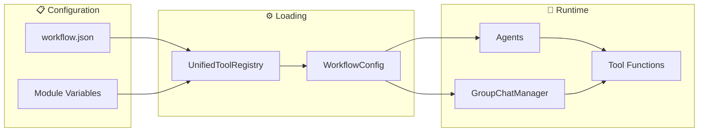

# Tool System Documentation

## Purpose
This document explains MozaiksAI's hybrid tool registration system, which combines workflow.json configuration with AG2-compatible module-level variables. This provides both centralized management and full AG2 compatibility.

---

## System Architecture



---

## Hybrid Configuration Approach

Our system supports **both** configuration methods for maximum flexibility:

### 1. Workflow.json Configuration (Centralized Management)
Define tools in workflow.json for centralized configuration management.

### 2. AG2 Module-Level Variables (AG2 Compatibility)
Use module-level variables for AG2-standard tool configuration that overrides workflow.json.

**Priority**: Module-level variables take precedence over workflow.json when both are present.

---

## Tool Types

### 1. Agent Tools
Tools registered directly with individual agents for use during conversations.

**Supported `apply_to` values:**
- `"all"` - Register on every agent
- `"specific_agent_name"` - Register on a specific agent by name
- `["agent1", "agent2"]` - Register on a list of specific agents

### 2. Lifecycle Hooks
Tools triggered by group chat events and lifecycle hooks.

**Supported `trigger` values:**
- `"on_start"` - Runs once at the beginning of group chat
- `"on_end"` - Runs once at the end of group chat
- `"after_each_agent"` - Runs after every agent message

**Optional `trigger_agent`:**
- Can be combined with `after_each_agent` to trigger only for specific agents

---

## Configuration Structure

## Configuration Examples

### Example 1: Workflow.json Configuration
```json
{
  "workflow_name": "Generator",
  "tools": {
    "agent_tools": [
      {
        "name": "echo_all",
        "module": "workflows.Generator.tools.echo_all",
        "function": "echo",
        "apply_to": "all",
        "description": "Simple echo tool for all agents",
        "enabled": true
      }
    ],
    "lifecycle_hooks": [
      {
        "name": "after_agent_echo",
        "module": "workflows.Generator.tools.after_agent_echo",
        "function": "echo_after_each",
        "trigger": "after_each_agent",
        "description": "Logs after every agent message",
        "enabled": true
      }
    ]
  }
}
```

### Example 2: AG2 Module-Level Variables (Overrides workflow.json)
```python
# workflows/Generator/tools/echo_all.py
from typing import Annotated

# AG2-compatible configuration (takes precedence over workflow.json)
APPLY_TO = "all"

def echo(message: Annotated[str, "The message to echo"]) -> str:
    """Simple echo tool that returns the input message."""
    return f"Echo: {message}"
```

```python
# workflows/Generator/tools/after_agent_echo.py
from typing import Any, List, Dict

# AG2-compatible lifecycle hook configuration
TRIGGER = "after_each_agent"

def echo_after_each(manager: Any, message_history: List[Dict[str, Any]]) -> None:
    """Log information after each agent message."""
    # Hook implementation here
    pass
```

### Example 3: Agent-Specific Hook
```python
# workflows/Generator/tools/after_orchestrator_echo.py
from typing import Any, List, Dict

# AG2-compatible agent-specific hook
TRIGGER = "after_each_agent"
TRIGGER_AGENT = "OrchestratorAgent"  # Only trigger for this agent

def echo_after_orchestrator(manager: Any, message_history: List[Dict[str, Any]]) -> None:
    """Log information after OrchestratorAgent messages only."""
    # Hook implementation here
    pass
```
```

---

## Tool Registration Flow

1. **Workflow Loading**: `WorkflowConfig` reads tools from `workflow.json`
2. **Function Import**: Each tool's module and function are dynamically imported by `SimpleToolLoader`
3. **Tool Registration**:
   - Agent tools are registered with specific agents based on `apply_to`
   - Lifecycle hooks are registered as hooks based on `trigger`
4. **Execution**: Tools are called during conversation flow

### Example Registration Code
```python
# In workflows/Generator/Hooks.py
from .simple_tool_loader import load_tools_from_workflow

def discover_all_tools():
    tools = load_tools_from_workflow(WORKFLOW_TYPE)
    return {
        "AgentTools": {tool["name"]: tool for tool in tools["agent_tools"]},
        "GroupchatTools": {hook["name"]: hook for hook in tools["lifecycle_hooks"]}
    }

# Tools are automatically registered during workflow initialization
tools = discover_all_tools()
register_agent_tools(agents, tools["AgentTools"])
register_groupchat_hooks(group_chat_manager, tools["GroupchatTools"])
```

---

## Tool Function Structure

### AgentTool Example
```python
# workflows/Generator/tools/echo_all.py
def echo(message: str) -> str:
    """Simple echo tool that returns the input message"""
    return f"Echo: {message}"
```

### GroupchatTool Example
```python
# workflows/Generator/tools/after_agent_echo.py
def echo_after_each(sender, recipient, message, **kwargs):
    """Runs after every agent message and logs details"""
    print(f"[HOOK] {sender.name} -> {recipient.name}: {len(message)} chars")
    return message
```

---

## Current Implementation Status

### ✅ Working Features
- **Hybrid Configuration**: Both workflow.json and AG2 module-level variables supported
- **AG2 Compatibility**: Full compliance with AG2 tool patterns and conventions
- **Centralized Management**: workflow.json for platform-wide tool configuration
- **Module Override**: AG2 variables override workflow.json for compatibility
- **Type Annotations**: Full support for AG2 Annotated types for LLM guidance
- **Flexible Registration**: Agent tools with apply_to patterns and lifecycle hooks with triggers

### 📋 Configuration Priority
1. **Module-level variables** (APPLY_TO, TRIGGER, TRIGGER_AGENT) take precedence
2. **workflow.json** values used when module variables not present
3. **Enables both** centralized platform management and AG2 standard compliance

---

## AG2 LLM Guidance System

### How AG2 Uses Tool Metadata for LLM Decision Making

AG2 automatically extracts function metadata and sends it to the LLM as part of the tool schema. This enables the LLM to make intelligent decisions about **when** and **how** to use tools.

#### 1. Type Annotations → LLM Parameter Descriptions
```python
from typing import Annotated

def check_weather(
    city: Annotated[str, "The city name to check weather for"],
    units: Annotated[str, "Temperature units: 'celsius' or 'fahrenheit'"] = "celsius"
) -> str:
    """Get current weather information for a specified city."""
```

**What the LLM receives:**
```json
{
  "name": "check_weather",
  "parameters": {
    "city": {"type": "string", "description": "The city name to check weather for"},
    "units": {"type": "string", "description": "Temperature units: 'celsius' or 'fahrenheit'"}
  }
}
```

#### 2. Docstrings → LLM Tool Descriptions
The function docstring becomes the tool description that helps the LLM decide **when** to use the tool:

```python
def check_weather(...):
    """Get current weather information for a specified city.
    
    Use this tool when the user asks about weather conditions,
    temperature, or forecast for any location."""
```

#### 3. Best Practices for LLM-Friendly Tools

**✅ Good Example:**
```python
from typing import Annotated

def analyze_sentiment(
    text: Annotated[str, "The text content to analyze for emotional sentiment"],
    include_confidence: Annotated[bool, "Whether to include confidence scores"] = False
) -> str:
    """Analyze the emotional sentiment of text content.
    
    Use this tool when users want to understand the emotional tone,
    mood, or sentiment expressed in text, messages, or documents.
    Returns sentiment classification (positive/negative/neutral).
    """
```

**❌ Avoid This:**
```python
def analyze_sentiment(text, include_confidence=False):
    """Analyzes stuff."""  # Too vague for LLM!
    # No type hints = LLM doesn't know parameter expectations
```

#### 4. Why This Matters
- **Tool Selection**: Clear descriptions help LLM choose the RIGHT tool
- **Parameter Accuracy**: Type annotations help LLM provide properly formatted arguments  
- **User Experience**: Better tool selection = more accurate AI responses
- **Debugging**: Unclear descriptions can be traced when tools are called incorrectly

---

## AG2 Compatibility Benefits

### Why Module-Level Variables Are Important

1. **AG2 Standard**: Follows official AG2 documentation patterns
2. **Type Safety**: Works with AG2's function registration system
3. **LLM Guidance**: Type annotations provide clear parameter descriptions to LLM
4. **Flow Control**: Tools can return ReplyResult for conversation control
5. **Direct Registration**: Compatible with `functions=[tool_func]` pattern

### Best Practices for AG2 Compatibility

```python
# ✅ Good: AG2-compatible tool
from typing import Annotated

APPLY_TO = "all"  # or ["AgentName"] or "AgentName"

def my_tool(
    param: Annotated[str, "Clear description for LLM"]
) -> str:
    """Clear docstring describing what the tool does."""
    return result

# ✅ Good: AG2-compatible lifecycle hook
TRIGGER = "after_each_agent"
TRIGGER_AGENT = "SpecificAgent"  # Optional for agent-specific hooks

def my_hook(manager: Any, message_history: List[Dict[str, Any]]) -> None:
    """Hook that runs after agent messages."""
    pass
```

---

### Adding AG2 Compatibility to Existing Tools

```python
# Before (workflow.json only)
def echo(message):
    return f"Echo: {message}"

# After (AG2 compatible)
from typing import Annotated

APPLY_TO = "all"  # AG2 module-level configuration

def echo(message: Annotated[str, "Message to echo"]) -> str:
    """Echo the input message back to the caller."""
    return f"Echo: {message}"
```

---

## Suggestions & Future Enhancements

- **Tool Validation**: Add JSON schema validation for workflow.json tool structure
- **Hot Reload**: Enable tool reloading without workflow restart
- **Tool Dependencies**: Support tool dependency graphs and ordered execution
- **Tool Metadata**: Add versioning, author, and category fields
- **Tool Testing**: Automated testing framework for tool functions
- **Tool Documentation**: Auto-generate tool docs from workflow.json + docstrings

---

## Related Documentation

- **[UNIFIED_TOOL_AND_UI_SYSTEM.md](./UNIFIED_TOOL_AND_UI_SYSTEM.md)** - How backend tools and frontend UI components work together
- **[WORKFLOW_CONFIG.md](./WORKFLOW_CONFIG.md)** - Complete workflow.json configuration reference

---

## Status
This document reflects the current Hybrid Tool System as implemented in July 2025. The system combines workflow.json centralized configuration with AG2-compatible module-level variables, providing both platform management benefits and full AG2 standard compliance with LLM guidance capabilities.
