# Tool Manifest System

## Purpose
This document explains MozaiksAI's manifest-based tool registration system, which replaces legacy module-level variables with centralized JSON configuration. It covers tool types, registration patterns, and lifecycle hooks.

---

## System Architecture

```mermaid
flowchart LR
    subgraph Config["📋 Configuration"]
        TM[tool_manifest.json]
        WJ[workflow.json]
    end
    
    subgraph Loading["⚙️ Loading"]
        MTL[ManifestToolLoader]
        H[Hooks.py]
    end
    
    subgraph Runtime["🚀 Runtime"]
        A[Agents]
        GCM[GroupChatManager]
        TF[Tool Functions]
    end
    
    TM --> MTL
    WJ --> MTL
    MTL --> H
    H --> A
    H --> GCM
    A --> TF
    GCM --> TF
```



---

## Tool Types

### 1. AgentTools
Tools registered directly with individual agents for use during conversations.

**Supported `apply_to` values:**
- `"all"` - Register on every agent
- `"specific_agent_name"` - Register on a specific agent by name
- `["agent1", "agent2"]` - Register on a list of specific agents
- `"manager"` - Register on the manager agent only

### 2. GroupchatTools
Tools triggered by group chat events and lifecycle hooks.

**Supported `trigger` values:**
- `"on_start"` - Runs once at the beginning of group chat
- `"on_end"` - Runs once at the end of group chat
- `"after_each_agent"` - Runs after every agent message
- `"before_each_agent"` - Runs before every agent message (future)
- `"after_all_agents"` - Runs after all agents have responded (future)

**Optional `trigger_agent`:**
- Can be combined with `after_each_agent` to trigger only for specific agents

---

## Configuration Structure

### tool_manifest.json
```json
{
  "AgentTools": [
    {
      "name": "echo_all",
      "module": "workflows.Generator.tools.echo_all",
      "function": "echo",
      "apply_to": "all",
      "description": "Simple echo tool registered for every agent",
      "enabled": true
    },
    {
      "name": "echo_ctx_only",
      "module": "workflows.Generator.tools.echo_ctx_only",
      "function": "echo_context",
      "apply_to": ["ContextVariablesAgent"],
      "description": "Echo tool registered only for ContextVariablesAgent",
      "enabled": true
    }
  ],
  "GroupchatTools": [
    {
      "name": "after_agent_echo",
      "module": "workflows.Generator.tools.after_agent_echo",
      "function": "echo_after_each",
      "trigger": "after_each_agent",
      "description": "Runs after every agent message and logs sender + char count",
      "enabled": true
    },
    {
      "name": "after_orchestrator_echo",
      "module": "workflows.Generator.tools.after_orchestrator_echo",
      "function": "echo_after_orchestrator",
      "trigger": "after_each_agent",
      "trigger_agent": "OrchestratorAgent",
      "description": "Runs after OrchestratorAgent messages only",
      "enabled": true
    }
  ]
}
```

---

## Tool Registration Flow

1. **Manifest Loading**: `ManifestToolLoader` reads `tool_manifest.json`
2. **Function Import**: Each tool's module and function are dynamically imported
3. **Tool Registration**:
   - AgentTools are registered with specific agents based on `apply_to`
   - GroupchatTools are registered as hooks based on `trigger`
4. **Execution**: Tools are called during conversation flow

### Example Registration Code
```python
# In workflows/Generator/Hooks.py
def discover_all_tools():
    loader = ManifestToolLoader("tool_manifest.json")
    return {
        "AgentTools": loader.get_agent_tools(),
        "GroupchatTools": loader.get_groupchat_tools()
    }

# Tools are automatically registered during workflow initialization
tools = discover_all_tools()
register_agent_tools(agents, tools["AgentTools"])
register_groupchat_hooks(group_chat_manager, tools["GroupchatTools"])
```

---

## Tool Function Structure

### AgentTool Example
```python
# workflows/Generator/tools/echo_all.py
def echo(message: str) -> str:
    """Simple echo tool that returns the input message"""
    return f"Echo: {message}"
```

### GroupchatTool Example
```python
# workflows/Generator/tools/after_agent_echo.py
def echo_after_each(sender, recipient, message, **kwargs):
    """Runs after every agent message and logs details"""
    print(f"[HOOK] {sender.name} -> {recipient.name}: {len(message)} chars")
    return message
```

---

## Current Implementation Status

### ✅ Working Features
- Manifest-based tool loading and registration
- AgentTools with flexible `apply_to` patterns
- GroupchatTools with lifecycle hooks
- Dynamic tool discovery from JSON configuration
- Tool enabling/disabling via `enabled` flag

### 📋 Configuration Files
- **tool_manifest.json**: Tool registration patterns
- **workflow.json**: Workflow settings and agent definitions

---

## Suggestions & Future Enhancements

- **Tool Validation**: Add JSON schema validation for tool manifest structure
- **Hot Reload**: Enable tool reloading without workflow restart
- **Tool Dependencies**: Support tool dependency graphs and ordered execution
- **Tool Metadata**: Add versioning, author, and category fields
- **Tool Testing**: Automated testing framework for tool functions
- **Tool Documentation**: Auto-generate tool docs from manifest + docstrings

---

## Status
This document reflects the current Tool Manifest System as implemented in July 2025. All legacy module-level tool registration has been removed in favor of the manifest-based approach described above.
