# Tool System Documentation

## Purpose
This document explains MozaiksAI's hybrid tool registration system, which combines workflow.json configuration with AG2-compatible module-level variables. This provides both centralized management and full AG2 compatibility.

---

## System Architecture

```mermaid
flowchart LR
    subgraph Config["📋 Configuration"]
        WJ[workflow.json]
        TM[Tool Modules]
    end
    
    subgraph Core["⚙️ Core System"]
        WC[WorkflowConfig]
        TL[core/workflow/tool_loader.py]
    end
    
    subgraph Runtime["🚀 Runtime"]
        A[Agents]
        GCM[GroupChatManager]
        TF[Tool Functions]
    end
    
    WJ --> TL
    TM --> TL
    TL --> WC
    WC --> A
    WC --> GCM
    A --> TF
    GCM --> TF
```



---

## Simplified Configuration Approach

Our system uses **workflow.json** as the single source of truth for tool configuration, with the core system handling all registration automatically.

### Core Tool Loading System
- **Location**: `core/workflow/tool_loader.py` (universal, workflow-agnostic)
- **Configuration**: `workflow.json` in each workflow folder
- **Registration**: Automatic AG2-compatible registration using `register_for_execution` and `register_for_llm`
- **Lifecycle Hooks**: Automatic registration using AG2's `register_hook` system

---

## Tool Types

### 1. Agent Tools
Tools registered directly with individual agents for use during conversations.

**Supported `apply_to` values:**
- `"all"` - Register on every agent
- `"specific_agent_name"` - Register on a specific agent by name
- `["agent1", "agent2"]` - Register on a list of specific agents

### 2. Lifecycle Hooks
Tools triggered by group chat events and lifecycle hooks.

### Supported AG2 Lifecycle Hooks
AG2 provides several built-in hooks that can be registered with agents:

**Available Hook Names:**
- `"update_agent_state"` - Called to update agent state before replying
- `"process_message_before_send"` - Called before sending a message
- `"process_all_messages_before_reply"` - Called before generating a reply to process all messages
- `"process_last_received_message"` - Called to process the most recent received message

**Note**: Lifecycle hooks are registered directly with individual agents, not the GroupChatManager.

---

## Configuration Structure

## Configuration Examples

### Example 1: Workflow.json Configuration
```json
{
  "workflow_name": "Generator",
  "tools": {
    "agent_tools": [
      {
        "name": "echo_all",
        "module": "workflows.Generator.tools.echo_all",
        "function": "echo",
        "apply_to": "all",
        "description": "Simple echo tool for all agents",
        "enabled": true
      }
    ],
    "lifecycle_hooks": [
      {
        "name": "after_agent_echo",
        "module": "workflows.Generator.tools.after_agent_echo",
        "function": "echo_after_each",
        "trigger": "after_each_agent",
        "description": "Logs after every agent message",
        "enabled": true
      }
    ]
  }
}
```

### Example 1: Complete Workflow.json Configuration
```json
{
  "workflow_name": "Generator",
  "tools": {
    "agent_tools": [
      {
        "name": "echo_all",
        "module": "workflows.Generator.tools.echo_all",
        "function": "echo",
        "apply_to": "all",
        "description": "Simple echo tool for all agents",
        "enabled": true
      },
      {
        "name": "weather_check",
        "module": "workflows.Generator.tools.weather",
        "function": "check_weather",
        "apply_to": ["WeatherAgent"],
        "description": "Check weather for a city",
        "enabled": true
      }
    ],
    "lifecycle_hooks": [
      {
        "name": "message_processor",
        "module": "workflows.Generator.tools.message_processor",
        "function": "process_message",
        "trigger": "process_last_received_message",
        "apply_to": ["OrchestratorAgent"],
        "description": "Process messages before reply",
        "enabled": true
      }
    ]
  }
}
```

### Example 2: Tool Module with AG2 Annotations
```python
# workflows/Generator/tools/echo_all.py
from typing import Annotated

def echo(message: Annotated[str, "The message to echo back"]) -> str:
    """Simple echo tool that returns the input message.
    
    Use this tool when you need to repeat or confirm information.
    """
    return f"Echo: {message}"
```

### Example 3: Lifecycle Hook Module
```python
# workflows/Generator/tools/message_processor.py
from typing import Any, List, Dict

def process_message(
    sender: Any,
    message: Dict[str, Any],
    recipient: Any,
    request_reply: bool = False,
    silent: bool = False,
    sender_type: str = "agent"
) -> Dict[str, Any]:
    """Process the last received message before generating a reply.
    
    This hook allows preprocessing of messages before the agent responds.
    """
    # Process the message
    processed_message = message.copy()
    processed_message["processed"] = True
    
    return processed_message
```
```

---

## Tool Registration Flow

1. **Workflow Loading**: `WorkflowConfig` reads tools from `workflow.json`
2. **Core Tool Loading**: `core/workflow/tool_loader.py` imports modules and functions
3. **AG2 Registration**:
   - Agent tools: `agent.register_for_execution()` and `agent.register_for_llm()`
   - Lifecycle hooks: `agent.register_hook(hook_name, function)`
4. **Execution**: Tools and hooks are called during conversation flow

### Example Registration Code
```python
# In workflows/Generator/Agents.py
from core.workflow.tool_loader import load_tools_from_workflow, register_agent_tools, register_lifecycle_hooks

def define_agents():
    # Create agents...
    
    # Load and register tools automatically
    tools_data = load_tools_from_workflow("generator")
    agent_tools = tools_data.get("agent_tools", [])
    lifecycle_hooks = tools_data.get("lifecycle_hooks", [])
    
    # Register with AG2's proper methods
    register_agent_tools(agents, agent_tools)
    register_lifecycle_hooks(agents, lifecycle_hooks)  # Note: hooks go to agents, not manager
```

---

## Tool Function Structure

### AgentTool Example
```python
# workflows/Generator/tools/echo_all.py
def echo(message: str) -> str:
    """Simple echo tool that returns the input message"""
    return f"Echo: {message}"
```

### GroupchatTool Example
```python
# workflows/Generator/tools/after_agent_echo.py
def echo_after_each(sender, recipient, message, **kwargs):
    """Runs after every agent message and logs details"""
    print(f"[HOOK] {sender.name} -> {recipient.name}: {len(message)} chars")
    return message
```

---

## Current Implementation Status

### ✅ Working Features
- **Centralized Configuration**: workflow.json as single source of truth
- **Core Tool Loading**: Universal `core/workflow/tool_loader.py` for all workflows
- **AG2 Compatibility**: Full compliance with AG2 tool and hook registration
- **Automatic Registration**: Tools and hooks are registered automatically during agent creation
- **Type Annotations**: Full support for AG2 Annotated types for LLM guidance
- **Flexible Application**: Agent tools with apply_to patterns for targeted registration
- **Lifecycle Hooks**: AG2-compatible hook registration with individual agents

### 📋 Simplified Architecture
- **No workflow-specific files**: All tool loading handled by core system
- **Configuration-driven**: Everything defined in workflow.json
- **AG2 Standard**: Uses proper AG2 registration methods (`register_for_execution`, `register_for_llm`, `register_hook`)
- **Automatic Discovery**: Core system discovers and loads tools without custom logic

---

## AG2 LLM Guidance System

### How AG2 Uses Tool Metadata for LLM Decision Making

AG2 automatically extracts function metadata and sends it to the LLM as part of the tool schema. This enables the LLM to make intelligent decisions about **when** and **how** to use tools.

#### 1. Type Annotations → LLM Parameter Descriptions
```python
from typing import Annotated

def check_weather(
    city: Annotated[str, "The city name to check weather for"],
    units: Annotated[str, "Temperature units: 'celsius' or 'fahrenheit'"] = "celsius"
) -> str:
    """Get current weather information for a specified city."""
```

**What the LLM receives:**
```json
{
  "name": "check_weather",
  "parameters": {
    "city": {"type": "string", "description": "The city name to check weather for"},
    "units": {"type": "string", "description": "Temperature units: 'celsius' or 'fahrenheit'"}
  }
}
```

#### 2. Docstrings → LLM Tool Descriptions
The function docstring becomes the tool description that helps the LLM decide **when** to use the tool:

```python
def check_weather(...):
    """Get current weather information for a specified city.
    
    Use this tool when the user asks about weather conditions,
    temperature, or forecast for any location."""
```

#### 3. Best Practices for LLM-Friendly Tools

**✅ Good Example:**
```python
from typing import Annotated

def analyze_sentiment(
    text: Annotated[str, "The text content to analyze for emotional sentiment"],
    include_confidence: Annotated[bool, "Whether to include confidence scores"] = False
) -> str:
    """Analyze the emotional sentiment of text content.
    
    Use this tool when users want to understand the emotional tone,
    mood, or sentiment expressed in text, messages, or documents.
    Returns sentiment classification (positive/negative/neutral).
    """
```

**❌ Avoid This:**
```python
def analyze_sentiment(text, include_confidence=False):
    """Analyzes stuff."""  # Too vague for LLM!
    # No type hints = LLM doesn't know parameter expectations
```

#### 4. Why This Matters
- **Tool Selection**: Clear descriptions help LLM choose the RIGHT tool
- **Parameter Accuracy**: Type annotations help LLM provide properly formatted arguments  
- **User Experience**: Better tool selection = more accurate AI responses
- **Debugging**: Unclear descriptions can be traced when tools are called incorrectly

---

## AG2 Compatibility Benefits

### Why Our System Works Well with AG2

1. **AG2 Standard Registration**: Uses official `register_for_execution` and `register_for_llm` methods
2. **Type Safety**: Compatible with AG2's function registration system
3. **LLM Guidance**: Type annotations provide clear parameter descriptions to LLM
4. **Hook Integration**: Uses AG2's built-in `register_hook` system
5. **Tool Discovery**: Compatible with AG2's function introspection

### Best Practices for AG2 Compatibility

```python
# ✅ Good: AG2-compatible tool with proper annotations
from typing import Annotated

def my_tool(
    param: Annotated[str, "Clear description for LLM guidance"],
    optional_param: Annotated[int, "Optional parameter description"] = 10
) -> str:
    """Clear docstring describing exactly what the tool does and when to use it.
    
    The LLM will use this description to decide when to call this tool.
    """
    return f"Processed: {param} with value {optional_param}"

# ✅ Good: AG2-compatible lifecycle hook
def my_hook(
    sender: Any,
    message: Dict[str, Any],
    recipient: Any,
    request_reply: bool = False,
    silent: bool = False,
    sender_type: str = "agent"
) -> Dict[str, Any]:
    """Hook that processes messages using AG2's standard hook signature."""
    # Process and return the message
    return message
```

---

### Adding Tools to Existing Workflows

```python
# 1. Create the tool function with AG2 annotations
# workflows/MyWorkflow/tools/my_new_tool.py
from typing import Annotated

def my_new_tool(
    input_text: Annotated[str, "Text to process"]
) -> str:
    """Process input text and return a result.
    
    Use this tool when you need to process or transform text.
    """
    return f"Processed: {input_text}"

# 2. Add to workflow.json
{
  "tools": {
    "agent_tools": [
      {
        "name": "my_new_tool",
        "module": "workflows.MyWorkflow.tools.my_new_tool",
        "function": "my_new_tool",
        "apply_to": "all",
        "description": "Process input text",
        "enabled": true
      }
    ]
  }
}

# 3. Tool is automatically registered when workflow loads!
```

---

## Suggestions & Future Enhancements

- **Tool Validation**: Add JSON schema validation for workflow.json tool structure
- **Hot Reload**: Enable tool reloading without workflow restart
- **Tool Dependencies**: Support tool dependency graphs and ordered execution
- **Tool Metadata**: Add versioning, author, and category fields
- **Tool Testing**: Automated testing framework for tool functions
- **Tool Documentation**: Auto-generate tool docs from workflow.json + docstrings

---

## Related Documentation

- **[UNIFIED_TOOL_AND_UI_SYSTEM.md](./UNIFIED_TOOL_AND_UI_SYSTEM.md)** - How backend tools and frontend UI components work together
- **[WORKFLOW_CONFIG.md](./WORKFLOW_CONFIG.md)** - Complete workflow.json configuration reference

---

## Status
This document reflects the current Simplified Tool System as implemented in July 2025. The system uses workflow.json as the single source of truth with a universal core tool loader (`core/workflow/tool_loader.py`) that provides automatic AG2-compatible tool and hook registration for all workflows.
