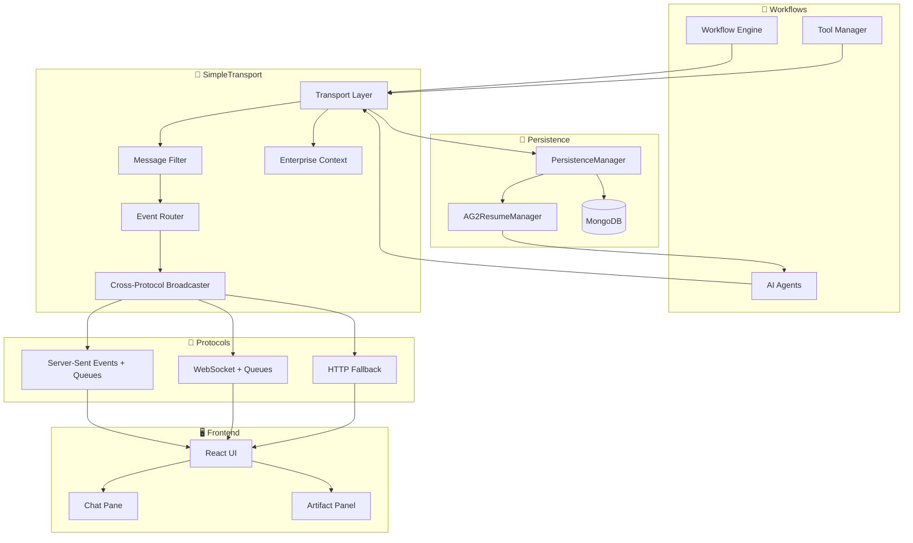

# Transport & Events System

## Purpose
This document describes the **production-ready unified transport and event system** powering MozaiksAI's backend-to-frontend communication. It covers the `SimpleTransport` architecture, cross-protocol broadcasting, event types, message filtering, AG2 groupchat resume functionality, and enterprise context management.

---

## System Architecture



### Component Responsibilities

#### 🔄 Workflows
- **Workflow Engine**: Orchestrates agent execution and lifecycle with enterprise context
- **AI Agents**: Generate content and request UI components  
- **Tool Manager**: Handles tool registration and execution

#### 🚀 SimpleTransport (Production-Ready)
- **Transport Layer**: Unified communication manager with enterprise context
- **Message Filter**: Removes internal/coordination messages (AutoGen noise)
- **Event Router**: Directs events to appropriate protocols
- **Cross-Protocol Broadcaster**: Sends events to both SSE and WebSocket connections simultaneously
- **Enterprise Context**: Manages enterprise-specific routing and session handling

#### 📡 Protocols (Enhanced)
- **Server-Sent Events**: One-way streaming with asyncio.Queue-based event broadcasting
- **WebSocket**: Bidirectional real-time communication with unified event queue integration
- **HTTP Fallback**: Basic request-response for compatibility

#### 🖥️ Frontend
- **React UI**: Main application interface supporting both SSE and WebSocket
- **Chat Pane**: Conversational interface with inline components
- **Artifact Panel**: Full-screen components and generated content

#### 💾 Persistence
- **PersistenceManager**: Handles data storage operations with corrected database collections
- **AG2ResumeManager**: Manages groupchat state restoration
- **MongoDB**: Document storage for messages and state (autogen_ai_agents.Concepts)

---

## SimpleTransport (Production-Ready)
- **Location:** `core/transport/simple_transport.py`
- **Role:** Unified transport manager for all backend event transmission with enterprise context.
- **Features:**
  - **Cross-Protocol Broadcasting**: Events sent to both SSE and WebSocket connections simultaneously
  - **Enterprise Context Management**: `set_enterprise_context()` and `get_enterprise_context()` methods
  - **Real-time Event Queues**: asyncio.Queue-based broadcasting system for live updates
  - **Intelligent Connection Management**: Separate tracking of SSE vs WebSocket connections
  - **Production Message Filtering**: Removes AutoGen noise and coordination messages
  - **AG2 Groupchat Resume**: Full persistence and state restoration
  - **Graceful Error Handling**: Automatic cleanup of failed connections
  - **Unified Communication Channel**: `SimpleCommunicationChannelWrapper` for workflow integration

### Key Production Improvements
✅ **Cross-Protocol Events**: SSE and WebSocket clients receive identical event streams  
✅ **Memory Management**: Proper cleanup of SSE queues and WebSocket connections  
✅ **Enterprise Context**: Full support for multi-tenant deployments  
✅ **Real-time Broadcasting**: asyncio.Queue-based event system for live updates  

### Protocols Supported
- **SSE:** One-way, server-to-client streaming with real-time event broadcasting
- **WebSocket:** Bidirectional, real-time communication with unified event queue integration
- **Cross-Protocol:** Events broadcast to all connected clients regardless of connection type

---

## Event Types & Broadcasting
MozaiksAI uses seven core event types for all backend-to-frontend communication. **All events are broadcast to both SSE and WebSocket connections simultaneously**:

1. **CHAT_MESSAGE**: Standard conversational exchanges with agent filtering
2. **ROUTE_TO_ARTIFACT**: Content for artifact panel (code, files, visualizations)
3. **ROUTE_TO_CHAT**: Inline UI components in chat pane
4. **UI_TOOL_ACTION**: Interactive tool events and responses
5. **COMPONENT_ACTION**: Frontend-to-backend component interactions for AG2 ContextVariables
6. **STATUS**: System status updates, progress indicators, heartbeats
7. **ERROR**: Error conditions, validation failures

### Event Structure
All events include:
- `type`: Event type (see above)
- `data`: Flexible payload with chat_id context
- `timestamp`: ISO timestamp for ordering
- `agent_name`: Optional, for multi-agent workflows

### Component Actions (Frontend → Backend)
**COMPONENT_ACTION** events flow from frontend to backend for AG2 ContextVariables:

**WebSocket Flow:**
```javascript
// Frontend sends via WebSocket
{
  "type": "component_action",
  "component_id": "APIKeyInput_openai",
  "action_type": "submit", 
  "action_data": {"service": "openai", "hasApiKey": true}
}
```

**SSE Flow:**
```javascript
// Frontend sends via HTTP POST to /chat/{enterprise_id}/{chat_id}/component_action
fetch(`/chat/${enterpriseId}/${chatId}/component_action`, {
  method: 'POST',
  body: JSON.stringify({
    component_id: "APIKeyInput_openai",
    action_type: "submit",
    action_data: {"service": "openai", "hasApiKey": true}
  })
});
```

**Backend Processing (Both Paths):**
```python
# Both WebSocket and HTTP call the same AG2 tool
from workflows.Generator.ContextVariables import update_context_from_ui
result = update_context_from_ui(component_id, action_type, action_data, context_variables)
```

### Broadcasting Mechanism
- **SSE Connections**: Events added to `asyncio.Queue` and streamed as `data: {json}`
- **WebSocket Connections**: Events sent directly as JSON messages
- **Cross-Protocol**: Same event sent to all connection types for the target chat_id
- **Enterprise Context**: Events routed based on enterprise_id context

---

## Message Filtering (Production-Ready)
- **Purpose:** Ensures only user-appropriate messages reach the frontend.
- **Enhanced Logic:**
  - Blocks internal agent messages (`chat_manager`, `coordinator`, `groupchat_manager`)
  - Filters out coordination, handoff, and system messages
  - Removes short/empty content and AutoGen noise
  - Filters JSON structures and UUIDs
  - Formats agent names for UI display (CamelCase → Title Case)

---

## AG2 Groupchat Resume & Persistence (Enhanced)
- **Location:** `core/data/persistence_manager.py`, `core/transport/simple_transport.py`
- **Role:** Persists groupchat state and agent context for recovery across restarts.
- **Production Features:**
  - **Corrected Database Collections**: Uses `autogen_ai_agents.Concepts` (not `MozaiksDB.Concepts`)
  - **Graceful Enterprise Validation**: Handles missing enterprises without errors
  - **AG2-Compatible State Restoration**: Official AG2 groupchat.messages restoration
  - **Cross-Protocol Resume**: Works with both SSE and WebSocket connections
  - **Enterprise Context Integration**: Resume tied to enterprise_id context

---

## Enterprise Context Management (NEW)
- **Purpose:** Multi-tenant support with enterprise-specific session handling
- **Methods:**
  - `set_enterprise_context(enterprise_id)`: Set current enterprise context
  - `get_enterprise_context()`: Get current enterprise (defaults to 'default')
- **Integration:**
  - SSE streams automatically set enterprise context from URL parameters
  - WebSocket connections inherit enterprise context
  - Session creation uses enterprise context for proper data isolation
  - Workflow handlers receive correct enterprise_id from context

---

## Connection Management (Enhanced)
- **Intelligent Counting**: `get_connection_info()` accurately tracks SSE vs WebSocket
- **Cross-Protocol Cleanup**: Proper cleanup of both SSE queues and WebSocket objects
- **Memory Management**: Automatic queue cleanup when connections close
- **Error Recovery**: Failed WebSocket sends automatically mark connections as inactive

---

## Workflow Integration
- **Workflows** pass a `communication_channel` to agents and managers.
- **Agents** use this channel to send events, route UI components, and trigger tool actions.
- **Frontend** receives events and renders appropriate UI (chat, artifact, component).

---

## API Reference (Production-Ready)
### SimpleTransport Core Methods
- `send_to_ui(message, agent_name, message_type, chat_id, metadata)`: Send filtered messages to UI
- `send_error(error_message, error_code, chat_id)`: Send error events with broadcasting
- `send_status(status_message, status_type, chat_id)`: Send status updates with broadcasting
- `send_event(event_type, data, agent_name)`: Protocol compatibility method
- `send_ui_event(event_type, data)`: Send UI routing events with broadcasting

### Enterprise Context Management
- `set_enterprise_context(enterprise_id)`: Set current enterprise context
- `get_enterprise_context()`: Get current enterprise context (defaults to 'default')

### Connection Management
- `create_sse_stream(chat_id, user_id, workflow_type, enterprise_id)`: Create SSE with enterprise context
- `handle_websocket(websocket, chat_id, user_id, workflow_type, enterprise_id)`: Handle WebSocket with enterprise context
- `get_connection_info()`: Get accurate counts of SSE vs WebSocket connections
- `disconnect()`: Clean up all connections and queues

### Session & Persistence
- `create_session(chat_id, enterprise_id, check_resume)`: Create/resume session with enterprise context
- `save_groupchat_session(chat_id, enterprise_id, groupchat, manager)`: Save AG2 state
- `resume_groupchat_session(chat_id, enterprise_id, groupchat, manager)`: Resume AG2 state
- `get_resume_info(chat_id, enterprise_id)`: Check if session can be resumed

### Workflow Integration
- `handle_user_input_from_api(chat_id, user_id, workflow_type, message)`: Process user input through workflows

### MessageFilter
- `should_stream_message(sender_name, message_content, message_type)`: Production filtering logic
- `format_agent_name_for_ui(agent_name)`: UI name formatting (CamelCase → Title Case)

### Broadcasting System
- `_broadcast_to_sse(event_data, target_chat_id)`: Internal cross-protocol broadcasting

---

## Production Endpoints
### SSE Endpoint
```
GET /stream/{workflow_type}/{enterprise_id}/{chat_id}/{user_id}
```
- **Enterprise Context**: Automatically sets enterprise_id context
- **Auto-Workflow Start**: Automatically starts workflow with welcome message
- **Real-time Broadcasting**: Uses asyncio.Queue for live event streaming
- **Heartbeat**: 30-second heartbeat for connection health

### WebSocket Endpoint
```
WS /ws/{workflow_type}/{enterprise_id}/{chat_id}/{user_id}
```
- **Enterprise Context**: Automatically sets enterprise_id context  
- **Bidirectional**: Supports both sending and receiving messages
- **Unified Events**: Receives same event stream as SSE connections
- **Auto-Cleanup**: Automatic queue cleanup on disconnect

### Chat Input Endpoint
```
POST /chat/{enterprise_id}/{chat_id}/{user_id}/input
```
- **Workflow Integration**: Processes input through workflow registry
- **Enterprise Context**: Uses enterprise_id for proper session handling
- **Cross-Protocol Broadcasting**: Events sent to all connected clients

---

## Implementation Status ✅
**All features are production-ready as of July 2025:**

✅ **Cross-Protocol Broadcasting**: Events reach both SSE and WebSocket clients  
✅ **Enterprise Context Management**: Full multi-tenant support  
✅ **Real-time Event Queues**: asyncio.Queue-based live streaming  
✅ **Production Message Filtering**: AutoGen noise removal  
✅ **AG2 Groupchat Resume**: Full state persistence and restoration  
✅ **Database Collection Fix**: Corrected autogen_ai_agents.Concepts usage  
✅ **Memory Management**: Proper cleanup and error handling  
✅ **No TODOs**: All workflow integration and enterprise handling complete  

---

## Suggestions & Future Enhancements
- **Centralized Event Logging:** Add unified event log for debugging and analytics
- **Transport Security:** Implement authentication and input validation for all connections
- **Custom Event Types:** Allow workflows to define new event types for specialized use cases
- **Connection Health Monitoring:** Add real-time connection state dashboard in UI
- **Rate Limiting:** Prevent abuse by limiting message throughput per connection
- **Event Persistence:** Optional event replay for debugging and testing
- **Multi-Region Broadcasting:** Scale to multiple server instances

---

## Status
This document reflects the **production-ready transport and event system** as of July 2025. All legacy code, TODOs, and unfinished implementations have been completed. The system supports hybrid SSE/WebSocket connectivity with enterprise context management and real-time cross-protocol broadcasting.
