# Transport & Events System

## Purpose
This document describes the unified transport and event system powering MozaiksAI's backend-to-frontend communication. It covers the `SimpleTransport` architecture, supported protocols, event types, message filtering, and AG2 groupchat resume functionality.

---

## System Architecture

```mermaid
flowchart TD
    subgraph Workflows["🔄 Workflows"]
        WF[Workflow Engine]
        AG[AI Agents]
        TM[Tool Manager]
    end
    
    subgraph Transport["🚀 SimpleTransport"]
        ST[Transport Layer]
        MF[Message Filter]
        ER[Event Router]
    end
    
    subgraph Protocols["📡 Protocols"]
        SSE[Server-Sent Events]
        WS[WebSocket]
        HTTP[HTTP Fallback]
    end
    
    subgraph Frontend["🖥️ Frontend"]
        UI[React UI]
        CP[Chat Pane]
        AP[Artifact Panel]
    end
    
    subgraph Persistence["💾 Persistence"]
        PM[PersistenceManager]
        RM[AG2ResumeManager]
        DB[(MongoDB)]
    end
    
    AG --> ST
    WF --> ST
    TM --> ST
    ST --> MF
    MF --> ER
    ER --> SSE
    ER --> WS
    ER --> HTTP
    SSE --> UI
    WS --> UI
    HTTP --> UI
    UI --> CP
    UI --> AP
    
    ST --> PM
    PM --> RM
    PM --> DB
    RM --> AG
```

### Component Responsibilities

#### 🔄 Workflows
- **Workflow Engine**: Orchestrates agent execution and lifecycle
- **AI Agents**: Generate content and request UI components  
- **Tool Manager**: Handles tool registration and execution

#### 🚀 SimpleTransport
- **Transport Layer**: Unified communication manager
- **Message Filter**: Removes internal/coordination messages
- **Event Router**: Directs events to appropriate protocols

#### 📡 Protocols
- **Server-Sent Events**: One-way streaming (status, notifications)
- **WebSocket**: Bidirectional real-time communication
- **HTTP Fallback**: Basic request-response for compatibility

#### 🖥️ Frontend
- **React UI**: Main application interface
- **Chat Pane**: Conversational interface with inline components
- **Artifact Panel**: Full-screen components and generated content

#### 💾 Persistence
- **PersistenceManager**: Handles data storage operations
- **AG2ResumeManager**: Manages groupchat state restoration
- **MongoDB**: Document storage for messages and state

---

## SimpleTransport
- **Location:** `core/transport/simple_transport.py`
- **Role:** Unified transport manager for all backend event transmission.
- **Features:**
  - Supports both Server-Sent Events (SSE) and WebSocket protocols
  - Implements `SimpleCommunicationChannel` protocol
  - Built-in message filtering (removes internal/coordination messages)
  - AG2 groupchat resume and persistence
  - Dynamic UI event routing (inline/artifact components)

### Protocols Supported
- **SSE:** One-way, server-to-client streaming (status, notifications, streaming text)
- **WebSocket:** Bidirectional, real-time communication (interactive workflows, live collaboration)

---

## Event Types
MozaiksAI uses six core event types for all backend-to-frontend communication:

1. **CHAT_MESSAGE**: Standard conversational exchanges
2. **ROUTE_TO_ARTIFACT**: Content for artifact panel (code, files, visualizations)
3. **ROUTE_TO_CHAT**: Inline UI components in chat pane
4. **UI_TOOL_ACTION**: Interactive tool events and responses
5. **STATUS**: System status updates, progress indicators
6. **ERROR**: Error conditions, validation failures

All events include:
- `type`: Event type (see above)
- `data`: Flexible payload
- `timestamp`: For ordering
- `agent_name`: Optional, for multi-agent workflows

---

## Message Filtering
- **Purpose:** Ensures only user-appropriate messages reach the frontend.
- **Logic:**
  - Blocks internal agent messages (e.g., `chat_manager`, `coordinator`)
  - Filters out coordination, handoff, and system messages
  - Removes short/empty content and AutoGen noise
  - Formats agent names for UI display

---

## AG2 Groupchat Resume & Persistence
- **Location:** `core/data/persistence_manager.py`, `core/transport/simple_transport.py`
- **Role:** Persists groupchat state and agent context for recovery across restarts.
- **Features:**
  - MongoDB-based message and state storage
  - AG2ResumeManager for restoring groupchat sessions
  - Protocol-agnostic resume (works with SSE/WebSocket)

---

## Workflow Integration
- **Workflows** pass a `communication_channel` to agents and managers.
- **Agents** use this channel to send events, route UI components, and trigger tool actions.
- **Frontend** receives events and renders appropriate UI (chat, artifact, component).

---

## API Reference
### SimpleTransport
- `send_event(event_type, data, agent_name)`: Send event
- `send_ui_component_route(agent_id, content, routing_decision)`: Route UI component
- `send_ui_tool(tool_id, payload)`: Send UI tool request
- `resume_ag2_groupchat(chat_id, enterprise_id, agents, manager)`: Resume groupchat

### MessageFilter
- `should_stream_message(sender_name, message_content, message_type)`: Filter logic
- `format_agent_name_for_ui(agent_name)`: UI name formatting

---

## Suggestions & Future Enhancements
- **Centralized Event Logging:** Add unified event log for debugging and analytics.
- **Transport Security:** Implement authentication and input validation for all connections.
- **Custom Event Types:** Allow workflows to define new event types for specialized use cases.
- **Connection Health Monitoring:** Add real-time connection state dashboard.
- **Rate Limiting:** Prevent abuse by limiting message throughput per connection.

---

## Status
This document reflects the current, production-ready transport and event system as of July 2025. All legacy message routing and over-engineered systems have been removed. For technical details, see referenced modules and API docs above.
