# Unified Tool and UI System

## Overview

MozaiksAI has a unified system where both backend tools and frontend UI components are configured in `workflow.json`. This document explains how tools and UI components work together to create a seamless agent-driven experience.

---

## System Architecture

```mermaid
flowchart TD
    subgraph WF["📋 workflow.json"]
        AT[agent_tools]
        LH[lifecycle_hooks]
        UCA[ui_capable_agents]
        COMP[components]
    end
    
    subgraph Core["⚙️ Core System"]
        TL[core/workflow/tool_loader.py]
        WC[WorkflowConfig]
    end
    
    subgraph Backend["🔧 Backend"]
        AG[Agents]
        TF[Tool Functions]
        BH[Backend Handlers]
    end
    
    subgraph Frontend["🎨 Frontend"]
        DC[Dynamic Components]
        AP[Artifact Panel]
        IC[Inline Components]
    end
    
    AT --> TL
    LH --> TL
    TL --> AG
    AG --> TF
    
    UCA --> WC
    COMP --> WC
    WC --> DC
    BH --> DC
```



---

## Two Types of Agent Capabilities

### 1. Backend Tools
**Purpose**: Pure backend functionality for agents
**Location**: `workflow.json → tools`
**Loading**: `core/workflow/tool_loader.py` (universal core system)
**AG2 Compatibility**: Full support for AG2 type annotations and LLM guidance
**Types**:
- **Agent Tools**: Functions registered with specific agents using `register_for_execution` only (avoids IndexError)
- **Lifecycle Hooks**: Functions registered with agents using `register_hook`

**Example**:
```json
{
  "tools": {
    "agent_tools": [
      {
        "name": "echo_all",
        "module": "workflows.Generator.tools.echo_all",
        "function": "echo",
        "apply_to": "all",
        "description": "Simple echo tool for all agents"
      }
    ],
    "lifecycle_hooks": [
      {
        "name": "message_processor",
        "module": "workflows.Generator.tools.message_processor",
        "function": "process_message",
        "trigger": "process_last_received_message",
        "apply_to": ["OrchestratorAgent"],
        "description": "Process messages before reply"
      }
    ]
  }
}
```

### 2. Frontend UI Components
**Purpose**: Dynamic UI elements that agents can control
**Location**: `workflow.json → ui_capable_agents → components`
**Types**:
- **Artifact Components**: Appear in the artifact panel
- **Inline Components**: Appear inline in the chat

**Example**:
```json
{
  "ui_capable_agents": [
    {
      "name": "UserFeedbackAgent",
      "components": [
        {
          "name": "FileDownloadCenter",
          "type": "artifact",
          "description": "Download generated files",
          "actions": ["download", "download_all"],
          "backend_handler": "file_manager.handle_download"
        }
      ]
    }
  ]
}
```

---

## Key Differences

| Aspect | Backend Tools | Frontend UI Components |
|--------|---------------|------------------------|
| **Purpose** | Agent functionality | User interaction |
| **Execution** | Backend Python functions | React components |
| **Triggering** | Agents call during conversation | Agents request UI rendering |
| **User Interaction** | Indirect (through agent) | Direct (user clicks/inputs) |
| **Configuration** | `tools` section | `ui_capable_agents` section |

---

## Unified Loading System

Both systems use the same loading pattern:

### 1. Configuration Loading
```python
# From core/workflow/tool_loader.py
tools_data = load_tools_from_workflow(workflow_type)
agent_tools = tools_data.get("agent_tools", [])
lifecycle_hooks = tools_data.get("lifecycle_hooks", [])

# From core/workflow/workflow_config.py  
ui_components = workflow_config.get_ui_capable_agents(workflow_type)
```

### 2. Dynamic Import
```python
# Tools: Import Python functions
module = importlib.import_module(tool["module"])
tool["function_obj"] = getattr(module, tool["function"])

# Components: Load React components from workflow folders
component_path = f"workflows/{workflow_type}/Components/{component_name}"
```

### 3. Registration
```python
# Tools: Register with AG2's proper methods
agent.register_for_execution(name=tool_name)(tool_function)
# NOTE: We intentionally do NOT use register_for_llm to avoid AG2 IndexError

# Hooks: Register with AG2's hook system
agent.register_hook(hook_name, hook_function)

# Components: Make available to frontend
transport.send_ui_tool_event(component_definition)
```

---

## Interaction Flow

### Backend Tools Flow
1. **Agent decides** to use a tool during conversation
2. **Tool function executes** in Python backend
3. **Result is returned** to agent for processing
4. **Agent continues** conversation with result

### Frontend UI Flow
1. **Agent requests** UI component rendering
2. **Frontend receives** component definition via transport
3. **React component renders** in UI (artifact panel or inline)
4. **User interacts** with component (clicks, inputs)
5. **Frontend sends** action to backend handler
6. **Backend handler processes** action and returns result
7. **Agent receives** result and continues conversation

---

## Best Practices

### Tool Development
- **Keep tools pure**: Tools should be stateless Python functions
- **Use AG2 annotations**: Use `Annotated[type, "description"]` for LLM guidance
- **Write clear docstrings**: LLM uses docstrings to decide when to use tools
- **Use descriptive names**: Tool names should clearly indicate purpose
- **Handle errors gracefully**: Tools should not crash agents
- **Log tool usage**: Use business logging for tool calls

### UI Component Development
- **Design for agent control**: Components should respond to agent data
- **Handle all actions**: Define clear action handlers for user interactions
- **Provide feedback**: Components should show loading/success/error states
- **Keep data flowing**: Use onAction callbacks to send data back to agents

### Configuration Management
- **Group related tools**: Keep workflow-specific tools together
- **Use clear descriptions**: Help developers understand tool/component purpose
- **Enable/disable flags**: Use enabled flags for easy testing
- **Version compatibility**: Document any breaking changes in workflow.json

---

## Current Implementation Status

### ✅ Fully Implemented
- Workflow.json-based tool configuration with core loading system
- Universal tool loading via `core/workflow/tool_loader.py`
- AG2-compatible tool registration with `register_for_execution` only (prevents IndexError)
- AG2-compatible lifecycle hook registration with `register_hook`
- Frontend component discovery from workflow folders
- UI component rendering and action handling
- Automatic tool and hook registration during agent creation
---

## Conclusion

The unified tool and UI system provides a clean separation of concerns while maintaining a consistent configuration approach. Backend tools handle pure functionality with full AG2 compatibility and LLM guidance through the universal `core/workflow/tool_loader.py` system, while frontend UI components handle user interaction. Both are configured in workflow.json and follow automated loading patterns.

This design enables agents to have both computational capabilities (tools with LLM guidance) and user interaction capabilities (UI components) without mixing concerns or requiring workflow-specific loading logic. The core system handles all the complexity automatically.
