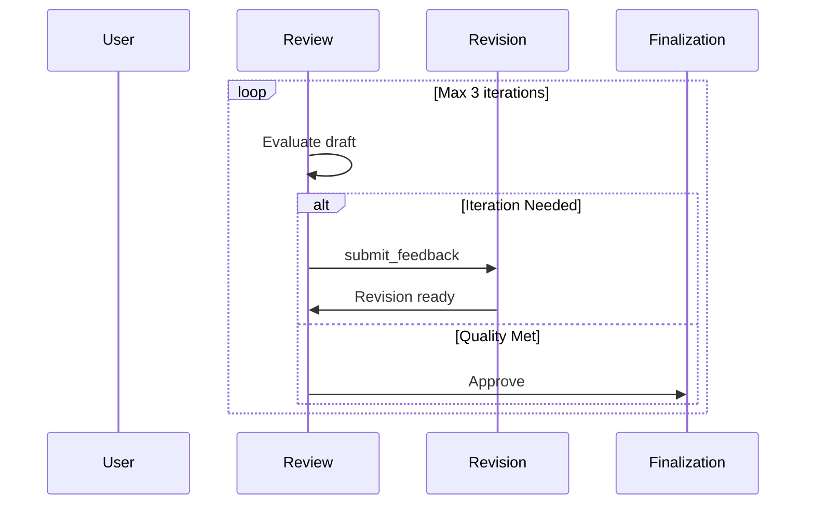

# AG2 Update Agent State Pattern Hooks - Technical Guide

## Overview

The `update_agent_state_pattern.py` module provides **dynamic pattern guidance injection** for the MozaiksAI Generator workflow. It implements AG2's `update_agent_state` hook mechanism to inject pattern-specific instructions into agent system messages **at runtime**, ensuring each Generator agent receives tailored guidance based on the selected AG2 orchestration pattern.

---

## Architecture & Purpose

### What is `update_agent_state`?

`update_agent_state` is an **AG2 lifecycle hook** that executes **before each agent processes messages**. It allows dynamic modification of agent behavior without hardcoding pattern-specific logic into agent system messages.

### Why Use This Pattern?

1. **Separation of Concerns**: Pattern knowledge lives in `ag2_pattern_taxonomy.json`, not scattered across agent prompts
2. **Dynamic Adaptation**: Agents receive relevant guidance only after user selects a pattern via `PatternAgent`
3. **Maintainability**: Single source of truth for pattern requirements (taxonomy JSON)
4. **Scalability**: Adding new patterns requires updating taxonomy, not modifying multiple agent configurations

---

## Four-Pillar Execution Model

MozaiksAI workflows are built on **four execution pillars** that define how agents coordinate. Each pillar uses specific AG2 primitives:

### 1. **Router Pillar** - Content-Driven Domain Dispatch
**Purpose**: Analyze request content and route to appropriate specialist domain  
**AG2 Primitives**: `OnContextCondition` with `StringLLMCondition` (LLM evaluates content)  
**When to Use**: Multi-domain systems, tiered support, content-based classification  
**Flow**: Single router agent evaluates → Routes to ONE specialist → Returns to router or user

### 2. **Sequential Pillar** - Linear Pipelines
**Purpose**: Execute stages in strict order with deterministic handoffs  
**AG2 Primitives**: `after_work` handoffs, `OnContextCondition` with `ExpressionContextCondition` for gates  
**When to Use**: Order processing, ETL, validation workflows, approval gates  
**Flow**: Stage1 → Stage2 → Stage3 (with optional loop-backs for iteration)

### 3. **Nested Pillar** - Diversity & Evaluation
**Purpose**: Sequential invocation of multiple experts for independent solutions  
**AG2 Primitives**: `NestedChatTarget` with `chat_queue` (sequential nested chats, NOT simultaneous)  
**When to Use**: Critical decisions, research synthesis, multi-perspective analysis  
**Flow**: Coordinator → Expert1 (nested) → Expert2 (nested) → Expert3 (nested) → Coordinator evaluates/synthesizes

### 4. **Triage Pillar** - Task-Category Sequencing
**Purpose**: Decompose work into typed tasks with enforced dependencies  
**AG2 Primitives**: `ExpressionContextCondition` enforcing ALL TaskTypeA → THEN TaskTypeB  
**When to Use**: Research-then-write workflows, prerequisite-dependent tasks  
**Flow**: Triage agent creates task lists → Execute ALL research tasks → THEN execute ALL writing tasks

**CRITICAL**: Parallel execution is NOT used. Nested pillar achieves diversity through **sequential nested chats**, not simultaneous agent execution.

---

## AG2 Pattern Integration

### The 9 AG2 Orchestration Patterns (Mapped to Four Pillars)

This module supports all 9 AG2 orchestration patterns from the official Pattern Cookbook, categorized by execution pillar:

| Pattern ID | Pattern Name | Primary Use Case | Pillar | Coordination Primitives |
|------------|--------------|------------------|--------|------------------------|
| 1 | **Context-Aware Routing** | Multi-domain queries | **Router** | `OnContextCondition` + `StringLLMCondition` for domain classification |
| 2 | **Escalation** | Tiered support, cost optimization | **Router** | `OnContextCondition` + `ExpressionContextCondition` for confidence thresholds |
| 3 | **Feedback Loop** | Iterative refinement, quality assurance | **Sequential** | `after_work` handoffs + conditional loop-back to revision stage |
| 6 | **Pipeline (Sequential)** | Order processing, ETL workflows | **Sequential** | Linear `after_work` handoffs with validation gates |
| 7 | **Redundant** | Critical decisions, creative ideation | **Nested** | `NestedChatTarget` for sequential expert invocation + evaluator synthesis |
| 4 | **Hierarchical (Tree)** | Complex research, organizational workflows | **Nested** | `NestedChatTarget` for 3-level delegation (Executive → Managers → Specialists) |
| 8 | **Star (Hub-and-Spoke)** | Multi-domain coordination | **Nested** | `NestedChatTarget` for hub→spoke coordination + aggregation |
| 9 | **Triage with Tasks** | Task decomposition, dependency enforcement | **Triage** | `ExpressionContextCondition` enforcing ALL research → THEN writing |
| 5 | **Organic** | Exploratory conversations, rapid prototyping | **Hybrid** | LLM-based adaptive routing (can combine any pillar's primitives) |

**Key Principle**: Each pattern uses ONE primary pillar's coordination style. Patterns may combine pillars (e.g., Hierarchical = Nested for delegation + Sequential for manager aggregation).

---

## Hook Functions & Target Agents

The module provides **6 specialized hook functions**, each targeting a specific Generator agent:

### 1. `inject_workflow_strategy_guidance`
**Target Agent**: `WorkflowStrategyAgent`

**Purpose**: Inject pattern-specific phase structure recommendations

**Injected Content**:
- Pattern name and coordination style
- Recommended phases for the selected pattern
- Typical agent types per phase
- When to use this pattern
- Pattern characteristics

**Example (Hierarchical Pattern)**:
```
[INJECTED PATTERN GUIDANCE - Hierarchical (Tree)]
The workflow requires the **Hierarchical (Tree)** orchestration pattern.
CRITICAL: Your phase design MUST align with this pattern's structure.

**Phase Structure Recommendations:**
Three-level structure with Executive, Manager, and Specialist roles...

**Recommended Phases:**
1. **Executive Coordination**
   - Purpose: Strategic task decomposition and final synthesis
   - Typical Agent Types: Executive Coordinator, Task Decomposer

2. **Manager Delegation**
   - Purpose: Domain-specific coordination and aggregation
   - Typical Agent Types: Domain Managers, Section Compilers

3. **Specialist Execution**
   - Purpose: Deep expertise and detailed work
   - Typical Agent Types: Research Specialists, Data Analysts
```

---

### 2. `inject_workflow_architect_guidance`
**Target Agent**: `WorkflowArchitectAgent`

**Purpose**: Inject pattern-specific technical requirements (tools, context variables, lifecycle operations) **per phase**

**Injected Content**:
- Phase-by-phase breakdown of required tools
- Required context variables with triggers
- Required lifecycle operations
- Shared workflow requirements
- Typical integrations

**Example (Escalation Pattern - Phase 2)**:
```
**PHASE 2 (Basic Tier):**
Required Tools:
- answer_question_basic (Agent_Tool, phase_specific): Answer with confidence score

Required Context Variables:
- basic_agent_confidence (derived, agent_text): Confidence score (1-10) 
  Trigger: agent emits "CONFIDENCE: N"
- last_escalation_reason (derived, agent_text): Reason if confidence < 8

Required Lifecycle Operations:
- Log Tier Response (after_agent, target: BasicAgent): Log confidence and response
```

**Key Feature**: Pattern-specific technical requirements are **exhaustive** and cover all phases, ensuring architects have complete implementation blueprints.

---

### 3. `inject_workflow_implementation_guidance`
**Target Agent**: `WorkflowImplementationAgent`

**Purpose**: Inject pattern-specific agent coordination and communication flow guidance

**Injected Content**:
- Agent coordination pattern description
- Communication flow topology
- Required agent roles
- Pattern characteristics
- Required AG2 features

**Example (Star Pattern)**:
```
**Agent Coordination Pattern:**
Central coordinator delegates to independent specialists in parallel,
then synthesizes responses into unified output.

**Communication Flow:**
Hub-and-spoke topology: User → Coordinator → Specialists (parallel) → 
Coordinator (synthesis) → User

**Required Agent Roles:**
- Central Coordinator (hub)
- Domain Specialists (spokes: Weather, Events, Transit, etc.)
```

---

### 4. `inject_project_overview_guidance`
**Target Agent**: `ProjectOverviewAgent`

**Purpose**: Inject comprehensive Mermaid diagram guidance for pattern visualization

**Injected Content**:
- Pattern topology description
- Mermaid diagram structure requirements
- Key visual elements
- Example Mermaid code snippets
- Pattern-specific visualization instructions

**Example (Feedback Loop Pattern)**:
```
**Topology:** Linear pipeline with review-revision loop

**Mermaid Structure:**
1. **Participants:**
   - User, Entry, Planning, Drafting, Review, Revision, Finalization

2. **Flow:**
   - User → Entry → Planning → Drafting → Review
   - Review → Revision (if iteration_needed=true)
   - Revision → Review (loop back)
   - Review → Finalization (when quality met)

3. **Loop Visualization:**
   - Use `loop Max N iterations` block
   - Add alt blocks for iteration_needed decision
   - Show feedback severity in Notes
   - Include iteration counter annotations

4. **Example Pattern:**

```

**Key Feature**: Each pattern receives **custom Mermaid diagram templates** matching its topology.

---

### 5. `inject_handoffs_guidance`
**Target Agent**: `HandoffsAgent`

**Purpose**: Inject pattern-specific handoff rules and coordination guidance

**Injected Content**:
- Handoff coordination pattern
- Communication flow
- Pattern-specific handoff rules
- Required agent roles
- Handoff type guidelines (after_work vs condition)
- Condition type guidelines (expression vs string_llm)
- Condition scope guidelines (null, pre, post)

**Example (Pipeline Pattern)**:
```
**Pattern-Specific Handoff Rules:**
- Sequential stage progression using after_work handoffs
- Each stage validates input before processing
- Error states trigger RevertToUserTarget
- OnContextCondition with ExpressionContextCondition for stage completion
- Use pre-scope conditions for UI-derived variables (form submissions)
- Use null-scope for agent_text triggers (stage completion flags)

**Handoff Type Guidelines:**
- **after_work**: Use for sequential stage transitions
- **condition**: Use for validation gates and error handling
```

---

### 6. `inject_tools_manager_guidance`
**Target Agent**: `ToolsManagerAgent`

**Purpose**: Inject pattern-specific tool requirements and organization guidance

**Injected Content**:
- Pattern-specific tool catalogs
- Tool scope guidelines (shared vs phase_specific)
- Tool type guidelines (Agent_Tool, UI_Tool)
- Tool design principles

**Example (Redundant Pattern)**:
```
**Pattern-Specific Tool Requirements:**

**Core Tools:**
1. initiate_task (Agent_Tool, phase_specific, Taskmaster)
   - Dispatches same task to multiple specialist agents
   - Returns task ID for tracking

2. submit_*_approach (Agent_Tool, phase_specific, per specialist)
   - Each specialist submits their unique solution approach
   - Includes methodology explanation

3. evaluate_and_select (Agent_Tool, phase_specific, Evaluator)
   - Scores all approaches (1-10 scale)
   - Returns selected best approach or synthesized result

**Shared Tools:**
- score_approach: Utility for approach evaluation
- synthesize_approaches: Merge best elements from multiple approaches
```

---

### 7. `inject_context_variables_guidance`
**Target Agent**: `ContextVariablesAgent`

**Purpose**: Inject pattern-specific context variable requirements

**Injected Content**:
- Pattern-specific context variable catalogs
- Variable type definitions (derived, static, database, environment)
- Trigger specifications (agent_text, ui_response)
- Scope guidelines
- Naming conventions

**Example (Triage with Tasks Pattern)**:
```
**Pattern-Specific Context Variables:**

**Task Queue Management:**
- ResearchTasks (derived, agent_text): Array of ResearchTask objects
  Trigger: TriageAgent emits "RESEARCH_TASKS: [...]"
  
- WritingTasks (derived, agent_text): Array of WritingTask objects
  Trigger: TriageAgent emits "WRITING_TASKS: [...]"

**Task Tracking:**
- CurrentResearchTaskIndex (derived, agent_text): Current research task index (int, 0-based)
  Trigger: TaskManager emits "RESEARCH_INDEX: N"
  
- ResearchTasksDone (derived, agent_text): Boolean - all research complete
  Trigger: TaskManager emits "RESEARCH_COMPLETE"

**Dependency Enforcement:**
- WritingBlocked (derived, agent_text): Boolean - writing blocked until research done
  Evaluated: ExpressionContextCondition "${ResearchTasksDone} == false"
```

---

## How It Works: Runtime Flow

### 1. Pattern Selection Phase

```
User → InterviewAgent → PatternAgent
```

`PatternAgent` calls `PatternSelectionCall` tool, which stores pattern selection in `context_variables.data`:

```python
context_variables.data['PatternSelection'] = {
    'selected_pattern': 3,  # Feedback Loop
    'pattern_name': 'Feedback Loop',
    'rationale': '...',
    'confidence': 9
}
```

### 2. Hook Execution Phase

When `WorkflowStrategyAgent` is invoked, AG2 triggers the hook:

```python
# AG2 internal flow:
def process_agent(agent, messages):
    if hasattr(agent, 'update_agent_state'):
        agent.update_agent_state(messages)  # <-- Hook fires here
    
    # Then agent processes messages with modified system_message
    response = agent.generate_reply(messages)
```

### 3. Pattern Extraction

The hook extracts the selected pattern:

```python
def inject_workflow_strategy_guidance(agent, messages):
    pattern = _get_pattern_from_context(agent)
    # pattern = {
    #     'id': 3,
    #     'name': 'Feedback Loop',
    #     'phase_structure': {...},
    #     'characteristics': [...],
    #     ...
    # }
```

### 4. Guidance Injection

Pattern-specific guidance is appended to `agent.system_message`:

```python
guidance = f"""
[INJECTED PATTERN GUIDANCE - {pattern['name']}]
...
"""
agent.system_message += guidance
```

### 5. Agent Execution

The agent now has **pattern-aware context** and generates responses aligned with the selected pattern's requirements.

---

## Pattern-Specific Technical Requirements (Mapped to Four Pillars)

Each pattern has unique technical requirements injected into `WorkflowArchitectAgent`, organized by execution pillar:

---

### **ROUTER PILLAR PATTERNS**

#### Context-Aware Routing (Pattern 1)
**Pillar**: Router (content-driven domain dispatch)  
**AG2 Primitives**: `OnContextCondition` with `StringLLMCondition` for domain classification

- **Tools**: `analyze_request`, `route_to_*_specialist`, `request_clarification`
- **Context Variables**: `routing_started`, `current_domain`, `domain_confidence`, `question_responses`
- **Lifecycle Operations**: None (pure AG2 routing)
- **Handoffs**: `OnContextCondition` with `StringLLMCondition` evaluating request content → Routes to ONE specialist domain
- **Key Feature**: LLM evaluates "Is this a weather question?" → Routes to WeatherAgent OR EventsAgent OR TransitAgent

#### Escalation (Pattern 2)
**Pillar**: Router (tiered routing based on confidence)  
**AG2 Primitives**: `OnContextCondition` with `ExpressionContextCondition` for confidence thresholds

- **Tools**: `new_question_asked`, `answer_question_basic/intermediate/advanced`
- **Context Variables**: Tier-specific confidence scores (`basic_agent_confidence`, `intermediate_agent_confidence`), `escalation_count`, `current_tier`
- **Lifecycle Operations**: Log Tier Response (after_agent for each tier)
- **Handoffs**: `OnContextCondition` with `ExpressionContextCondition` evaluating `${basic_agent_confidence} < 8` → Routes to IntermediateAgent OR AdvancedAgent
- **Key Feature**: Confidence thresholds trigger tier escalation (BasicAgent → IntermediateAgent → AdvancedAgent)

---

### **SEQUENTIAL PILLAR PATTERNS**

#### Feedback Loop (Pattern 3)
**Pillar**: Sequential (linear pipeline with conditional loop-back)  
**AG2 Primitives**: `after_work` handoffs + `OnContextCondition` with `ExpressionContextCondition` for iteration gate

- **Tools**: `start_document_creation`, `submit_document_plan/draft`, `submit_feedback`, `submit_revised_document`, `finalize_document`
- **Context Variables**: `current_iteration`, `max_iterations`, `iteration_needed`, `current_stage` (enum: Planning/Drafting/Review/Revision/Finalization)
- **Lifecycle Operations**: Check Max Iterations (before_agent), Increment Iteration (after_agent)
- **Handoffs**: Sequential `after_work` (Planning → Drafting → Review) + Conditional loop-back (`${iteration_needed} == true` → RevisionAgent)
- **Key Feature**: DocumentStage enum tracking, FeedbackItem severity levels, max iteration enforcement

#### Pipeline (Pattern 6)
**Pillar**: Sequential (strict linear stage progression)  
**AG2 Primitives**: `after_work` handoffs + `OnContextCondition` with `ExpressionContextCondition` for validation gates

- **Tools**: `run_*_check`, `complete_*_check`, stage-specific validation tools
- **Context Variables**: Per-stage completion flags (`validation_stage_completed`, `processing_stage_completed`), result objects with `is_valid`, `error_message`
- **Lifecycle Operations**: Validate Stage Prerequisites (before_agent), Early Termination Check
- **Handoffs**: Sequential `after_work` (Stage1 → Stage2 → Stage3) with validation gates (`${validation_stage_completed} == true AND ${result.is_valid} == true`)
- **Key Feature**: Linear progression with NO branching, validation gates enforce prerequisites

---

### **NESTED PILLAR PATTERNS**

#### Redundant (Pattern 7)
**Pillar**: Nested (sequential invocation of multiple independent experts)  
**AG2 Primitives**: `NestedChatTarget` with `chat_queue` for sequential expert execution (NOT simultaneous)

- **Tools**: `initiate_task`, `submit_*_approach` (per specialist), `evaluate_and_select`
- **Context Variables**: Per-expert result variables (`expert_a_approach`, `expert_b_approach`, `expert_c_approach`), `evaluation_scores`, `selected_result`
- **Lifecycle Operations**: Enforce Nested Chat Isolation (before_agent ensures experts don't see each other's work)
- **Handoffs**: Coordinator uses `NestedChatTarget` to sequentially invoke ExpertA → ExpertB → ExpertC (independent solutions) → Evaluator synthesizes
- **Key Feature**: Multiple experts solve SAME task independently via sequential nested chats, evaluator scores (1-10) and selects best

#### Hierarchical (Pattern 4)
**Pillar**: Nested (3-level delegation with sequential nested chats)  
**AG2 Primitives**: `NestedChatTarget` with `chat_queue` for Executive→Managers→Specialists delegation

- **Tools**: `initiate_research`, `compile_*_section` (per manager), `complete_*_research` (per specialist)
- **Context Variables**: Multi-level completion flags (`manager_a_completed`, `manager_b_completed`, `specialist_1_completed`), `report_sections` (aggregated results)
- **Lifecycle Operations**: Track Manager/Specialist Progress (after_agent logs completion)
- **Handoffs**: Executive uses `NestedChatTarget` for ManagerA/ManagerB (sequential) → Each Manager uses `NestedChatTarget` for their specialists (sequential) → Upstream aggregation
- **Key Feature**: 3-tier delegation (Executive → Managers → Specialists) with sequential invocation at each level, NOT parallel

#### Star (Pattern 8)
**Pillar**: Nested (hub-spoke coordination with sequential nested chats)  
**AG2 Primitives**: `NestedChatTarget` with `chat_queue` for Coordinator→Specialists invocation + `OnContextCondition` for specialist selection

- **Tools**: `analyze_query`, `provide_*_info` (per specialist), `compile_final_response`
- **Context Variables**: Per-specialist completion flags (`weather_info_completed`, `events_info_completed`), `*_info` payloads (results), `needs_*_info` flags (domain requirements)
- **Lifecycle Operations**: AfterWork Handoff (specialists → coordinator), Validate All Spokes Completed
- **Handoffs**: Coordinator uses `NestedChatTarget` to sequentially invoke WeatherAgent → EventsAgent → TransitAgent (domain-specific work) → Coordinator synthesizes
- **Key Feature**: Hub-and-spoke topology with sequential specialist invocation (NOT simultaneous), coordinator aggregates independent domain results

---

### **TRIAGE PILLAR PATTERNS**

#### Triage with Tasks (Pattern 9)
**Pillar**: Triage (task-category sequencing with enforced dependencies)  
**AG2 Primitives**: `ExpressionContextCondition` enforcing ALL TaskTypeA → THEN TaskTypeB

- **Tools**: `initiate_tasks`, `get_next_research_task`, `get_next_writing_task`, `complete_*_task`
- **Context Variables**: Task arrays (`ResearchTasks`, `WritingTasks`), task indices (`CurrentResearchTaskIndex`, `CurrentWritingTaskIndex`), completion flags (`ResearchTasksDone`, `WritingTasksDone`)
- **Lifecycle Operations**: Enforce Research Prerequisite (before_agent blocks WritingAgent until `${ResearchTasksDone} == true`), Update Task Details (UpdateSystemMessage injects current task into agent prompts)
- **Handoffs**: `OnContextCondition` with `ExpressionContextCondition` enforcing `${ResearchTasksDone} == false` → BLOCKS WritingAgent, `${ResearchTasksDone} == true` → ALLOWS WritingAgent
- **Key Feature**: Typed task decomposition (ResearchTask vs WritingTask) with sequential enforcement (ALL research MUST complete before ANY writing begins)

---

### **HYBRID PILLAR PATTERNS**

#### Organic (Pattern 5)
**Pillar**: Hybrid (can combine any pillar's primitives based on conversation flow)  
**AG2 Primitives**: LLM-based adaptive routing (description-based, no explicit handoff conditions)

- **Tools**: Agent-specific tools (no canonical list, varies by use case)
- **Context Variables**: Minimal (`conversation_state`, `current_speaker`, `topic_focus`)
- **Lifecycle Operations**: None (pure LLM-based routing)
- **Handoffs**: No explicit handoffs; LLM evaluates agent descriptions and routes based on conversation context
- **Key Feature**: Maximum flexibility for exploratory conversations, rapid prototyping, and unpredictable flows (trades structure for adaptability)

---
**Pillar**: Nested (3-level delegation with sequential nested chats)  
**AG2 Primitives**: `NestedChatTarget` with `chat_queue` for Executive→Managers→Specialists delegation

- **Tools**: `initiate_research`, `compile_*_section` (per manager), `complete_*_research` (per specialist)
- **Context Variables**: Multi-level completion flags (`manager_a_completed`, `manager_b_completed`, `specialist_1_completed`), `report_sections` (aggregated results)
- **Lifecycle Operations**: Track Manager/Specialist Progress (after_agent logs completion)
- **Handoffs**: Executive uses `NestedChatTarget` for ManagerA/ManagerB (sequential) → Each Manager uses `NestedChatTarget` for their specialists (sequential) → Upstream aggregation
- **Key Feature**: 3-tier delegation (Executive → Managers → Specialists) with sequential invocation at each level, NOT parallel

#### Star (Pattern 8)
**Pillar**: Nested (hub-spoke coordination with sequential nested chats)  
**AG2 Primitives**: `NestedChatTarget` with `chat_queue` for Coordinator→Specialists invocation
- **Tools**: `analyze_query`, `provide_*_info` (per specialist), `compile_final_response`
- **Context Variables**: Per-specialist completion flags, `*_info` payloads, `needs_*_info` flags
- **Lifecycle Operations**: AfterWork Handoff (specialists → coordinator), Validate All Spokes Completed
- **Key Feature**: Hub-and-spoke topology with parallel specialist execution

### Triage with Tasks (Pattern 9)
- **Tools**: `initiate_tasks`, `get_next_research_task`, `get_next_writing_task`, `complete_*_task`
- **Context Variables**: Task arrays (`ResearchTasks`, `WritingTasks`), task indices, `ResearchTasksDone`, `WritingTasksDone`
- **Lifecycle Operations**: Enforce Research Prerequisite (before_agent), Update Task Details (UpdateSystemMessage)
- **Key Feature**: Typed task decomposition with sequential enforcement (ALL research → THEN writing)

---

## Key AG2 Concepts Leveraged

### 1. Context Variables
**Purpose**: Shared state across agents in a group chat

**Types**:
- `derived`: Set by agents/tools during execution (trigger required)
- `static`: Fixed configuration values
- `database`: Fetched from DB (user_id, enterprise_id)
- `environment`: From environment variables

**Usage in Patterns**:
- Pipeline: Stage completion flags (`validation_stage_completed`)
- Feedback Loop: Iteration tracking (`current_iteration`, `iteration_needed`)
- Hierarchical: Multi-level completion tracking (`manager_a_completed`, `specialist_1_completed`)

### 2. Handoffs
**Purpose**: Define agent-to-agent transitions

**Types**:
- `after_work`: Agent completes, then handoff evaluates
- `condition`: Immediate evaluation (for branching, escalation)

**Condition Types**:
- `expression`: Context variable evaluation (`${basic_agent_confidence} < 8`)
- `string_llm`: LLM-based content analysis

**Condition Scopes**:
- `null`: Default (agent_text triggers, after_work flows)
- `pre`: Pre-reply evaluation (UI interactions)
- `post`: Post-reply evaluation (agent output analysis)

**Usage in Patterns**:
- Escalation: `OnContextCondition` with confidence thresholds
- Pipeline: `after_work` for sequential transitions
- Star: Mixed (OnContextCondition + OnCondition with StringLLMCondition)

### 3. Lifecycle Operations
**Purpose**: Custom hooks at specific workflow points

**Types**:
- `before_chat`: Initialize state
- `before_agent`: Pre-process before agent executes
- `after_agent`: Post-process after agent completes
- `after_chat`: Cleanup resources

**Usage in Patterns**:
- Feedback Loop: Check Max Iterations (before_agent), Increment Iteration (after_agent)
- Pipeline: Validate Stage Prerequisites (before_agent), Early Termination Check
- Triage: Enforce Research Prerequisite (before_agent), Update Task Details (UpdateSystemMessage)

### 4. Tool Scopes
**Purpose**: Control tool accessibility

**Scopes**:
- `shared`: Module-level singleton (accessible by all agents)
- `phase_specific`: Agent-owned (only accessible by specific agents)

**Usage in Patterns**:
- Hierarchical: `compile_*_section` (phase_specific per manager)
- Star: `provide_*_info` (phase_specific per specialist), `compile_final_response` (shared)

### 5. UpdateSystemMessage Hook
**Purpose**: Dynamic prompt injection with current task details

**Usage in Patterns**:
- Triage with Tasks: Inject current task from context into agent prompts
- Allows agents to receive task-specific instructions at runtime

---

## Pattern Taxonomy JSON Structure

The module loads pattern data from `ag2_pattern_taxonomy.json`:

```json
{
  "patterns": [
    {
      "id": 1,
      "name": "Context-Aware Routing",
      "description": "...",
      "characteristics": ["Dynamic content analysis", "..."],
      "when_to_use": ["Multi-domain support systems", "..."],
      "phase_structure": {
        "recommended_phases": [
          {
            "name": "Analysis & Routing",
            "purpose": "Analyze request and classify domain",
            "typical_agents": ["Router Agent", "Analyzer Agent"]
          },
          ...
        ],
        "coordination_pattern": "Hub-based routing with content analysis"
      },
      "agent_patterns": {
        "required_roles": ["Router", "Domain Specialists"],
        "coordination": "Central router analyzes queries and routes to specialists",
        "communication_flow": "User → Router → Specialist → Router → User"
      },
      "technical_requirements": {
        "ag2_features": ["OnContextCondition", "ExpressionContextCondition", "..."],
        "context_variables": ["routing_started", "current_domain", "..."],
        "tools": ["analyze_request", "route_to_specialist", "..."]
      },
      "mermaid_guidance": {
        "diagram_type": "sequenceDiagram",
        "key_elements": ["Router participant", "Specialist participants", "..."],
        "example_structure": "..."
      }
    },
    ...
  ]
}
```

---

## Benefits of This Architecture

### 1. **Single Source of Truth**
- Pattern knowledge lives in taxonomy JSON
- No duplication across agent prompts
- Easy to update pattern guidance globally

### 2. **Dynamic Adaptation**
- Agents receive guidance only for selected pattern
- No irrelevant instructions cluttering prompts
- Cleaner agent system messages

### 3. **Maintainability**
- Adding new patterns: Update taxonomy + add hook logic
- Modifying existing patterns: Update taxonomy only
- No need to touch agent configurations

### 4. **Testability**
- Hook functions can be tested independently
- Pattern extraction logic isolated
- Taxonomy validation separate concern

### 5. **Separation of Concerns**
- Pattern knowledge: Taxonomy JSON
- Injection logic: Hook functions
- Agent behavior: Base system messages
- Workflow execution: AG2 runtime

---

## Usage Example: End-to-End Flow

### User Request
```
"Create a workflow for customer support with tiered escalation"
```

### Pattern Selection
```
PatternAgent → PatternSelectionCall:
{
  "selected_pattern": 2,
  "pattern_name": "Escalation",
  "rationale": "Tiered support requires progressive escalation based on complexity",
  "confidence": 9
}
```

### Hook Execution: WorkflowStrategyAgent

**Before Hook**:
```
System Message: "You are a workflow architect..."
```

**After Hook**:
```
System Message: "You are a workflow architect...

[INJECTED PATTERN GUIDANCE - Escalation]
The workflow requires the **Escalation** orchestration pattern.
CRITICAL: Your phase design MUST align with this pattern's structure.

**Phase Structure Recommendations:**
Progressive tiers with confidence-based escalation...

**Recommended Phases:**
1. **Triage**
   - Purpose: Initial routing to appropriate tier
   - Typical Agent Types: Triage Agent, Router

2. **Basic Tier**
   - Purpose: Handle simple queries with basic model
   - Typical Agent Types: Basic Support Agent

3. **Intermediate Tier**
   - Purpose: Handle moderate complexity
   - Typical Agent Types: Intermediate Support Agent

4. **Advanced Tier**
   - Purpose: Handle complex queries with advanced model
   - Typical Agent Types: Senior Support Agent
```

### Hook Execution: WorkflowArchitectAgent

**Injected Guidance**:
```
**PHASE 2 (Basic Tier):**
Required Tools:
- answer_question_basic (Agent_Tool, phase_specific): Answer with confidence score

Required Context Variables:
- basic_agent_confidence (derived, agent_text): Confidence score (1-10)
  Trigger: agent emits "CONFIDENCE: N"
- last_escalation_reason (derived, agent_text): Reason if confidence < 8

Required Lifecycle Operations:
- Log Tier Response (after_agent, target: BasicAgent): Log confidence
```

### Result
The Generator workflow produces a complete escalation pattern implementation with:
- 4 phases (Triage, Basic, Intermediate, Advanced)
- Confidence-based handoffs
- Tier-specific tools and context variables
- Lifecycle operations for logging
- Mermaid diagram showing escalation flow

---

## CRITICAL: Knowable vs Unknown — Agent Design Boundaries

### The Core Problem

Agents often generate **placeholder lifecycle operations** and **fictional integrations** because they lack constraints about what's knowable at workflow design time. This section defines strict boundaries.

---

### What IS Knowable (From User Context)

**At workflow design time, agents KNOW**:
1. User's stated automation goal (from InterviewAgent)
2. Selected AG2 pattern (determines coordination style)
3. Phase structure from WorkflowStrategyAgent (phase names, purposes, sequence)
4. Agent roles and specialist domains
5. Handoff logic between phases

**These inputs are SUFFICIENT to design workflows**. Agents must NOT assume additional context.

---

### What is NOT Knowable (Requires Explicit User Input)

**Without explicit user specification, agents CANNOT know**:
1. **Database schemas**: Field names, validation rules, data types
2. **Third-party API details**: Endpoints, authentication methods, payload structures
3. **Business-specific validation logic**: Threshold values, approval hierarchies, compliance rules
4. **Webhook/schedule specifics**: Event payloads, cron expressions, data formats

**If the user didn't provide it, DON'T assume it.**

---

### Lifecycle Operations — CUSTOM BUSINESS LOGIC ONLY

#### What Lifecycle Operations Are NOT

lifecycle_operations are **NOT** for:
- ❌ Context variable initialization (runtime handles automatically)
- ❌ Tool registration (runtime handles automatically)
- ❌ Handoff setup (runtime handles automatically)
- ❌ Agent instantiation (runtime handles automatically)
- ❌ Generic "Validate Inputs" without specific business context

#### What Lifecycle Operations ARE

lifecycle_operations are **ONLY** for:
- ✅ **Business-specific validation gates**: "Check budget threshold before procurement" (requires user-specified threshold)
- ✅ **Compliance audit logging**: "Log decision to compliance audit trail" (requires user-specified audit system)
- ✅ **External system synchronization**: "Sync inventory to ERP after order" (requires user-specified ERP endpoint)
- ✅ **Custom cleanup tasks**: "Archive temporary files to S3" (requires user-specified S3 bucket)

#### Valid vs Invalid Lifecycle Operation Examples

**INVALID (too generic, runtime handles this)**:
```json
{
  "name": "Validate Inputs",
  "trigger": "before_chat",
  "target": null,
  "description": "Run initialization tasks"
}
```
**Problem**: What inputs? What validation rules? This is a placeholder with no actionable meaning.

**VALID (specific business logic with known context)**:
```json
{
  "name": "Validate Budget Threshold",
  "trigger": "before_agent",
  "target": "ProcurementAgent",
  "description": "Block procurement if order total exceeds $10,000 (requires manual approval above threshold)"
}
```
**Why Valid**: User specified "$10,000 threshold" in their automation goal; this is KNOWN business context.

**INVALID (assumes unknown system)**:
```json
{
  "name": "Sync to Database",
  "trigger": "after_agent",
  "target": "DataAgent",
  "description": "Update database with results"
}
```
**Problem**: Which database? Which collection? Which fields? This assumes knowledge we don't have.

**VALID (specific sync with known destination)**:
```json
{
  "name": "Sync Order to Shopify",
  "trigger": "after_agent",
  "target": "OrderProcessingAgent",
  "description": "Update Shopify order status via REST API after payment confirmation"
}
```
**Why Valid**: User specified "Shopify integration" in goal; we know the target system and operation.

#### Guidance for WorkflowStrategyAgent

**When defining lifecycle_operations**, ask:
1. Did the user explicitly mention this validation/sync/audit requirement?
2. Do I have specific values (thresholds, endpoints, rules) from user context?
3. Is this custom business logic, or generic runtime infrastructure?

**If answer to 1 or 2 is NO** → DO NOT create lifecycle operation  
**If answer to 3 is "generic infrastructure"** → DO NOT create lifecycle operation (runtime handles it)

---

### Integrations — REAL APIs ONLY

#### What Integrations Are NOT

Integrations are **NOT**:
- ❌ Generic categories like "SocialMediaPlatforms" (not a specific API)
- ❌ Fictional services like "ContentManagementSystem" (not a real endpoint)
- ❌ Placeholder names like "PaymentGateway" (which gateway specifically?)
- ❌ Vague references like "ThirdPartyAnalytics" (which analytics service?)

#### What Integrations ARE

Integrations are **ONLY**:
- ✅ **Real, documented third-party APIs**: Stripe, Slack, SendGrid, HubSpot, Shopify
- ✅ **Specific services with known endpoints**: OpenAI API, Google Calendar API, Twilio SMS
- ✅ **Platform database** (MongoDB reads/writes): User profiles, workflow state, audit logs

#### Valid vs Invalid Integration Examples

**INVALID (fictional API)**:
```json
{
  "name": "ContentGenerationAgent",
  "integrations": ["SocialMediaPlatforms", "ContentManagementSystem"]
}
```
**Problem**: These aren't real APIs. What endpoints? What authentication? Unusable.

**VALID (real APIs)**:
```json
{
  "name": "ContentGenerationAgent",
  "integrations": ["OpenAI", "TwitterAPI", "WordPress"]
}
```
**Why Valid**: OpenAI, Twitter, WordPress have documented REST APIs with known endpoints.

**INVALID (generic category)**:
```json
{
  "name": "PaymentAgent",
  "integrations": ["PaymentGateway"]
}
```
**Problem**: "PaymentGateway" is a category, not a specific service. Which one?

**VALID (specific service)**:
```json
{
  "name": "PaymentAgent",
  "integrations": ["Stripe"]
}
```
**Why Valid**: Stripe is a real payment processor with documented API, clear endpoints, known authentication (API keys).

#### Guidance for WorkflowArchitectAgent & WorkflowImplementationAgent

**When defining integrations**, ask:
1. Is this a REAL third-party service with documented REST/GraphQL API?
2. Can I find official API documentation for this service online?
3. Does this service have known authentication methods (API keys, OAuth)?

**If answer to any question is NO** → DO NOT include as integration

**If user mentioned generic category** (e.g., "social media") → Ask user to specify which platform (Twitter, Facebook, LinkedIn) OR omit integration entirely

---

### Database Condition & Webhook Triggers — Handle Gracefully

#### The Challenge

When workflows trigger on `database_condition` or `webhook`, users often don't provide:
- Database schema details (field names, data types)
- Webhook payload structure (JSON keys, nested objects)
- Validation rules or business logic

**This is NORMAL**. These trigger types are inherently technical and require system-level knowledge.

#### Graceful Degradation Strategy

**For database_condition triggers**:
1. Create context variables for EXPECTED database fields (based on common patterns)
2. Use generic field names: `trigger_condition_met`, `database_event_type`, `entity_id`
3. Add Notes in documentation: "SETUP REQUIRED: Configure database watch collection and field names"
4. Provide examples in context variable descriptions: "database_event_type: Expected values: 'order_created', 'payment_confirmed', 'inventory_low'"

**For webhook triggers**:
1. Create context variables for EXPECTED webhook payload keys
2. Use generic payload structure: `webhook_payload`, `webhook_event_type`, `webhook_source`
3. Add Notes in documentation: "SETUP REQUIRED: Configure webhook endpoint and payload schema"
4. Provide examples: "webhook_event_type: Expected values from source system (e.g., 'charge.succeeded' for Stripe)"

**For schedule triggers**:
1. Create context variables for time-based metadata: `scheduled_run_time`, `schedule_frequency`, `schedule_config`
2. Avoid assuming cron syntax or specific intervals
3. Add Notes: "SETUP REQUIRED: Configure schedule via platform UI"

#### Example: Database Condition Workflow

**User Goal**: "Alert when inventory falls below threshold"

**Valid Approach**:
```json
{
  "lifecycle_operations": [],
  "context_variables": [
    {
      "name": "database_event_type",
      "type": "static",
      "description": "Type of database event that triggered workflow. Expected: 'inventory_low'",
      "source": {"type": "database", "database_name": "app_db", "collection": "inventory_events", "field": "event_type"}
    },
    {
      "name": "product_id",
      "type": "static",
      "description": "ID of product with low inventory",
      "source": {"type": "database", "database_name": "app_db", "collection": "inventory_events", "field": "product_id"}
    },
    {
      "name": "current_stock",
      "type": "static",
      "description": "Current stock level that triggered alert",
      "source": {"type": "database", "database_name": "app_db", "collection": "inventory_events", "field": "stock_level"}
    }
  ]
}
```
**Notes for User**: "SETUP REQUIRED: Configure MongoDB watch on inventory collection. Trigger when stock_level field changes. Ensure inventory_events collection exists with fields: event_type, product_id, stock_level."

#### Example: Webhook Workflow

**User Goal**: "Process Stripe payment webhooks"

**Valid Approach**:
```json
{
  "context_variables": [
    {
      "name": "webhook_event_type",
      "type": "static",
      "description": "Stripe event type. Expected: 'charge.succeeded', 'charge.failed', 'refund.created'",
      "source": {"type": "static", "value": null}
    },
    {
      "name": "webhook_payload",
      "type": "static",
      "description": "Full Stripe webhook payload (JSON object)",
      "source": {"type": "static", "value": null}
    },
    {
      "name": "payment_amount",
      "type": "derived",
      "description": "Payment amount in cents from webhook",
      "source": {"type": "derived", "triggers": [{"type": "agent_text", "agent": "WebhookParserAgent", "match": {"contains": "AMOUNT:", "equals": null, "regex": null}}]}
    }
  ],
  "integrations": ["Stripe"]
}
```
**Notes for User**: "SETUP REQUIRED: Configure Stripe webhook endpoint in Stripe Dashboard. Point to platform webhook receiver. Ensure webhook secret is set in environment variables."

---

### Summary: Boundaries for Agent Design

| **Aspect** | **Knowable (Design Time)** | **Unknown (Requires User Input)** |
|------------|----------------------------|-----------------------------------|
| **Lifecycle Operations** | Phase sequencing, agent coordination, pattern-driven hooks | Database schemas, validation thresholds, audit systems |
| **Integrations** | Real third-party APIs mentioned by user (Stripe, Slack) | Fictional services, generic categories, unspecified endpoints |
| **Context Variables** | Phase transitions, agent tokens, pattern coordination | Database field names, webhook payload structures, business rules |
| **Tools** | Operations from agent responsibilities, pattern requirements | Specific API payloads, validation logic, data transformations |

**Golden Rule**: If the user didn't specify it AND it's not derivable from pattern/phase structure → DON'T assume it. Use placeholders with "SETUP REQUIRED" notes OR omit entirely.

---

## Four-Pillar Strategy Examples for Generator Agents

This section provides concrete examples of how each Generator agent should structure their outputs according to the four-pillar model. These examples serve as reference implementations aligned with Router/Sequential/Nested/Triage coordination styles.

---

### WorkflowStrategyAgent - Phase Structure Examples

**Purpose**: Define high-level workflow phases aligned with pattern's pillar

#### Example 1: Router Pillar (Escalation Pattern)

```python
workflow_strategy(
    workflow_name="Customer Support Escalation",
    workflow_description="When customer submits support query, this workflow routes through tiered support agents (Basic → Intermediate → Advanced) based on confidence thresholds, resulting in accurate resolution with cost optimization.",
    trigger="chat",
    pattern="Escalation",
    lifecycle_operations=[
        {
            "name": "Initialize Support Session",
            "trigger": "before_chat",
            "target": null,
            "description": "Create support ticket, log customer context"
        }
    ],
    phases=[
        {
            "phase_name": "Phase 1: Triage",
            "phase_description": "TriageAgent analyzes query complexity and routes to appropriate tier.",
            "approval_required": false,
            "agents_needed": "single",
            "specialist_domains": ["customer_support"]
        },
        {
            "phase_name": "Phase 2: Basic Tier",
            "phase_description": "BasicAgent attempts resolution using lightweight model, emits confidence score.",
            "approval_required": false,
            "agents_needed": "single",
            "specialist_domains": ["basic_support"]
        },
        {
            "phase_name": "Phase 3: Intermediate Tier",
            "phase_description": "IntermediateAgent handles moderate complexity if BasicAgent confidence < 8.",
            "approval_required": false,
            "agents_needed": "single",
            "specialist_domains": ["intermediate_support"]
        },
        {
            "phase_name": "Phase 4: Advanced Tier",
            "phase_description": "AdvancedAgent handles complex queries if IntermediateAgent confidence < 8.",
            "approval_required": false,
            "agents_needed": "single",
            "specialist_domains": ["advanced_support"]
        }
    ],
    strategy_notes="Router pillar: OnContextCondition with ExpressionContextCondition evaluates confidence thresholds. Each tier attempts resolution; escalation triggers only when confidence < 8. Max 3 tiers to prevent infinite escalation."
)
```

**Key Characteristics**:
- **Pillar**: Router (confidence-based tiered routing)
- **Phases**: Linear tier progression (Triage → Basic → Intermediate → Advanced)
- **agents_needed**: Always "single" (one agent per tier)
- **Coordination**: Conditional escalation via OnContextCondition

---

#### Example 2: Sequential Pillar (Pipeline Pattern)

```python
workflow_strategy(
    workflow_name="Order Processing Pipeline",
    workflow_description="When customer places order, this workflow validates payment → processes inventory → confirms shipment in strict sequence, resulting in reliable order fulfillment.",
    trigger="form_submit",
    pattern="Pipeline",
    lifecycle_operations=[
        {
            "name": "Validate Stage Prerequisites",
            "trigger": "before_agent",
            "target": null,
            "description": "Ensure previous stage completed successfully before proceeding"
        }
    ],
    phases=[
        {
            "phase_name": "Phase 1: Payment Validation",
            "phase_description": "PaymentAgent validates payment method, processes charge, sets validation_stage_completed flag.",
            "approval_required": false,
            "agents_needed": "single",
            "specialist_domains": ["payment_processing"]
        },
        {
            "phase_name": "Phase 2: Inventory Processing",
            "phase_description": "InventoryAgent checks stock, reserves items, updates inventory database.",
            "approval_required": false,
            "agents_needed": "single",
            "specialist_domains": ["inventory_management"]
        },
        {
            "phase_name": "Phase 3: Shipment Confirmation",
            "phase_description": "ShipmentAgent creates shipping label, notifies warehouse, sends customer confirmation.",
            "approval_required": false,
            "agents_needed": "single",
            "specialist_domains": ["logistics"]
        }
    ],
    strategy_notes="Sequential pillar: Strict linear progression with after_work handoffs. Each stage validates input before processing. Validation gates use ExpressionContextCondition (${validation_stage_completed} == true). Error in any stage triggers RevertToUserTarget (no partial orders)."
)
```

**Key Characteristics**:
- **Pillar**: Sequential (strict linear pipeline)
- **Phases**: Stage1 → Stage2 → Stage3 (deterministic order)
- **agents_needed**: Always "single" (one agent per stage)
- **Coordination**: after_work handoffs with validation gates

---

#### Example 3: Nested Pillar (Redundant Pattern)

```python
workflow_strategy(
    workflow_name="Architecture Decision Review",
    workflow_description="When technical decision is proposed, this workflow solicits independent recommendations from multiple architects, then evaluates and selects best approach, resulting in high-quality decision-making.",
    trigger="chat",
    pattern="Redundant",
    lifecycle_operations=[
        {
            "name": "Enforce Nested Chat Isolation",
            "trigger": "before_agent",
            "target": "ArchitectA",
            "description": "Ensure experts don't see each other's recommendations (independent solutions)"
        }
    ],
    phases=[
        {
            "phase_name": "Phase 1: Task Initiation",
            "phase_description": "TaskmasterAgent presents decision prompt to all architects via sequential nested chats.",
            "approval_required": false,
            "agents_needed": "single",
            "specialist_domains": ["task_coordination"]
        },
        {
            "phase_name": "Phase 2: Independent Evaluation (Sequential Nested Chats)",
            "phase_description": "ArchitectA, ArchitectB, ArchitectC each analyze independently (sequential invocation via NestedChatTarget, NOT simultaneous).",
            "approval_required": false,
            "agents_needed": "sequential",
            "specialist_domains": ["architecture_review", "system_design", "security_architecture"]
        },
        {
            "phase_name": "Phase 3: Evaluation & Selection",
            "phase_description": "EvaluatorAgent scores each approach (1-10 scale), selects best or synthesizes hybrid.",
            "approval_required": false,
            "agents_needed": "single",
            "specialist_domains": ["decision_evaluation"]
        }
    ],
    strategy_notes="Nested pillar: Multiple experts solve SAME task independently via NestedChatTarget with chat_queue (sequential invocation). Phase 2 specialists are invoked sequentially (A → B → C), NOT in parallel. Evaluator aggregates results and selects best approach."
)
```

**Key Characteristics**:
- **Pillar**: Nested (diversity through sequential nested chats)
- **Phases**: Initiation → Independent Evaluation (sequential) → Synthesis
- **agents_needed**: "sequential" for Phase 2 (multiple experts invoked sequentially)
- **Coordination**: NestedChatTarget with chat_queue (NOT parallel)

---

#### Example 4: Triage Pillar (Triage with Tasks Pattern)

```python
workflow_strategy(
    workflow_name="Research Report Generation",
    workflow_description="When user requests research report, this workflow decomposes into typed tasks (ResearchTasks, WritingTasks), enforces ALL research BEFORE ANY writing, resulting in well-researched comprehensive reports.",
    trigger="chat",
    pattern="TriageWithTasks",
    lifecycle_operations=[
        {
            "name": "Enforce Research Prerequisite",
            "trigger": "before_agent",
            "target": "WritingAgent",
            "description": "Block WritingAgent until ${ResearchTasksDone} == true"
        },
        {
            "name": "Update Task Details",
            "trigger": "UpdateSystemMessage",
            "target": "ResearchAgent",
            "description": "Inject current task from ${ResearchTasks[${CurrentResearchTaskIndex}]} into agent prompt"
        }
    ],
    phases=[
        {
            "phase_name": "Phase 1: Task Decomposition",
            "phase_description": "TriageAgent analyzes request, creates ResearchTasks array and WritingTasks array.",
            "approval_required": false,
            "agents_needed": "single",
            "specialist_domains": ["task_planning"]
        },
        {
            "phase_name": "Phase 2: Research Execution",
            "phase_description": "ResearchAgent iterates through ALL research tasks sequentially, sets ResearchTasksDone=true upon completion.",
            "approval_required": false,
            "agents_needed": "single",
            "specialist_domains": ["research"]
        },
        {
            "phase_name": "Phase 3: Writing Execution",
            "phase_description": "WritingAgent executes writing tasks ONLY after ResearchTasksDone=true (enforced by ExpressionContextCondition).",
            "approval_required": false,
            "agents_needed": "single",
            "specialist_domains": ["content_writing"]
        }
    ],
    strategy_notes="Triage pillar: Task-category sequencing with dependency enforcement. ExpressionContextCondition blocks WritingAgent with ${ResearchTasksDone} == false. Tools must enforce sequential execution within task types (iterate ResearchTasks[0..N] before WritingTasks[0..M])."
)
```

**Key Characteristics**:
- **Pillar**: Triage (task-category sequencing with dependencies)
- **Phases**: Decomposition → ResearchExecution → WritingExecution
- **agents_needed**: Always "single" (task execution is sequential)
- **Coordination**: ExpressionContextCondition enforces ALL TaskTypeA → THEN TaskTypeB

---

### WorkflowArchitectAgent - Technical Requirements Examples

**Purpose**: Define tools, context variables, and lifecycle operations per phase

#### Example: Nested Pillar (Hierarchical Pattern - Phase 2)

```json
{
    "phase_index": 1,
    "phase_name": "Phase 2: Manager Delegation",
    "required_tools": [
        {
            "name": "compile_tech_section",
            "type": "Agent_Tool",
            "scope": "phase_specific",
            "owner": "TechManagerAgent",
            "description": "Aggregates technical research from specialists into cohesive section",
            "inputs": ["specialist_1_report", "specialist_2_report"],
            "outputs": "tech_section_compiled (dict with aggregated content)"
        },
        {
            "name": "compile_market_section",
            "type": "Agent_Tool",
            "scope": "phase_specific",
            "owner": "MarketManagerAgent",
            "description": "Aggregates market research from specialists into cohesive section",
            "inputs": ["specialist_3_report", "specialist_4_report"],
            "outputs": "market_section_compiled (dict with aggregated content)"
        }
    ],
    "required_context_variables": [
        {
            "name": "tech_manager_completed",
            "type": "derived",
            "source": "agent_text",
            "trigger": "TechManagerAgent emits 'SECTION_COMPLETE'",
            "description": "Boolean flag - TechManagerAgent finished aggregation"
        },
        {
            "name": "market_manager_completed",
            "type": "derived",
            "source": "agent_text",
            "trigger": "MarketManagerAgent emits 'SECTION_COMPLETE'",
            "description": "Boolean flag - MarketManagerAgent finished aggregation"
        },
        {
            "name": "tech_section",
            "type": "derived",
            "source": "agent_text",
            "trigger": "TechManagerAgent emits 'TECH_SECTION: {...}'",
            "description": "Dict with aggregated technical section content"
        }
    ],
    "required_lifecycle_operations": [
        {
            "name": "Track Manager Progress",
            "trigger": "after_agent",
            "target": "TechManagerAgent",
            "description": "Log completion timestamp, validate section structure"
        }
    ],
    "notes": "Nested pillar: Managers use NestedChatTarget to sequentially invoke their specialists (TechManager → Specialist1 → Specialist2). Each manager aggregates results before returning to Executive. NOT parallel delegation."
}
```

**Key Characteristics**:
- **Pillar**: Nested (NestedChatTarget for manager→specialists)
- **Tools**: phase_specific per manager (compile_*_section owned by specific agent)
- **Context Variables**: Completion flags + aggregated results
- **Coordination**: Sequential nested chat invocation within each manager's delegation

---

### WorkflowImplementationAgent - Agent Configuration Examples

**Purpose**: Define agent configurations with AG2-specific settings

#### Example: Sequential Pillar (Feedback Loop Pattern - RevisionAgent)

```json
{
    "agent": "RevisionAgent",
    "system_message": "You are a document revision specialist. You receive feedback and revise drafts to address all concerns while maintaining coherence.",
    "specialist_domain": "document_revision",
    "human_input_mode": "NEVER",
    "description": "Revises documents based on reviewer feedback",
    "auto_tool_mode": false,
    "max_consecutive_auto_reply": 1,
    "tools": [
        {
            "file": "revision_tools.py",
            "function": "submit_revised_document",
            "description": "Submit revised document after addressing feedback"
        }
    ],
    "handoffs": [
        {
            "target": "ReviewAgent",
            "type": "after_work",
            "condition_type": null,
            "condition_scope": null,
            "condition": null,
            "description": "Return to ReviewAgent after revision (loop-back for re-evaluation)"
        }
    ],
    "context_variables": ["current_iteration", "max_iterations", "iteration_needed", "feedback_items"],
    "notes": "Sequential pillar: after_work handoff creates loop-back (Revision → Review). Review phase uses ExpressionContextCondition to break loop when ${iteration_needed} == false OR ${current_iteration} >= ${max_iterations}."
}
```

**Key Characteristics**:
- **Pillar**: Sequential (loop-back via after_work handoff)
- **Handoffs**: after_work to ReviewAgent (creates iterative cycle)
- **Tools**: Agent_Tool for document submission
- **Loop Control**: Managed by ExpressionContextCondition in ReviewAgent's handoffs

---

### ProjectOverviewAgent - Mermaid Diagram Examples

**Purpose**: Visual representation of workflow execution aligned with pillar

#### Example: Router Pillar (Context-Aware Routing Pattern)

```json
{
    "MermaidSequenceDiagram": {
        "workflow_name": "Multi-Domain Query Router",
        "mermaid_diagram": "sequenceDiagram\n    participant User\n    participant Router as RouterAgent\n    participant Weather as WeatherAgent\n    participant Events as EventsAgent\n    participant Transit as TransitAgent\n\n    User->>Router: Submit query\n    Note over Router: Analyze domain (StringLLMCondition)\n    \n    alt Weather Query\n        Router->>Weather: Route to WeatherAgent\n        Weather->>Weather: Provide forecast\n        Weather->>Router: Return weather info\n    else Events Query\n        Router->>Events: Route to EventsAgent\n        Events->>Events: Search events\n        Events->>Router: Return events list\n    else Transit Query\n        Router->>Transit: Route to TransitAgent\n        Transit->>Transit: Get schedules\n        Transit->>Router: Return transit info\n    end\n    \n    Router->>User: Deliver specialist response\n    \n    Note over Router,Transit: Router Pillar: OnContextCondition with StringLLMCondition<br/>LLM evaluates query content → Routes to ONE specialist",
        "legend": [
            "Router Pillar: Content-driven domain classification",
            "OnContextCondition with StringLLMCondition evaluates query",
            "Routes to EXACTLY ONE specialist per request",
            "No parallel execution - sequential routing only"
        ]
    },
    "agent_message": "Multi-domain router diagram ready. Review specialist routing logic and domain classification strategy."
}
```

**Key Characteristics**:
- **Pillar**: Router (alt blocks for domain branching)
- **Visual Elements**: alt/else for conditional routing, Notes explaining LLM evaluation
- **Flow**: User → Router → ONE Specialist → Router → User
- **NO Parallel**: Uses alt/else (conditional), NOT par/and blocks

---

#### Example: Nested Pillar (Redundant Pattern)

```json
{
    "MermaidSequenceDiagram": {
        "workflow_name": "Architecture Decision Review",
        "mermaid_diagram": "sequenceDiagram\n    participant User\n    participant Taskmaster as TaskmasterAgent\n    participant ArchA as ArchitectA\n    participant ArchB as ArchitectB\n    participant ArchC as ArchitectC\n    participant Eval as EvaluatorAgent\n\n    User->>Taskmaster: Present decision prompt\n    Taskmaster->>Taskmaster: Prepare task context\n    \n    Note over Taskmaster,ArchC: Sequential Nested Chats (NestedChatTarget)<br/>Experts invoked ONE AT A TIME (not simultaneous)\n    \n    Taskmaster->>ArchA: Invoke ArchitectA (nested chat 1)\n    Note over ArchA: Independent analysis<br/>(isolated from other experts)\n    ArchA->>Taskmaster: Submit Approach A\n    \n    Taskmaster->>ArchB: Invoke ArchitectB (nested chat 2)\n    Note over ArchB: Independent analysis<br/>(isolated from other experts)\n    ArchB->>Taskmaster: Submit Approach B\n    \n    Taskmaster->>ArchC: Invoke ArchitectC (nested chat 3)\n    Note over ArchC: Independent analysis<br/>(isolated from other experts)\n    ArchC->>Taskmaster: Submit Approach C\n    \n    Taskmaster->>Eval: Forward all approaches\n    Eval->>Eval: Score approaches (1-10 scale)\n    Eval->>Eval: Select best or synthesize hybrid\n    Eval->>User: Deliver recommendation\n    \n    Note over Taskmaster,Eval: Nested Pillar: NestedChatTarget with chat_queue<br/>Sequential invocation ensures expert isolation",
        "legend": [
            "Nested Pillar: Sequential nested chats for diversity",
            "NestedChatTarget invokes experts ONE AT A TIME",
            "Experts are isolated (don't see each other's work)",
            "Evaluator aggregates results and selects best",
            "NOT parallel execution - sequential nested chat invocation"
        ]
    },
    "agent_message": "Redundant pattern diagram with sequential nested chat flow. Review expert isolation and evaluation logic."
}
```

**Key Characteristics**:
- **Pillar**: Nested (sequential nested chat invocations shown explicitly)
- **Visual Elements**: Sequential arrows (ArchA → ArchB → ArchC), Notes explaining isolation
- **Flow**: Taskmaster → Expert1 (nested) → Expert2 (nested) → Expert3 (nested) → Evaluator
- **NO Parallel**: Each expert invoked sequentially, NOT simultaneously

---

### HandoffsAgent - Handoff Rules Examples

**Purpose**: Define agent-to-agent transitions with AG2 conditions

#### Example: Triage Pillar (Triage with Tasks Pattern)

```json
{
    "handoff_rules": [
        {
            "source_agent": "TriageAgent",
            "target_agent": "ResearchAgent",
            "handoff_type": "after_work",
            "condition_type": null,
            "condition_scope": null,
            "condition": null,
            "transition_target": "ResearchAgentTarget",
            "metadata": {
                "description": "After task decomposition, hand off to ResearchAgent to begin research tasks"
            }
        },
        {
            "source_agent": "ResearchAgent",
            "target_agent": "WritingAgent",
            "handoff_type": "condition",
            "condition_type": "expression",
            "condition_scope": null,
            "condition": "${ResearchTasksDone} == true",
            "transition_target": "WritingAgentTarget",
            "metadata": {
                "description": "BLOCKS WritingAgent until ALL research tasks complete (Triage pillar dependency enforcement)"
            }
        },
        {
            "source_agent": "WritingAgent",
            "target_agent": "User",
            "handoff_type": "condition",
            "condition_type": "expression",
            "condition_scope": null,
            "condition": "${WritingTasksDone} == true",
            "transition_target": "RevertToUserTarget",
            "metadata": {
                "description": "Return to user after all writing tasks complete"
            }
        }
    ],
    "agent_message": "Triage pillar handoffs enforce sequential task-category execution: ALL research → THEN writing."
}
```

**Key Characteristics**:
- **Pillar**: Triage (ExpressionContextCondition enforces dependencies)
- **Handoff Types**: after_work for linear flow, condition with expression for gates
- **Dependency Enforcement**: `${ResearchTasksDone} == true` BLOCKS WritingAgent
- **Sequential Category Execution**: ALL TaskTypeA before ANY TaskTypeB

---

### ToolsManagerAgent - Tool Design Examples

**Purpose**: Define tools with clear scope and pillar alignment

#### Example: Router Pillar (Escalation Pattern)

```json
{
    "tools": [
        {
            "agent": "BasicAgent",
            "file": "support_tools.py",
            "function": "answer_question_basic",
            "description": "Answer customer query using basic model, emit confidence score (1-10)",
            "tool_type": "Agent_Tool",
            "ui": null
        },
        {
            "agent": "IntermediateAgent",
            "file": "support_tools.py",
            "function": "answer_question_intermediate",
            "description": "Answer customer query using intermediate model, emit confidence score (1-10)",
            "tool_type": "Agent_Tool",
            "ui": null
        },
        {
            "agent": "AdvancedAgent",
            "file": "support_tools.py",
            "function": "answer_question_advanced",
            "description": "Answer customer query using advanced model, emit confidence score (1-10)",
            "tool_type": "Agent_Tool",
            "ui": null
        }
    ],
    "lifecycle_tools": [
        {
            "trigger": "after_agent",
            "agent": "BasicAgent",
            "file": "tier_logging.py",
            "function": "log_tier_response",
            "description": "Log tier response, confidence, and escalation reason (if any)"
        }
    ],
    "notes": "Router pillar: Each tier uses answer_question_* tool that MUST emit 'CONFIDENCE: N' in agent output. Context variables capture confidence via agent_text triggers. OnContextCondition evaluates ${basic_agent_confidence} < 8 to trigger escalation."
}
```

**Key Characteristics**:
- **Pillar**: Router (tier-specific tools with confidence scoring)
- **Tool Pattern**: Each tier has dedicated tool (phase_specific implied)
- **Critical Output**: Tools MUST emit structured text for agent_text triggers
- **Lifecycle Integration**: after_agent logs tier metrics for observability

---

### ContextVariablesAgent - Context Variable Examples

**Purpose**: Define shared state with triggers and scope

#### Example: Nested Pillar (Hierarchical Pattern)

```json
{
    "ContextVariablesPlan": {
        "definitions": [
            {
                "name": "tech_manager_completed",
                "type": "bool",
                "description": "Tracks TechManagerAgent completion status",
                "source": {
                    "type": "derived",
                    "triggers": [
                        {
                            "type": "agent_text",
                            "agent": "TechManagerAgent",
                            "pattern": "SECTION_COMPLETE",
                            "extraction": "Set to true when pattern detected"
                        }
                    ]
                }
            },
            {
                "name": "tech_section",
                "type": "dict",
                "description": "Aggregated technical section content from TechManagerAgent",
                "source": {
                    "type": "derived",
                    "triggers": [
                        {
                            "type": "agent_text",
                            "agent": "TechManagerAgent",
                            "pattern": "TECH_SECTION: {...}",
                            "extraction": "Parse JSON after 'TECH_SECTION:' prefix"
                        }
                    ]
                }
            },
            {
                "name": "specialist_1_completed",
                "type": "bool",
                "description": "Tracks Specialist1 completion within TechManager's nested chat",
                "source": {
                    "type": "derived",
                    "triggers": [
                        {
                            "type": "agent_text",
                            "agent": "Specialist1",
                            "pattern": "RESEARCH_COMPLETE",
                            "extraction": "Set to true when pattern detected"
                        }
                    ]
                }
            }
        ],
        "agents": [
            {
                "agent": "ExecutiveAgent",
                "variables": ["tech_manager_completed", "market_manager_completed", "tech_section", "market_section"]
            },
            {
                "agent": "TechManagerAgent",
                "variables": ["specialist_1_completed", "specialist_2_completed", "tech_section"]
            }
        ]
    },
    "notes": "Nested pillar: Multi-level completion tracking (specialists → managers → executive). Each level emits completion flags via agent_text triggers. Executive aggregates manager results; managers aggregate specialist results."
}
```

**Key Characteristics**:
- **Pillar**: Nested (multi-level completion tracking)
- **Trigger Pattern**: agent_text with pattern matching (structured output from agents)
- **Variable Scope**: Hierarchical (specialists → managers → executive)
- **Aggregation**: Each level aggregates results from subordinate level

---

## Error Handling & Logging

### Pattern Not Found
```python
if not pattern:
    logger.debug(f"No pattern available for {agent.name}, skipping guidance injection")
    return
```
**Behavior**: Hook exits gracefully, agent proceeds with base system message

### Taxonomy Loading Error
```python
if not taxonomy_path.exists():
    logger.error(f"Pattern taxonomy not found at {taxonomy_path}")
    return {}
```
**Behavior**: Returns empty dict, hooks exit gracefully

### Exception Handling
```python
try:
    # Hook logic
except Exception as e:
    logger.error(f"Error in inject_*_guidance: {e}", exc_info=True)
```
**Behavior**: Logs full stack trace, agent proceeds without guidance

### Success Logging
```python
logger.info(f"✓ Injected {len(guidance)} chars of pattern guidance into {agent.name}")
```
**Output**: `✓ Injected 2847 chars of pattern guidance into WorkflowStrategyAgent`

---

## Future Enhancements

### 1. Pattern Validation
- Validate taxonomy JSON schema on load
- Ensure all required fields present per pattern
- Check for pattern ID conflicts

### 2. Caching
- Cache loaded taxonomy to avoid repeated file reads
- Invalidate cache on taxonomy updates

### 3. Hook Registration
- Automatic hook registration based on agent names
- Convention-based hook discovery

### 4. Testing Framework
- Unit tests for each hook function
- Integration tests with mock agents
- Taxonomy schema validation tests

### 5. Pattern Metrics
- Track which patterns are most frequently selected
- Log guidance injection success rates
- Monitor agent performance by pattern

---

## Related Files

### Core Files
- **`ag2_pattern_taxonomy.json`**: Pattern knowledge database
- **`agents.json`**: Generator agent configurations (includes agent names targeted by hooks)
- **`workflow.json`**: Generator workflow definition (orchestrates agent flow)

### Agent System Messages
- **`InterviewAgent`**: No hook (captures user goal)
- **`PatternAgent`**: No hook (selects pattern, stores in context)
- **`WorkflowStrategyAgent`**: `inject_workflow_strategy_guidance`
- **`WorkflowArchitectAgent`**: `inject_workflow_architect_guidance`
- **`WorkflowImplementationAgent`**: `inject_workflow_implementation_guidance`
- **`ProjectOverviewAgent`**: `inject_project_overview_guidance`
- **`HandoffsAgent`**: `inject_handoffs_guidance`
- **`ToolsManagerAgent`**: `inject_tools_manager_guidance`
- **`ContextVariablesAgent`**: `inject_context_variables_guidance`

### Runtime Files
- **`shared_app.py`**: MozaiksAI runtime (executes workflows with hooks)
- **`core/workflow/loader.py`**: Workflow loader (registers hooks with agents)

---

## Conclusion

The `update_agent_state_pattern.py` module is a **critical piece of the MozaiksAI Generator's pattern-aware architecture**. By dynamically injecting pattern-specific guidance at runtime, it ensures:

1. **Accuracy**: Generator agents produce workflows aligned with AG2 patterns
2. **Maintainability**: Single source of truth for pattern knowledge
3. **Scalability**: Easy addition of new patterns
4. **Flexibility**: Agents adapt to any of the 9 AG2 patterns

This architecture exemplifies the **separation of concerns** between:
- **Pattern Knowledge** (taxonomy JSON)
- **Injection Logic** (hooks)
- **Agent Behavior** (base system messages)
- **Workflow Execution** (AG2 runtime)

By leveraging AG2's `update_agent_state` hook, the Generator workflow achieves **dynamic pattern-aware agent behavior** while keeping the codebase clean, modular, and maintainable.
