# Workflow Configuration

## Purpose
This document explains how MozaiksAI workflows are configured via `workflow.json`, including agent definitions, UI components, tool registration, and context variable integration.

---

## Configuration Structure

```mermaid
flowchart TD
    subgraph WJ["📋 workflow.json"]
        WN[workflow_name]
        MT[max_turns]
        IA[initiating_agent]
        HL[human_in_the_loop]
        UCA[ui_capable_agents]
        T[tools]
    end
    
    subgraph Runtime["🚀 Runtime"]
        A[Agents]
        GC[GroupChat]
        UI[UI Components]
        TL[Tool Loading]
    end
    
    WN --> GC
    MT --> GC
    IA --> A
    HL --> A
    UCA --> UI
    T --> TL
    A --> GC
    UI --> A
    TL --> A
```



---

## Core Configuration Fields

### Basic Workflow Settings
```json
{
  "workflow_name": "Generator",
  "max_turns": 25,
  "initiating_agent": "ContextVariablesAgent",
  "human_in_the_loop": true,
  "auto_start": true,
  "transport": "sse",
  "initial_message": null
}
```

- **workflow_name**: Identifier for the workflow
- **max_turns**: Maximum conversation turns before termination
- **initiating_agent**: Which agent starts the conversation
- **human_in_the_loop**: Whether user input is required
- **auto_start**: Whether workflow starts automatically
- **transport**: Preferred transport protocol (sse/websocket)
- **initial_message**: Optional predefined first message

---

## UI Capable Agents

Define which agents can use UI components:

```json
"ui_capable_agents": [
  {
    "name": "UserFeedbackAgent",
    "role": "user_feedback_manager",
    "capabilities": ["chat", "artifacts"],
    "components": [
      {
        "name": "FileDownloadCenter",
        "type": "artifact",
        "description": "Download generated files",
        "actions": ["download", "download_all"],
        "backend_handler": "file_manager.handle_download"
      }
    ]
  },
  {
    "name": "APIKeyAgent",
    "role": "api_credential_manager",
    "capabilities": ["chat", "inline_components"],
    "components": [
      {
        "name": "AgentAPIKeyInput",
        "type": "inline",
        "description": "Secure API key collection",
        "actions": ["submit", "cancel"],
        "backend_handler": "api_manager.store_api_key"
      }
    ]
  }
]
```

### Component Types
- **inline**: Chat-embedded components (forms, buttons, quick actions)
- **artifact**: Full-screen components (code editors, file downloads, visualizations)

### Component Integration
- **backend_handler**: Python function path for handling component actions
- **actions**: Supported user actions for the component

---

## Tool Configuration

Tools are registered via nested structure:

```json
"tools": {
  "agent_tools": [
    {
      "name": "echo_all",
      "module": "workflows.Generator.tools.echo_all",
      "function": "echo",
      "apply_to": "all",
      "description": "Simple echo tool registered for every agent",
      "enabled": true
    }
  ],
  "lifecycle_hooks": [
    {
      "name": "after_agent_echo",
      "module": "workflows.Generator.tools.after_agent_echo",
      "function": "echo_after_each",
      "trigger": "after_each_agent",
      "description": "Runs after every agent message",
      "enabled": true
    }
  ]
}
```
## Workflow Loading Process

1. **File Discovery**: System finds `workflow.json` in workflow directories
2. **Configuration Parsing**: JSON is parsed and validated
3. **Agent Creation**: Agents are instantiated based on configuration
4. **Tool Registration**: Tools are loaded and registered with agents
5. **UI Component Setup**: Components are configured for UI-capable agents
6. **Context Initialization**: ContextVariables are prepared for the workflow

---

## Directory Structure
```
workflows/
├── Generator/
│   ├── workflow.json                   # Main configuration
│   ├── Components/
│   │   ├── Artifacts/                  # Full-screen components
│   │   │   └── FileDownloadCenter.js   
│   │   └── Inline/                     # Chat-embedded components
│   │       └── AgentAPIKeyInput.js     
│   └── tools/                          # Backend handlers and tools
│       ├── api_manager.py              # Component action handlers
│       ├── echo_all.py                 # Agent tools
│       └── after_agent_echo.py         # Lifecycle hooks
```

---

## Current Implementation Status

### ✅ Working Features
- Complete workflow configuration via `workflow.json`
- UI component definition and backend handler integration
- Tool registration (both inline and from manifest files)
- Context variable integration across components and agents
- Transport protocol configuration
- Human-in-the-loop and auto-start settings

### 📋 Configuration Sources
- **workflow.json**: Primary configuration (single source of truth)

---

## Suggestions & Future Enhancements

### Code Generation from Configuration
- **Auto-Generated Agent Files**: Generate `Agents.py`, `ContextVariables.py`, `Handoffs.py`, `Hooks.py`, `OrchestrationPattern.py`, and `StructuredOutputs.py` files directly from `workflow.json` configuration
- **Configuration-to-Code Pipeline**: Automated workflow that generates Python files when `workflow.json` is updated

### System Improvements
- **Configuration Validation**: Add JSON schema validation for workflow.json
- **Environment Variables**: Support environment-specific configuration overrides
- **Workflow Templates**: Provide reusable templates for common patterns
- **Hot Reload**: Enable configuration changes without system restart
- **Workflow Versioning**: Track configuration changes and support rollbacks
- **Multi-Workflow Support**: Enable running multiple workflows simultaneously

---

## Status
This document reflects the current Workflow Configuration system as implemented in July 2025. All workflow settings are centralized in `workflow.json` with full support for UI components, tools, and context variables.
