# Workflow Diagram Composition Guide

## Overview

This guide explains how MozaiksAI generates workflow visualization diagrams using **modular, composable primitives** instead of rigid templates. The system intelligently assembles sequence diagrams based on workflow characteristics.

## Architecture

```
User Request → ContextAgent → Pattern Analysis → Primitive Composition → Sequence Diagram
                     ↓
              Pattern Library
         (10 composable primitives)
```

## Pattern Library Location

**File**: `workflows/Generator/MERMAID_PATTERN_LIBRARY.md`

Contains 10 reusable primitives that can be combined to visualize any workflow:

1. **Participants** - User, Phases, Agents, DB, APIs
2. **Basic Flow** - User → Phase → Agent linear flow
3. **Human-in-Loop** - Approval checkpoints with visual notes
4. **Database Persistence** - Storage/retrieval operations
5. **External API Calls** - Third-party service integrations
6. **Conditional Branching** - alt/else blocks for decisions
7. **Loops** - Iterative processes (content generation, optimization)
8. **Parallel Execution** - Multi-channel operations (simultaneous posting)
9. **Phase Handoffs** - Lifecycle transitions with state management
10. **Monitoring & Analytics** - Metric capture and feedback loops

## How ContextAgent Uses the Pattern Library

### Step 1: Analyze Workflow Characteristics

ContextAgent examines the Action Plan and identifies:

```javascript
{
  phases: 4,                          // Number of workflow phases
  loops: ["ContentGenerationAgent"],  // Agents with iterative behavior
  parallel: ["MultiChannelPublisher"], // Simultaneous operations
  humanCheckpoints: ["ApprovalAgent"], // Agents with humanInLoop: true
  externalSystems: [                   // connectedTools entries
    "Twitter API",
    "LinkedIn API",
    "Analytics DB"
  ],
  database: ["customer_profile", "analytics"] // Persistence operations
}
```

### Step 2: Select Primitives

Based on characteristics:

- **4 phases** → Use Primitive #9 (Phase Handoffs)
- **ContentGenerationAgent loop** → Use Primitive #7 (Loops)
- **MultiChannelPublisher parallel** → Use Primitive #8 (Parallel Execution)
- **ApprovalAgent humanInLoop** → Use Primitive #3 (Human-in-Loop)
- **External APIs** → Use Primitive #5 (External API Calls) for each service
- **Database operations** → Use Primitive #4 (Database Persistence)

### Step 3: Compose Diagram

ContextAgent assembles primitives in logical order:

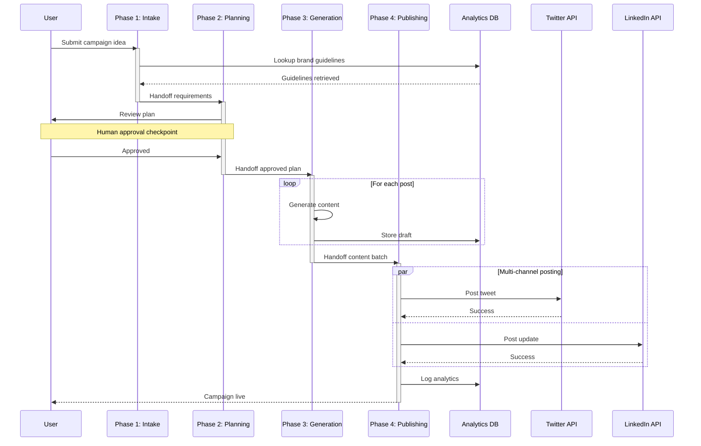

### Step 4: Validate & Optimize

ContextAgent checks:

✅ All `humanInLoop: true` agents have visual `Note over` indicators  
✅ All `connectedTools` have corresponding API participant arrows  
✅ Database operations have `Note right of DB:` explanations  
✅ No unused participants declared  
✅ Activation boxes for long operations  
✅ Arrow labels are specific (not generic "Process")  
✅ Participant names ≤15 chars  

## Composition Rules

### Simple Workflows (≤3 phases, linear)

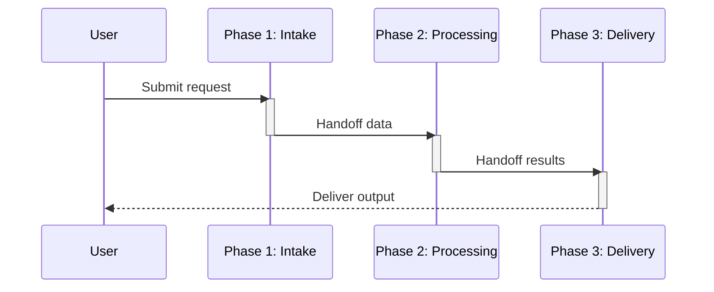

**Characteristics**: Minimal activation, focus on happy path, 1 note for critical checkpoint

### Complex Workflows (4+ phases)

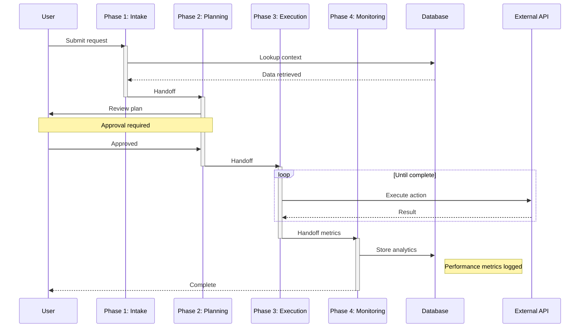

**Characteristics**: Activation boxes, loops, parallel blocks, checkpoints, database operations, notes for state changes

### Interview-Heavy Workflows

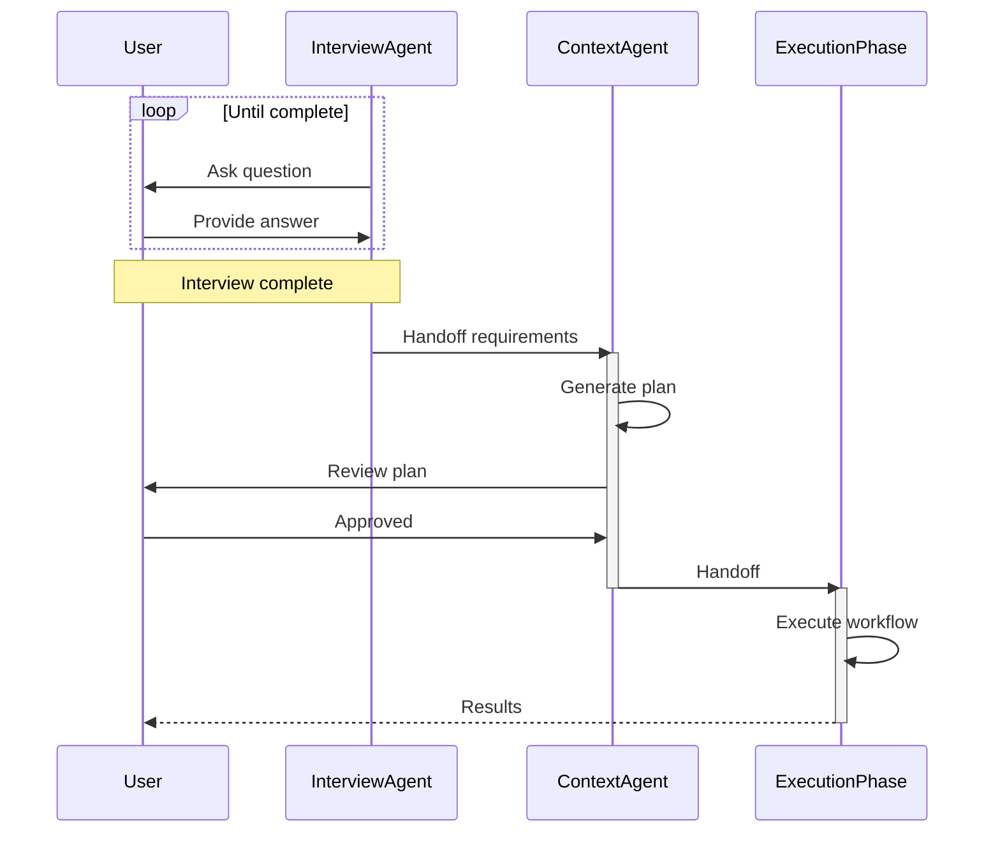

**Characteristics**: Bidirectional loops for Q&A, clear termination note, standard phases after interview

## Anti-Patterns (Avoid)

❌ **Too many participants** (>8)
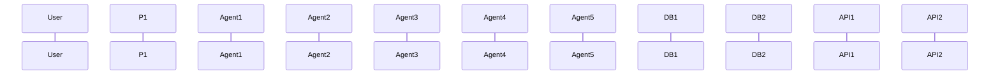

✅ **Better**: Group agents into phase participants
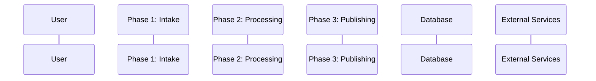

---

❌ **Generic arrow labels**
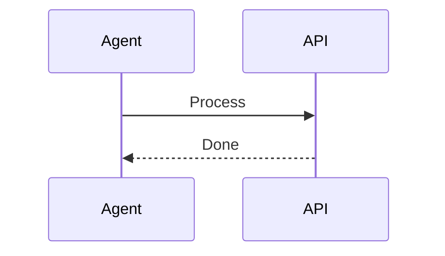

✅ **Better**: Specific actions
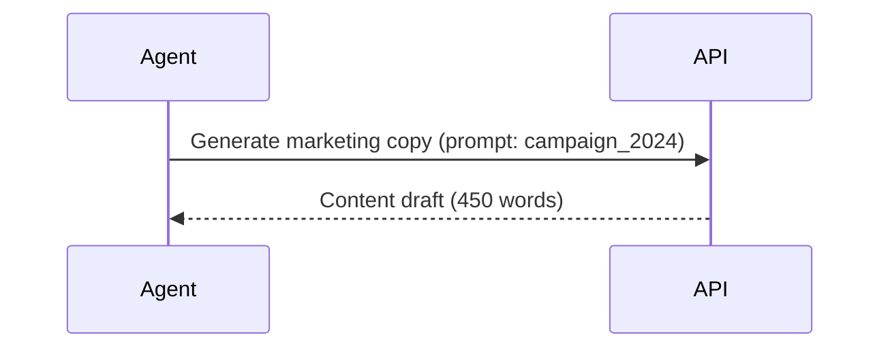

---

❌ **Missing activation boxes** for long operations
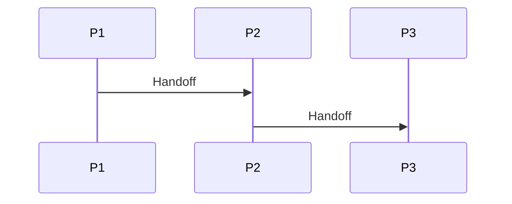

✅ **Better**: Show processing time
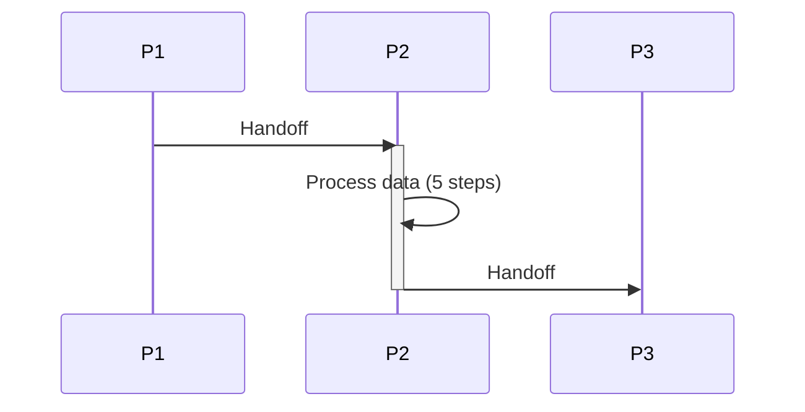

---

❌ **humanInLoop without visual indicator**
```json
{
  "agents": [{
    "name": "ApprovalAgent",
    "humanInLoop": true
  }]
}
```
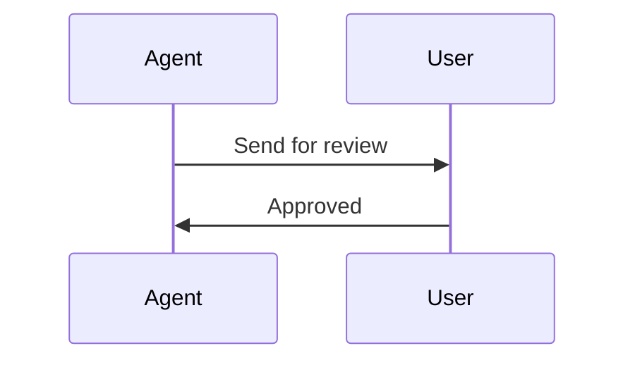

✅ **Better**: Add note over both participants
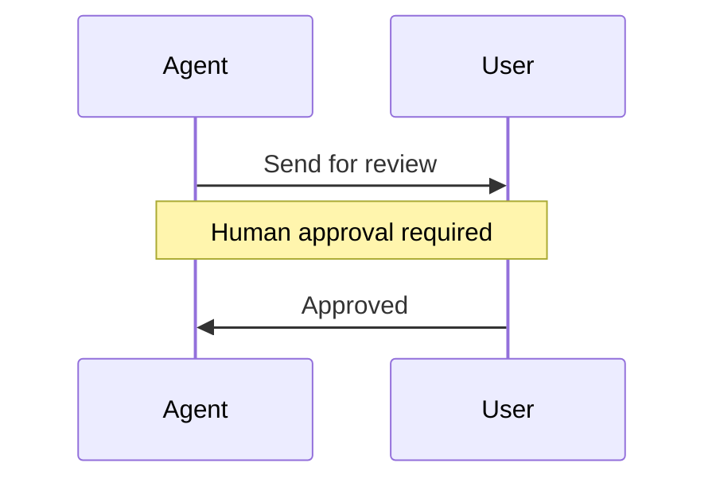

---

❌ **Database operations without context**
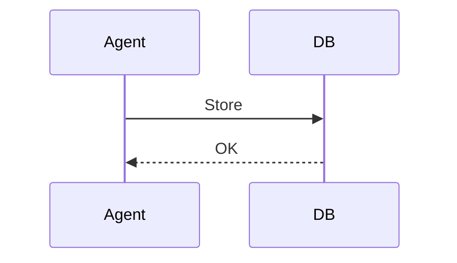

✅ **Better**: Explain what's stored
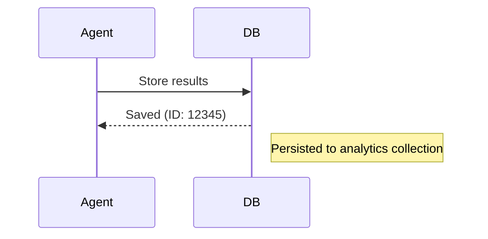

## Benefits of Modular Approach

1. **Scalability**: Works for simple (3-phase) to complex (7-phase with loops/parallel) workflows
2. **Semantic Accuracy**: Primitives map directly to workflow elements (loops → optimization, par → multi-channel)
3. **Maintainability**: Single source of truth (Pattern Library)
4. **Flexibility**: New primitives can be added without changing ContextAgent logic
5. **No Templates**: ContextAgent intelligently composes based on actual workflow characteristics
6. **Consistency**: Same primitive always rendered the same way

## Configuration Reference

### Frontend: ActionPlan.js Mermaid Config

```javascript
const mermaidConfig = {
  sequence: {
    actorMargin: 80,      // Horizontal space between participants
    messageMargin: 50,    // Vertical space between messages
    mirrorActors: true,   // Show participants at top and bottom
    wrap: true            // Wrap long text labels
  },
  flowchart: {
    nodeSpacing: 80,
    rankSpacing: 80,
    wrappingWidth: 200
  }
};

// Dynamic min-height based on diagram type
svgEl.style.minHeight = isSequence ? '500px' : '400px';
```

### Backend: ContextAgent Instruction (agents.json)

```
Step 1 - Analyze workflow characteristics
Step 2 - Declare participants (all at top)
Step 3 - Compose flow using primitives
Step 4 - Add clarity (activation, notes, labels)

Refer to MERMAID_PATTERN_LIBRARY.md primitives #1-10
```

### Schema: structured_outputs.json

```json
{
  "mermaid_flow": {
    "type": "str",
    "description": "Mermaid sequence diagram showing phase-to-agent-to-tool flow over time; must start with 'sequenceDiagram'; shows temporal interactions and handoffs."
  }
}
```

## Testing

1. **Generate workflow**: Request complex scenario (e.g., "e-commerce order fulfillment with inventory check, payment processing, shipping coordination, and customer notifications")
2. **Verify characteristics**: Check Action Plan has multiple phases, external APIs, database operations, human checkpoints
3. **Inspect diagram**: Validate sequence diagram uses appropriate primitives (parallel for multi-channel, loops for retries, notes for checkpoints)
4. **Check rendering**: Diagram should be 500px+ height, readable participant names, clear arrows

## Related Files

- **Pattern Library**: `workflows/Generator/MERMAID_PATTERN_LIBRARY.md`
- **Examples**: `docs/SEQUENCE_DIAGRAM_EXAMPLES.md`
- **Frontend**: `ChatUI/src/workflows/Generator/components/ActionPlan.js` (MermaidPreview)
- **Backend**: `workflows/Generator/agents.json` (ContextAgent instruction #6)
- **Schema**: `workflows/Generator/structured_outputs.json` (mermaid_flow)
- **Evolution Doc**: `docs/MERMAID_FLOWCHART_FIX.md`
