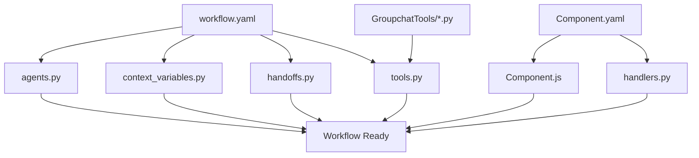

# Workflow Template System - Master Guide

## Overview

This template system enables rapid creation of complete AG2 workflows through standardized contracts and code generation. Each workflow consists of modular components that can be generated by LLMs or built by developers using these templates.

## 🎯 Complete Workflow Structure

```
workflows/{WorkflowName}/
├── workflow.yaml                    # Main configuration (REQUIRED)
├── metadata.json                    # Workflow metadata
├── templates/                       # Generated Python files
│   ├── agents.py                   # AG2 agents (AUTO-GENERATED)
│   ├── context_variables.py        # Shared state (AUTO-GENERATED)  
│   ├── handoffs.py                 # Agent transitions (AUTO-GENERATED)
│   └── tools.py                    # Tool registry (AUTO-GENERATED)
├── Components/                      # UI Components
│   ├── Artifacts/                  # Full-featured components
│   │   ├── {ComponentName}.js      # React component
│   │   └── {ComponentName}.yaml    # Component contract
│   └── Inline/                     # Lightweight components
│       ├── {ComponentName}.js      # React component
│       └── {ComponentName}.yaml    # Component contract
├── GroupchatTools/                 # Backend handlers
│   ├── __init__.py                # Module init (AUTO-GENERATED)
│   ├── {tool_name}.py             # Backend tools
│   └── handlers.py                # Component response handlers (AUTO-GENERATED)
└── generated/                      # Auto-generated files
    ├── manifest.json              # Component registry
    └── schema.json                # Validation schema
```

## 📋 Template Dependencies



## 🔧 Generation Pipeline

### 1. Create Base Configuration

```yaml
# workflow.yaml - Master configuration
metadata:
  name: "MyWorkflow"
  version: "1.0.0"
  description: "Custom workflow description"
  
configuration:
  human_in_the_loop: true
  transport: "sse"
  auto_start: false
  
agents:
  - name: "ConversationAgent"
    type: "conversational"
    capabilities: ["chat", "inline_components"]
    model: "gpt-4"
    
  - name: "SpecialistAgent"
    type: "specialist" 
    capabilities: ["artifacts"]
    model: "gpt-4"

context_variables:
  - name: "user_preferences"
    type: "Dict[str, Any]"
    default: "{}"
    
  - name: "workflow_data"
    type: "List[Dict[str, Any]]"
    default: "[]"

handoffs:
  - from: "ConversationAgent"
    to: "SpecialistAgent"
    condition: "requirements_collected"
    
components:
  inline:
    - name: "UserInputForm"
      required_props: ["fields", "title"]
      actions: ["submit", "cancel"]
      
  artifacts:
    - name: "ResultsViewer" 
      required_props: ["data", "format"]
      actions: ["download", "share"]

tools:
  - name: "collect_user_data"
    component: "UserInputForm"
    handler: "data_manager.store_user_input"
```

### 2. Generate Component Contracts

```yaml
# Components/Inline/UserInputForm.yaml
metadata:
  name: "UserInputForm"
  type: "inline"
  version: "1.0.0"
  
contract:
  props:
    required:
      - fields: "Array<Object>"
      - title: "string"
    optional:
      - validation: "Object"
      - theme: "string"
      
  actions:
    submit:
      payload_schema:
        type: "object"
        properties:
          formData: { type: "object" }
          isValid: { type: "boolean" }
      handler: "data_manager.store_user_input"
      
backend:
  module: "GroupchatTools.data_manager"
  functions: ["store_user_input", "validate_input"]
```

### 3. Generate Python Code

```bash
# CLI command to generate workflow
python tools/generate_workflow.py --config workflow.yaml --output workflows/MyWorkflow/

# Generated files:
# ✅ templates/agents.py
# ✅ templates/context_variables.py  
# ✅ templates/handoffs.py
# ✅ templates/tools.py
# ✅ GroupchatTools/handlers.py
# ✅ generated/manifest.json
```

### 4. Create Custom Components

```javascript
// Components/Inline/UserInputForm.js
import React, { useState } from 'react';

const UserInputForm = ({ 
  fields, 
  title, 
  validation = {},
  theme = "default",
  onAction 
}) => {
  const [formData, setFormData] = useState({});
  const [errors, setErrors] = useState({});
  
  const handleSubmit = async (e) => {
    e.preventDefault();
    
    const isValid = validateForm(formData, validation);
    
    await onAction({
      type: 'submit',
      data: { formData, isValid }
    });
  };
  
  return (
    <form onSubmit={handleSubmit} className={`user-input-form ${theme}`}>
      <h3>{title}</h3>
      {fields.map(field => (
        <div key={field.name} className="form-field">
          <label>{field.label}</label>
          <input
            type={field.type}
            value={formData[field.name] || ''}
            onChange={(e) => setFormData(prev => ({
              ...prev,
              [field.name]: e.target.value
            }))}
          />
          {errors[field.name] && (
            <span className="error">{errors[field.name]}</span>
          )}
        </div>
      ))}
      <button type="submit">Submit</button>
    </form>
  );
};

export default UserInputForm;
```

### 5. Implement Backend Tools

```python
# GroupchatTools/data_manager.py
class DataManager:
    """Handle user data collection and storage"""
    
    async def store_user_input(
        self,
        form_data: Dict[str, Any],
        context: MyWorkflowContext
    ) -> str:
        """Store user input from UserInputForm component"""
        
        try:
            # Validate input
            validation_errors = self._validate_input(form_data)
            if validation_errors:
                return f"Validation errors: {', '.join(validation_errors)}"
            
            # Store in context
            context.user_preferences.update(form_data)
            context.workflow_stage = "data_collected"
            
            # Log business event
            log_business_event(
                event_type="USER_DATA_COLLECTED",
                description="User input form submitted",
                context={"fields": list(form_data.keys())}
            )
            
            return "User data collected successfully"
            
        except Exception as e:
            logger.error(f"Error storing user input: {e}")
            return f"Error: {str(e)}"
```

## 🎯 Template Customization Points

### 1. Agent Behavior Customization

```yaml
# In workflow.yaml
agents:
  - name: "CustomAgent"
    model: "gpt-4"
    system_message: |
      You are a {ROLE_DESCRIPTION}.
      
      Your specific tasks:
      1. {TASK_1}
      2. {TASK_2}
      3. {TASK_3}
      
      UI Guidelines:
      - Use {COMPONENT_TYPE} components for {USE_CASE}
      - Always {BEHAVIOR_REQUIREMENT}
      
      Handoff when: {HANDOFF_CONDITION}
    
    custom_config:
      temperature: 0.7
      max_tokens: 1000
      response_format: "structured"
```

### 2. Component Interface Customization

```yaml
# In Component.yaml
contract:
  props:
    required:
      - data: "Array<{DATA_TYPE}>"
      - config: "Object"
    optional:
      - theme: "string"
      - permissions: "Array<string>"
      
  actions:
    primary_action:
      payload_schema: {CUSTOM_SCHEMA}
      handler: "{CUSTOM_HANDLER}"
      
    secondary_action:
      payload_schema: {SECONDARY_SCHEMA}
      handler: "{SECONDARY_HANDLER}"
      
  validation:
    required_permissions: ["read", "write"]
    data_constraints:
      min_items: 1
      max_items: 100
```

### 3. Handoff Logic Customization

```yaml
# In workflow.yaml
handoffs:
  - from: "AgentA"
    to: "AgentB"
    condition: "custom_condition"
    priority: 10
    custom_logic: |
      return (
        context.custom_field > threshold and
        len(context.data_list) >= minimum_items and
        context.user_permissions.includes("advanced")
      )
```

## 🚀 Quick Start Templates

### 1. Simple Data Collection Workflow

```yaml
metadata:
  name: "DataCollector"
  description: "Collect and validate user data"

agents:
  - name: "CollectorAgent"
    capabilities: ["chat", "inline_components"]
    
context_variables:
  - name: "collected_data"
    type: "Dict[str, Any]"
    default: "{}"

components:
  inline:
    - name: "DataForm"
      required_props: ["schema"]
      actions: ["submit"]
```

### 2. Content Generation Workflow

```yaml
metadata:
  name: "ContentGenerator"
  description: "Generate and deliver content files"

agents:
  - name: "RequirementsAgent"
    capabilities: ["chat", "inline_components"]
  - name: "GeneratorAgent"
    capabilities: ["artifacts"]
    
context_variables:
  - name: "content_specs"
    type: "Dict[str, Any]"
  - name: "generated_files"
    type: "List[Dict[str, Any]]"

components:
  inline:
    - name: "SpecsForm"
  artifacts:
    - name: "FileDownloader"
```

### 3. API Integration Workflow

```yaml
metadata:
  name: "APIIntegrator"
  description: "Configure and test API integrations"

agents:
  - name: "SetupAgent"
    capabilities: ["chat", "inline_components"]
  - name: "TestAgent"
    capabilities: ["artifacts"]
    
components:
  inline:
    - name: "APIKeyInput"
    - name: "EndpointConfig"
  artifacts:
    - name: "TestResults"
```

## 🔧 CLI Tools

### Workflow Generation

```bash
# Create new workflow from template
create-workflow --name "MyWorkflow" --template "content_generation"

# Generate from YAML config
generate-workflow --config workflow.yaml

# Validate workflow configuration
validate-workflow --path workflows/MyWorkflow/

# Update existing workflow
update-workflow --path workflows/MyWorkflow/ --config new_config.yaml
```

### Component Generation

```bash
# Create new component
create-component --workflow "MyWorkflow" --name "MyComponent" --type "inline"

# Generate from contract
generate-component --contract component_contract.yaml

# Validate component
validate-component --path Components/Inline/MyComponent.js
```

### Development Tools

```bash
# Start development server with hot reload
dev-server --workflow "MyWorkflow"

# Run workflow tests
test-workflow --path workflows/MyWorkflow/

# Build workflow for production
build-workflow --path workflows/MyWorkflow/ --output dist/
```

## 📚 LLM Integration

### Workflow Generation Prompt

```
Generate a complete AG2 workflow for: {WORKFLOW_DESCRIPTION}

Requirements:
- Workflow Type: {TYPE}
- Agents Needed: {AGENT_COUNT}
- UI Components: {COMPONENT_TYPES}
- Data Requirements: {DATA_NEEDS}
- Integration Points: {INTEGRATIONS}

Create:
1. workflow.yaml configuration
2. Component contracts for UI elements  
3. Agent system messages
4. Handoff logic
5. Backend tool specifications

Follow the MozaiksAI template system patterns.
```

### Component Generation Prompt

```
Create a {COMPONENT_TYPE} component for: {COMPONENT_PURPOSE}

Component Requirements:
- Props: {REQUIRED_PROPS}
- User Actions: {USER_ACTIONS}
- Data Flow: {DATA_REQUIREMENTS}
- Styling: {STYLE_REQUIREMENTS}

Generate:
1. React component with proper contract
2. Component YAML contract
3. Backend handler function
4. Validation logic
5. Error handling

Follow MozaiksAI component patterns and use the onAction callback system.
```

## 🎯 Best Practices Summary

1. **Start with Configuration**: Always begin with workflow.yaml
2. **Define Contracts First**: Create component contracts before implementation
3. **Use Auto-Generation**: Leverage templates for boilerplate code
4. **Test Incrementally**: Test each component as you build
5. **Follow Naming Conventions**: Use consistent naming across all files
6. **Validate Early**: Use validation tools throughout development
7. **Document Customizations**: Document any custom logic or patterns
8. **Version Control**: Track all generated and custom files
9. **Error Handling**: Implement comprehensive error handling
10. **Performance**: Consider caching and optimization from start

This template system makes workflow creation as simple as filling out configuration files while maintaining complete flexibility for custom business logic!
