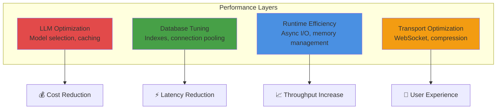

# Performance Tuning Guide

**Purpose:** Optimize MozaiksAI for scale, efficiency, and cost-effectiveness. Covers caching strategies, connection pooling, resource management, and horizontal scaling patterns.

---

## Overview

Performance optimization in MozaiksAI targets four key dimensions:

1. **Latency**: Reduce response time for agent turns and UI interactions
2. **Throughput**: Increase concurrent workflows and messages per second
3. **Resource Efficiency**: Minimize CPU, memory, and database load
4. **Cost**: Reduce LLM token consumption and infrastructure expenses



---

## Quick Wins (Immediate Impact)

### 1. Enable LLM Response Caching

**Impact:** 50-90% cost reduction on repeated queries

**Implementation:**

```bash
# In .env
LLM_CONFIG_CACHE_TTL=300  # Cache for 5 minutes

# For production stability, use per-chat cache seeds (auto-derived)
# NEVER set LLM_DEFAULT_CACHE_SEED in production
```

**How It Works:**
- AG2 uses `cache_seed` to enable LLM result caching
- Identical prompts within TTL window return cached responses
- Per-chat seeds prevent cross-chat contamination

**Verification:**
```python
# Check cache_seed in use
from core.workflow.llm_config import get_llm_config

config = get_llm_config("Generator", chat_id="chat_abc123")
print("Cache seed:", config["cache_seed"])
# Should be: "chat_abc123_<timestamp>" or similar
```

---

### 2. Use Smaller Models for Simple Tasks

**Impact:** 5-10x cost reduction, 2-3x latency improvement

**Strategy:**

```json
// In workflow's agents.json, use model hierarchy
{
  "agents": [
    {
      "name": "router",
      "model": "gpt-4o-mini",  // Fast, cheap routing
      "system_message": "Route user query to appropriate agent"
    },
    {
      "name": "executor",
      "model": "gpt-4",  // Powerful, expensive execution
      "system_message": "Execute complex task"
    }
  ]
}
```

**Model Selection Guide:**

| Use Case | Model | Cost (per 1M tokens) | Latency |
|----------|-------|----------------------|---------|
| Routing, classification | gpt-4o-mini | $0.15 input, $0.60 output | ~500ms |
| Simple generation | gpt-4o-mini | $0.15 input, $0.60 output | ~500ms |
| Complex reasoning | gpt-4o | $5 input, $15 output | ~2s |
| Code generation | gpt-4 | $30 input, $60 output | ~3s |

---

### 3. MongoDB Connection Pooling

**Impact:** 30-50% latency reduction on database operations

**Configuration:**

```bash
# In .env, add connection pool parameters
MONGO_URI=mongodb://localhost:27017/mozaiks?maxPoolSize=50&minPoolSize=10
```

**docker-compose.yml Enhancement:**

```yaml
services:
  app:
    environment:
      MONGO_URI: mongodb://mongo:27017/mozaiks?maxPoolSize=50&minPoolSize=10&maxIdleTimeMS=60000
```

**Optimal Pool Sizes:**

- **Small Deployment** (<10 concurrent workflows): `maxPoolSize=20`
- **Medium Deployment** (10-50 concurrent): `maxPoolSize=50`
- **Large Deployment** (>50 concurrent): `maxPoolSize=100`

---

### 4. Add Database Indexes

**Impact:** 10-100x query speedup on large collections

**Critical Indexes:**

```javascript
// In mongosh
use mozaiks

// Chat sessions: Lookup by chat_id (primary key)
db.chat_sessions.createIndex({ chat_id: 1 }, { unique: true })

// Chat sessions: List by app and user
db.chat_sessions.createIndex({ app_id: 1, user_id: 1 })

// Chat sessions: Recent chats
db.chat_sessions.createIndex({ created_at: -1 })

// Messages: Retrieve by chat in order
db.chat_messages.createIndex({ chat_id: 1, timestamp: 1 })

// Messages: Unique sequence per chat
db.chat_messages.createIndex({ chat_id: 1, sequence_id: 1 }, { unique: true })

// Context store: Fast key lookup
db.context_store.createIndex({ chat_id: 1, key: 1 }, { unique: true })

// UI component state: Retrieve by chat and tool
db.ui_component_state.createIndex({ chat_id: 1, ui_tool_id: 1 })
```

**Verify Indexes:**
```javascript
db.chat_sessions.getIndexes()
```

---

### 5. Reduce Log Verbosity in Production

**Impact:** 10-20% CPU reduction, faster I/O

**Configuration:**

```bash
# In .env
LOG_LEVEL=INFO  # Change from DEBUG
LOGS_AS_JSON=true  # More efficient than pretty-print

# Disable AG2 file logging (use SQLite only)
AG2_RUNTIME_LOGGING=sqlite
```

---

## LLM Optimization

### Prompt Engineering for Efficiency

**1. Concise System Messages:**

```python
# ❌ Verbose (high token cost)
system_message = """
You are a helpful assistant that helps users with their tasks.
Please be polite and professional in all your responses.
Always provide detailed explanations when possible.
If you don't understand something, ask for clarification.
"""

# ✅ Concise (lower token cost)
system_message = "You are a task assistant. Be concise and actionable."
```

**2. Limit Context Window:**

```json
// In agents.json
{
  "name": "analyst",
  "model": "gpt-4o",
  "max_consecutive_auto_reply": 10,  // Limit conversation length
  "context_window": 8000  // Use smaller window than model's max
}
```

**3. Use Structured Outputs:**

```python
# Structured outputs are more token-efficient than free-form
# Agent responds with JSON, not verbose prose
from pydantic import BaseModel

class AnalysisResult(BaseModel):
    """Structured output schema"""
    summary: str
    confidence: float
    next_steps: list[str]
```

---

### Model Temperature & Sampling

**Deterministic Tasks (Low Temperature):**

```json
{
  "model": "gpt-4o",
  "temperature": 0.1,  // Reduce from default 1.0
  "top_p": 0.9
}
```

**Use Cases:**
- Code generation
- Data extraction
- Classification tasks

**Creative Tasks (Higher Temperature):**

```json
{
  "model": "gpt-4o",
  "temperature": 0.7
}
```

**Use Cases:**
- Content creation
- Brainstorming
- Storytelling

---

### Batch Requests (Future Optimization)

**Concept:** Group multiple LLM calls into single batch request

```python
# Future: Batch API support
# Instead of 10 sequential calls, make 1 batch call
responses = await batch_llm_call([
    {"prompt": "Analyze A"},
    {"prompt": "Analyze B"},
    # ... 10 items
])
```

**Benefits:**
- 50% cost reduction with OpenAI Batch API
- Reduced latency variance
- Better resource utilization

---

## Database Optimization

### Query Optimization

**1. Use Projections (Limit Returned Fields):**

```python
# ❌ Returns entire document (wasteful)
session = await collection.find_one({"chat_id": chat_id})

# ✅ Returns only needed fields
session = await collection.find_one(
    {"chat_id": chat_id},
    {"_id": 0, "status": 1, "metadata": 1}
)
```

**2. Use Aggregation Pipelines:**

```python
# Efficient aggregation for analytics
pipeline = [
    {"$match": {"app_id": "acme_corp"}},
    {"$group": {
        "_id": "$workflow_name",
        "total_chats": {"$sum": 1},
        "avg_duration": {"$avg": "$runtime_sec"}
    }},
    {"$sort": {"total_chats": -1}}
]
results = await collection.aggregate(pipeline).to_list(length=100)
```

**3. Limit Result Sets:**

```python
# Always use limit for large collections
recent_chats = await collection.find(
    {"user_id": user_id}
).sort("created_at", -1).limit(50).to_list(length=50)
```

---

### Write Optimization

**1. Batch Inserts:**

```python
# ❌ Multiple round-trips
for message in messages:
    await collection.insert_one(message)

# ✅ Single batch insert
await collection.insert_many(messages, ordered=False)
```

**2. Async Writes (Fire-and-Forget):**

```python
# For non-critical writes, use write concern 0
await collection.update_one(
    {"chat_id": chat_id},
    {"$set": {"last_ping": datetime.now(UTC)}},
    write_concern=WriteConcern(w=0)
)
```

**3. Update Instead of Replace:**

```python
# ❌ Replace entire document
await collection.replace_one({"_id": doc_id}, new_doc)

# ✅ Update specific fields
await collection.update_one(
    {"_id": doc_id},
    {"$set": {"status": "completed", "ended_at": datetime.now(UTC)}}
)
```

---

### Connection Management

**Reuse Connections:**

```python
# ✅ Singleton pattern (already implemented)
from core.core_config import get_mongo_client

# Reuses same client across requests
mongo_client = get_mongo_client()
```

**Monitor Connection Pool:**

```python
# Check pool stats
client = get_mongo_client()
pool_stats = client.admin.command("serverStatus")["connections"]
print(f"Active: {pool_stats['active']}, Available: {pool_stats['available']}")
```

---

## Runtime Efficiency

### Async I/O Best Practices

**1. Await Concurrently, Not Sequentially:**

```python
import asyncio

# ❌ Sequential (slow)
user = await get_user(user_id)
session = await get_session(chat_id)
context = await get_context(chat_id)

# ✅ Concurrent (fast)
user, session, context = await asyncio.gather(
    get_user(user_id),
    get_session(chat_id),
    get_context(chat_id)
)
```

**2. Use asyncio.create_task for Fire-and-Forget:**

```python
# Don't block on non-critical operations
async def log_metric(metric):
    await db.metrics.insert_one(metric)

# Fire and forget
asyncio.create_task(log_metric({"name": "event", "value": 1}))
```

**3. Set Timeouts on External Calls:**

```python
try:
    response = await asyncio.wait_for(
        openai_api_call(),
        timeout=30.0
    )
except asyncio.TimeoutError:
    # Fallback or retry
    pass
```

---

### Memory Management

**1. Stream Large Responses:**

```python
# ❌ Load entire collection into memory
all_messages = await collection.find({}).to_list(length=None)

# ✅ Stream/cursor iteration
async for message in collection.find({}):
    process(message)
```

**2. Clear Caches Periodically:**

```python
# In core/workflow/llm_config.py
def clear_llm_caches(raw=True, built=True):
    """Clear LLM config caches to free memory"""
    global _raw_config_cache, _built_config_cache
    if raw:
        _raw_config_cache.clear()
    if built:
        _built_config_cache.clear()
```

**3. Limit In-Memory State (PerformanceManager):**

```python
# Flush metrics more frequently
perf_mgr = PerformanceManager(flush_interval_sec=60)  # Down from 300

# Or periodically clear old chat states
async def cleanup_old_chats():
    cutoff = datetime.now(UTC) - timedelta(hours=24)
    # Remove completed chats older than 24h
```

---

### Tool Execution Optimization

**1. Lazy Import Workflow Tools:**

```python
# Tools are dynamically imported only when called
# Already implemented in core/workflow/agent_tools.py
# Avoids loading all tools at startup
```

**2. Cache Tool Modules:**

```python
# Keep tool cache enabled in production
CLEAR_TOOL_CACHE_ON_START=false

# Tools load once and reuse across workflows
```

**3. Optimize Tool Logic:**

```python
# ❌ Expensive operation in tool
def slow_tool(query: str) -> str:
    # Fetch entire dataset
    data = fetch_all_data()
    # Filter in Python
    results = [x for x in data if query in x]
    return results

# ✅ Efficient operation
def fast_tool(query: str) -> str:
    # Query database with filter
    results = db.collection.find({"$text": {"$search": query}}).limit(10)
    return results
```

---

## Transport & WebSocket Optimization

### WebSocket Keep-Alive

**Reduce Ping Interval for Faster Failure Detection:**

```python
# In SimpleTransport or WebSocket handler
websocket.ping_interval = 20  # Seconds (default 20)
websocket.ping_timeout = 10   # Seconds (default 20)
```

**Benefits:**
- Detect disconnections faster
- Reduce stuck connections
- Better resource cleanup

---

### Message Compression

**Enable WebSocket Per-Message Deflate:**

```python
# In shared_app.py WebSocket endpoint
@app.websocket("/ws/chat")
async def websocket_chat(websocket: WebSocket):
    await websocket.accept(
        compression="deflate"  # Enable compression
    )
```

**Impact:** 30-70% bandwidth reduction for large payloads

---

### Event Batching

**Batch Multiple Events into Single Message:**

```python
# Instead of sending 10 small events:
# event1, event2, event3, ...

# Send batch:
batched_event = {
    "type": "batch",
    "events": [event1, event2, event3, ...]
}
```

**When to Batch:**
- Multiple agent messages in quick succession
- Tool progress updates (e.g., 10%, 20%, 30%)
- Metrics updates

---

## Caching Strategies

### LLM Config Cache

**Already Implemented:** `core/workflow/llm_config.py`

**Tuning:**

```bash
# In .env

# Cache TTL (seconds)
LLM_CONFIG_CACHE_TTL=300  # 5 minutes (default)

# For development (hot-reload workflows):
LLM_CONFIG_CACHE_TTL=0

# For production (stable workflows):
LLM_CONFIG_CACHE_TTL=3600  # 1 hour
```

**Monitoring:**

```python
# Check cache hit rate
from core.workflow.llm_config import _raw_config_cache, _built_config_cache

print(f"Raw cache size: {len(_raw_config_cache)}")
print(f"Built cache size: {len(_built_config_cache)}")
```

---

### Tool Cache

**Module-Level Caching:**

```bash
# In .env
CLEAR_TOOL_CACHE_ON_START=false  # Production
CLEAR_TOOL_CACHE_ON_START=true   # Development
```

**Impact:** Faster tool loading (100-500ms saved per workflow start)

---

### Frontend Workflow Registry Cache

**Already Implemented:** `ChatUI/src/workflows/index.js`

**Optimization:**

```javascript
// Increase cache TTL
const CACHE_EXPIRY_MS = 60 * 60 * 1000;  // 1 hour (up from default)

// Pre-fetch workflows on app load
useEffect(() => {
  workflowRegistry.initializeWorkflows();
}, []);
```

---

## Horizontal Scaling

### Load Balancing Multiple Backend Instances

**Architecture:**

```
            ┌─────────────┐
            │  nginx LB   │
            └──────┬──────┘
                   │
       ┌───────────┼───────────┐
       │           │           │
   ┌───▼───┐   ┌──▼────┐  ┌───▼───┐
   │ App 1 │   │ App 2 │  │ App 3 │
   └───┬───┘   └───┬───┘  └───┬───┘
       └───────────┼───────────┘
                   │
            ┌──────▼──────┐
            │   MongoDB   │
            └─────────────┘
```

**nginx Configuration:**

```nginx
upstream mozaiksai_backend {
    least_conn;  # Route to least-busy instance
    server app1:8000;
    server app2:8000;
    server app3:8000;
}

server {
    listen 443 ssl;
    server_name mozaiks.yourdomain.com;

    location /api/ {
        proxy_pass http://mozaiksai_backend/api/;
    }

    # WebSocket: Sticky sessions required
    location /ws/ {
        proxy_pass http://mozaiksai_backend/ws/;
        proxy_http_version 1.1;
        proxy_set_header Upgrade $http_upgrade;
        proxy_set_header Connection "upgrade";
        
        # Sticky session by IP hash
        ip_hash;
    }
}
```

**docker-compose.yml (Multiple Replicas):**

```yaml
services:
  app:
    image: mozaiksai-app:latest
    deploy:
      replicas: 3
    environment:
      MONGO_URI: mongodb://mongo:27017/mozaiks?maxPoolSize=100
```

---

### WebSocket Session Affinity

**Challenge:** WebSocket connections are stateful

**Solution:** Use sticky sessions based on chat_id or session cookie

**nginx IP Hash:**

```nginx
upstream mozaiksai_backend {
    ip_hash;  # Same IP always routes to same backend
    server app1:8000;
    server app2:8000;
}
```

**Or Use Redis for Shared State (Future):**

```python
# Store active WebSocket connections in Redis
# All backend instances can access same state
redis_client.sadd("active_chats", chat_id)
```

---

## Cost Optimization

### Token Usage Monitoring

**Track Token Consumption:**

```bash
# Query Prometheus metrics
curl http://localhost:9090/api/v1/query?query=sum(mozaiks_chat_prompt_tokens_total)

# Or via performance endpoint
curl http://localhost:8000/metrics/perf/aggregate | jq '.total_prompt_tokens'
```

**Set Cost Alerts:**

```yaml
# In Prometheus alerts.yml
- alert: DailyCostExceeded
  expr: increase(mozaiks_chat_cost_usd_total[24h]) > 100
  for: 1m
  labels:
    severity: critical
```

---

### Model Downgrade Strategy

**Automatic Fallback:**

```python
# Use cheaper model for retries
async def call_llm_with_fallback(prompt: str):
    try:
        return await call_llm(prompt, model="gpt-4")
    except OpenAIError as e:
        if e.status_code == 429:  # Rate limit
            # Retry with cheaper model
            return await call_llm(prompt, model="gpt-4o-mini")
        raise
```

---

### Reduce Max Turns

**Limit Conversation Length:**

```json
// In workflow orchestrator.json
{
  "max_turns": 10  // Down from 20+
}
```

**Impact:** Prevents runaway conversations, reduces token waste

---

## Performance Benchmarking

### Measure Baseline Performance

**1. Agent Turn Latency:**

```bash
# From performance logs
cat logs/logs/performance.log | jq 'select(.msg == "agent_turn") | .extra.duration_sec' | \
  awk '{sum+=$1; count++} END {print "Avg:", sum/count, "Count:", count}'
```

**2. Database Query Time:**

```javascript
// Enable MongoDB profiling
db.setProfilingLevel(2)  // Log all queries

// View slow queries (>100ms)
db.system.profile.find({ millis: { $gt: 100 } }).sort({ ts: -1 }).limit(10)
```

**3. WebSocket Latency:**

```javascript
// In browser console (ChatUI)
const start = Date.now();
api.sendMessage(chatId, "test");
api.on('message', () => {
  console.log('Latency:', Date.now() - start, 'ms');
});
```

---

### Load Testing

**Artillery Config (`artillery.yml`):**

```yaml
config:
  target: "http://localhost:8000"
  phases:
    - duration: 60
      arrivalRate: 10  # 10 new sessions per second
  processor: "./test-processor.js"

scenarios:
  - name: "Start workflow"
    flow:
      - post:
          url: "/api/start"
          json:
            workflow_name: "Generator"
            app_id: "test_app"
            user_id: "test_user"
      - think: 2
```

**Run Load Test:**

```bash
npm install -g artillery
artillery run artillery.yml
```

**Monitor During Load Test:**

```bash
# Terminal 1: Watch metrics
watch -n 1 'curl -s http://localhost:8000/metrics/perf/aggregate | jq'

# Terminal 2: Watch resource usage
docker stats mozaiksai-app

# Terminal 3: Watch logs for errors
docker compose logs -f app | grep ERROR
```

---

## Optimization Checklist

### Infrastructure

- [ ] MongoDB connection pooling enabled (maxPoolSize=50+)
- [ ] Database indexes created for all common queries
- [ ] Log level set to INFO (not DEBUG) in production
- [ ] LLM config cache enabled (TTL=300s+)
- [ ] Tool cache preserved on startup (CLEAR_TOOL_CACHE_ON_START=false)

### LLM Usage

- [ ] Appropriate model selected per agent (gpt-4o-mini vs gpt-4)
- [ ] System messages concise (< 200 tokens)
- [ ] Temperature tuned for task (0.1 for deterministic, 0.7 for creative)
- [ ] max_turns limit set (typically 10-20)
- [ ] Structured outputs used where applicable

### Database

- [ ] Queries use projections to limit returned fields
- [ ] Aggregation pipelines used for analytics
- [ ] Result sets limited (`.limit(100)`)
- [ ] Write concern optimized (w=1 for non-critical writes)
- [ ] Batch operations used for bulk inserts/updates

### Runtime

- [ ] Async operations run concurrently (asyncio.gather)
- [ ] Timeouts set on external API calls (30s)
- [ ] Large collections streamed, not loaded into memory
- [ ] Old metrics flushed periodically (flush_interval_sec=60)

### Transport

- [ ] WebSocket compression enabled (per-message deflate)
- [ ] Keep-alive tuned (ping_interval=20s)
- [ ] Event batching for high-frequency updates

### Monitoring

- [ ] Prometheus scraping metrics
- [ ] Grafana dashboards tracking latency, throughput, cost
- [ ] Alerts set for cost thresholds, error rates, slow queries
- [ ] Performance baselines documented

---

## Advanced Optimization Techniques

### 1. Pre-Warm LLM Cache

**Strategy:** Pre-populate cache with common queries at deployment

```python
# In startup script
async def pre_warm_cache():
    common_queries = [
        "Hello, how can I help?",
        "Please analyze this data",
        # ... 10-20 common prompts
    ]
    for query in common_queries:
        await call_llm(query, model="gpt-4o", cache_seed="global")
```

---

### 2. Read Replicas (MongoDB Atlas)

**Setup:**
- Enable read replicas in MongoDB Atlas
- Configure read preference in connection string

```bash
MONGO_URI=mongodb+srv://...?readPreference=secondaryPreferred&maxStalenessSeconds=120
```

**Benefits:**
- Offload read traffic from primary
- 2-3x read throughput
- Geographic distribution for low latency

---

### 3. CDN for Frontend Assets

**Use Cloudflare, CloudFront, or similar:**

- Cache React build artifacts (JS, CSS, images)
- Reduce server load
- Improve global latency

---

### 4. Database Sharding (Large Scale)

**When:** > 1TB data or > 100k concurrent users

**Strategy:**
- Shard by `app_id` or `user_id`
- Each shard handles subset of apps
- MongoDB native sharding or app-level routing

---

## Performance Targets (Benchmarks)

| Metric | Target | Measurement |
|--------|--------|-------------|
| Agent Turn Latency (p95) | < 5s | Performance logs |
| WebSocket Connection Time | < 500ms | Browser DevTools |
| Database Query (p95) | < 100ms | MongoDB profiler |
| Health Endpoint Response | < 50ms | curl timing |
| Concurrent Workflows | 50+ | /metrics/perf/aggregate |
| Memory Usage (per workflow) | < 100MB | Docker stats |
| Daily Cost (per 1000 sessions) | < $50 | Token tracking |

---

## Next Steps

- **[Monitoring Guide](monitoring.md)** - Track performance metrics with Prometheus/Grafana
- **[Troubleshooting Guide](troubleshooting.md)** - Debug performance issues
- **[Deployment Guide](deployment.md)** - Production deployment best practices
- **[Configuration Reference](../runtime/configuration_reference.md)** - All tuning parameters
- **[Database Schema](../reference/database_schema.md)** - Index strategies
