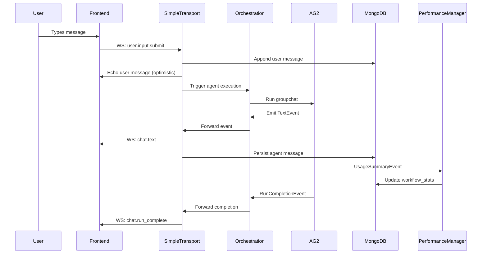

# Runtime Lifecycle: Request to Response

**Purpose:** End-to-end trace of a user message flowing through the MozaiksAI runtime, from WebSocket intake to persisted analytics.

## Overview

A typical user interaction follows this sequence:

1. **Frontend sends message** → WebSocket `user.input.submit` or HTTP POST `/api/input/submit`
2. **Transport validates and persists** → Message appended to `chat_sessions` MongoDB collection
3. **Orchestration invokes agents** → AG2 groupchat runs with handoffs and context variables
4. **Agents emit events** → Text, tool calls, structured outputs, input requests
5. **Events stream to UI** → WebSocket sends filtered events based on `visual_agents` config
6. **Persistence captures state** → Every message and context change saved to MongoDB
7. **Metrics rollup** → Performance manager updates `workflow_stats` with tokens/cost/duration

This document traces each step with the actual module and function involved.

---

## Phase 1: User Message Intake

### Step 1.1: WebSocket Message Reception

**Trigger:** Frontend sends `{"type": "user.input.submit", "content": "Create a workflow", "chat_id": "chat_abc123"}`

**Handler:** `core/transport/simple_transport.py` → `SimpleTransport.handle_websocket_message()`

**Logic:**
```python
async def handle_websocket_message(self, message_data: dict, ws: WebSocket):
    msg_type = message_data.get('type')
    if msg_type == 'user.input.submit':
        content = message_data.get('content')
        chat_id = message_data.get('chat_id')
        await self.process_incoming_user_message(
            chat_id=chat_id, 
            user_id=None, 
            content=content, 
            source='ws'
        )
```

**Alternate Path (HTTP):** `POST /api/input/submit` → `shared_app.py` → `submit_user_input()` → same `process_incoming_user_message()` call

---

### Step 1.2: Persistence of User Message

**Module:** `core/transport/simple_transport.py` → `process_incoming_user_message()`

**Actions:**
1. Increment `last_sequence` in `chat_sessions` document (atomic MongoDB operation)
2. Append message document to `messages` array:
   ```json
   {
     "role": "user",
     "name": "user",
     "content": "Create a workflow",
     "timestamp": "2025-10-02T14:30:05Z",
     "sequence": 42,
     "event_type": "message.created",
     "source": "ws"
   }
   ```
3. Update `last_updated_at` timestamp

**MongoDB Query:**
```python
await coll.find_one_and_update(
    {"_id": chat_id},
    {"$inc": {"last_sequence": 1}, "$set": {"last_updated_at": now_dt}},
    return_document=ReturnDocument.AFTER
)
await coll.update_one(
    {"_id": chat_id},
    {"$push": {"messages": msg_doc}}
)
```

---

### Step 1.3: UI Event Emission

**Module:** `core/transport/simple_transport.py` → `send_event_to_ui()`

**Event Sent:**
```json
{
  "type": "chat.text",
  "data": {
    "kind": "text",
    "agent": "user",
    "content": "Create a workflow",
    "index": 41,
    "sequence": 42
  },
  "timestamp": "2025-10-02T14:30:05Z"
}
```

**Purpose:** Echo user message back to frontend for immediate display (optimistic UI update)

---

## Phase 2: Orchestration Execution

### Step 2.1: Workflow Trigger

**Entry Point:** `POST /api/chats/{enterprise}/{workflow}/start` or resume via `/resume`

**Module:** `shared_app.py` → endpoint handler → `core/workflow/orchestration_patterns.py` → `run_default_pattern()`

**Initialization:**
1. Load workflow config from `workflows/{WorkflowName}/workflow.json`
2. Build agent list from `agents.json`
3. Register tools from `tools.json`
4. Initialize context variables from `context_variables.json`
5. Restore messages from MongoDB if resuming

**Key Code:**
```python
async def run_default_pattern(
    chat_id: str,
    enterprise_id: str,
    workflow_name: str,
    user_id: str,
    initial_message: Optional[str],
    ...
):
    # Load config
    config = workflow_manager.get_config(workflow_name)
    
    # Build agents
    agents = await _build_agents(workflow_name, chat_id, ...)
    
    # Restore or initialize groupchat
    groupchat = await _restore_or_create_groupchat(
        chat_id, agents, config
    )
```

---

### Step 2.2: Agent Execution Loop

**Module:** `core/workflow/orchestration_patterns.py` → AG2's `GroupChat.run()` (wrapped by orchestration)

**Flow:**
1. Select next speaker based on `handoffs.json` rules or AG2's internal selector
2. Agent generates response (calls LLM with system message + context)
3. Agent emits events:
   - `TextEvent` → free-form response
   - `ToolCallEvent` → function invocation
   - `StructuredOutputEvent` → Pydantic-validated JSON (if `structured_outputs_required: true`)
   - `InputRequestEvent` → user input prompt

**Event Handling:**
```python
# AG2 emits events via runtime.publish(event)
# Our event subscription catches them:
async def on_event(event: BaseEvent):
    # Serialize AG2 event to dict with 'kind' field
    serialized = serialize_ag2_event(event)
    
    # Forward to transport for UI streaming
    await transport.send_event_to_ui(serialized, chat_id)
    
    # Persist to MongoDB
    await persistence_manager.append_message(chat_id, serialized)
```

---

### Step 2.3: Handoff Evaluation

**Module:** `core/workflow/orchestration_patterns.py` → handoff logic

**Logic:**
1. After agent finishes, check `handoffs.json` for matching `source_agent`
2. Evaluate `condition` (if present) against context variables:
   ```python
   if rule['condition']:
       # Example: "${interview_complete} == True"
       result = eval_condition(rule['condition'], context)
       if not result:
           continue  # Skip this handoff
   ```
3. If `transition_target == "AgentTarget"`, hand off to `target_agent`
4. If `transition_target == "TerminateTarget"`, end the run
5. If `transition_target == "RevertToUserTarget"`, pause for user input

**Example Handoff:**
```json
{
  "source_agent": "InterviewAgent",
  "target_agent": "ContextAgent",
  "handoff_type": "after_work",
  "condition": "${interview_complete} == True",
  "transition_target": "AgentTarget"
}
```

---

## Phase 3: Event Streaming to UI

### Step 3.1: Event Envelope Construction

**Module:** `core/transport/simple_transport.py` → `build_outbound_event_envelope()`

**Input (AG2 serialized event):**
```python
{
  "kind": "text",
  "agent": "ContextAgent",
  "content": "I've drafted your action plan..."
}
```

**Output (WebSocket envelope):**
```python
{
  "type": "chat.text",
  "data": {
    "kind": "text",
    "agent": "ContextAgent",
    "content": "I've drafted your action plan...",
    "is_visual": True,
    "is_structured_capable": True,
    "is_tool_agent": False,
    "sequence": 43
  },
  "timestamp": "2025-10-02T14:30:12Z"
}
```

**Enrichment:**
- `is_visual` → `True` if agent in `visual_agents` list
- `is_structured_capable` → `True` if agent has `structured_outputs_required: true`
- `is_tool_agent` → `True` if agent owns a UI_Tool entry
- `sequence` → Monotonic counter from transport `_sequence_counters`

---

### Step 3.2: Filtering & Suppression

**Module:** `core/transport/simple_transport.py` → `build_outbound_event_envelope()`

**Filters Applied:**

1. **Visual Agent Filter:**
   ```python
   visual_agents = workflow_config.get('visual_agents', [])
   if agent_name not in visual_agents:
       # Don't send to WebSocket (internal coordination agent)
       return None
   ```

2. **UI_HIDDEN Trigger Suppression:**
   ```python
   hidden_triggers = workflow_manager.get_ui_hidden_triggers(workflow_name)
   if agent_name in hidden_triggers and content.strip() in hidden_triggers[agent_name]:
       event_dict['_mozaiks_hide'] = True  # Frontend hides this
   ```

3. **Auto-Tool Deduplication:**
   ```python
   auto_tool_agents = workflow_manager.get_auto_tool_agents(workflow_name)
   if agent_name in auto_tool_agents and kind == 'text':
       event_dict['_mozaiks_hide'] = True  # Suppress duplicate text
   ```

---

### Step 3.3: WebSocket Transmission

**Module:** `core/transport/simple_transport.py` → `_broadcast_to_websockets()`

**Logic:**
```python
async def _broadcast_to_websockets(self, event_data: dict, chat_id: str):
    conn = self.connections.get(chat_id)
    if not conn or not conn.get('websocket'):
        # Buffer event if WebSocket not yet connected
        self._pre_connection_buffers.setdefault(chat_id, []).append(event_data)
        return
    
    ws = conn['websocket']
    await ws.send_json(event_data)
```

**Pre-Connection Buffering:** If WebSocket connects after orchestration starts, buffered events are flushed on `ws.connect`.

---

## Phase 4: Persistence & State Capture

### Step 4.1: Message Append

**Module:** `core/data/persistence_manager.py` → `append_message()`

**Triggered By:** Every AG2 event (text, tool_call, tool_response, etc.)

**MongoDB Operation:**
```python
await coll.update_one(
    {"_id": chat_id},
    {
        "$push": {"messages": message_doc},
        "$set": {"last_updated_at": datetime.now(UTC)}
    }
)
```

**Message Document Structure:**
```json
{
  "role": "assistant",
  "name": "ContextAgent",
  "content": "...",
  "timestamp": "2025-10-02T14:30:12Z",
  "sequence": 43,
  "event_type": "message.created",
  "agent_message_id": "msg_xyz",
  "tokens": 450,
  "cost": 0.00675
}
```

---

### Step 4.2: Context Snapshot

**Module:** `core/workflow/orchestration_patterns.py` → context update hook

**Trigger:** When a derived variable changes (e.g., `interview_complete` → `True`)

**Persistence:**
```python
await persistence_manager.update_context_snapshot(
    chat_id,
    {"interview_complete": True, "api_key_received": False}
)
```

**MongoDB Update:**
```python
await coll.update_one(
    {"_id": chat_id},
    {"$set": {"context_snapshot": snapshot_dict}}
)
```

**Resume Restoration:** On chat resume, `context_snapshot` is loaded into `ConversableContext` before replaying messages.

---

## Phase 5: Metrics & Observability

### Step 5.1: Token/Cost Tracking

**Module:** `core/observability/performance_manager.py` → `track_tokens()`

**Triggered By:** `UsageSummaryEvent` from AG2 (emitted after each LLM call)

**Logic:**
```python
async def track_tokens(self, chat_id: str, agent_name: str, tokens: int, cost: float):
    # Update in-memory counters
    self._chat_stats[chat_id]['total_tokens'] += tokens
    self._chat_stats[chat_id]['total_cost'] += cost
    self._chat_stats[chat_id]['agent_stats'][agent_name]['tokens'] += tokens
    
    # Persist to workflow_stats collection (async, non-blocking)
    asyncio.create_task(self._persist_stats(chat_id))
```

---

### Step 5.2: Metrics Rollup to MongoDB

**Module:** `core/observability/performance_manager.py` → `_persist_stats()`

**Collection:** `workflow_stats_{enterprise}_{workflow}`

**Document Update:**
```python
await stats_coll.update_one(
    {"chat_id": chat_id},
    {
        "$set": {
            "total_tokens": total_tokens,
            "total_cost": total_cost,
            "agent_stats": agent_stats_dict,
            "last_updated": datetime.now(UTC)
        }
    },
    upsert=True
)
```

---

### Step 5.3: Metrics Exposition

**Endpoints:**
- `GET /metrics/perf/aggregate` → Returns in-memory aggregate counters
- `GET /metrics/perf/chats/{chat_id}` → Returns per-chat snapshot
- `GET /metrics/prometheus` → Prometheus text format

**Example Response (`/metrics/perf/aggregate`):**
```json
{
  "total_turns": 1247,
  "total_tool_calls": 342,
  "total_tokens": 1854920,
  "total_cost": 2.78,
  "active_chats": 12,
  "timestamp": "2025-10-02T14:35:00Z"
}
```

---

## Phase 6: Run Completion

### Step 6.1: Termination Event

**Module:** `core/workflow/orchestration_patterns.py` → AG2 emits `RunCompletionEvent`

**Event Payload:**
```python
{
  "kind": "run_complete",
  "status": "success",
  "reason": "TerminateTarget reached",
  "total_turns": 8,
  "timestamp": "2025-10-02T14:35:00Z"
}
```

**Actions:**
1. Forward event to UI via WebSocket
2. Persist final state snapshot
3. Flush any buffered metrics
4. Remove run from in-memory active runs registry

---

### Step 6.2: Frontend Acknowledgement

**Frontend receives:**
```json
{
  "type": "chat.run_complete",
  "data": {
    "kind": "run_complete",
    "status": "success"
  }
}
```

**UI Updates:**
- Disable input box (workflow complete)
- Show completion badge
- Offer "Download Results" or "Start New Chat" actions

---

## Sequence Diagram (Simplified)



---

## Key Invariants

1. **Every message persists:** No event is lost; MongoDB append happens before WebSocket send.
2. **Idempotent resume:** Replaying `messages` array + `context_snapshot` reconstructs exact groupchat state.
3. **Metrics never block:** `PerformanceManager` uses async tasks for persistence; main flow is never delayed.
4. **Frontend sees filtered view:** Only `visual_agents` emit to UI; internal coordination is invisible.
5. **Cache seed consistency:** Same `cache_seed` used across resume, UI component keys, and LLM config.

---

## Performance Characteristics

| Phase | Typical Latency | Bottleneck |
|-------|----------------|------------|
| Message intake | < 5ms | MongoDB roundtrip |
| Orchestration setup | 50-200ms | Agent initialization + tool loading |
| LLM call (OpenAI GPT-4) | 2-8s | External API |
| Event persistence | < 10ms | MongoDB bulk write |
| WebSocket send | < 1ms | Network |
| Metrics rollup | < 20ms (async) | MongoDB upsert |

**Total user-perceived latency:** Dominated by LLM call time; transport and persistence add minimal overhead.

---

## Next Steps

- **Transport Deep Dive:** See `docs/runtime/transport_and_streaming.md` for WebSocket lifecycle details
- **Event Pipeline:** See `docs/runtime/event_pipeline.md` for dispatcher internals
- **Persistence Schema:** See `docs/runtime/persistence_and_resume.md` for MongoDB schema reference
- **Observability:** See `docs/runtime/observability.md` for metrics collection logic
