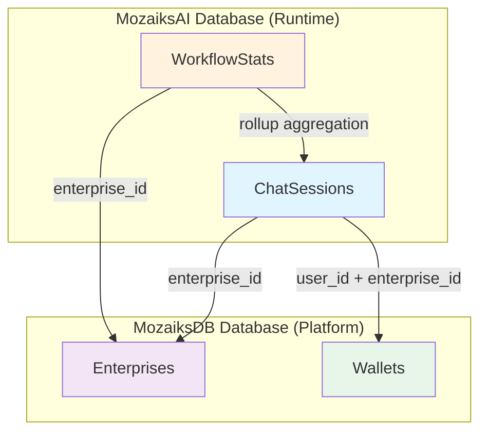
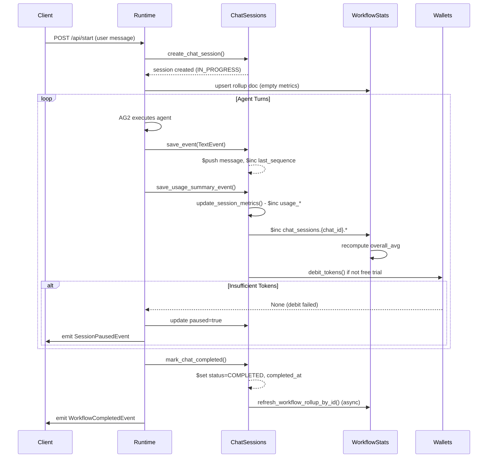
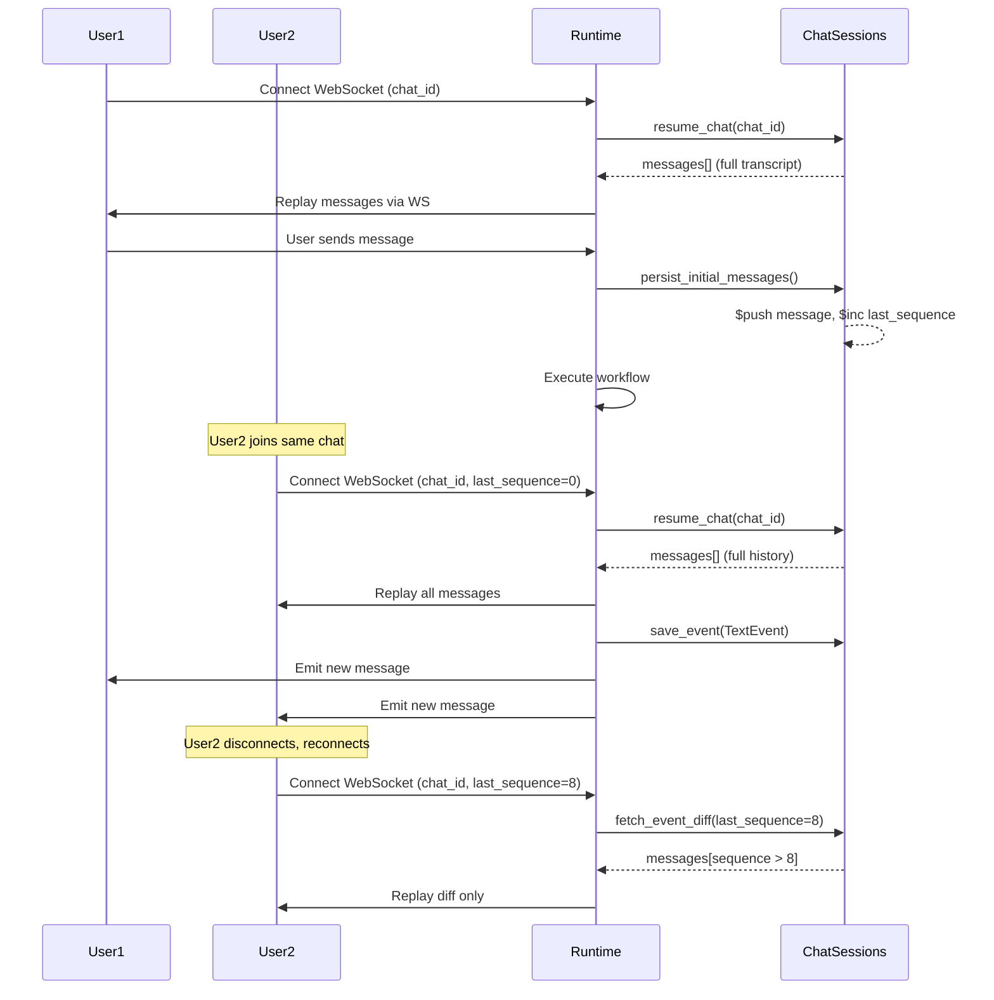
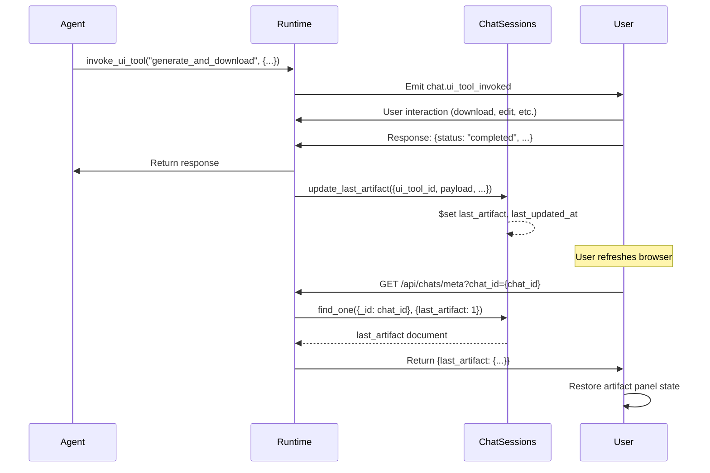

# Database Schema Reference

**Document Type:** Reference  
**Last Updated:** 2025  
**Intended Audience:** Platform engineers, database administrators, backend developers

---

## Purpose

This document provides a comprehensive reference for MozaiksAI's MongoDB database schema, covering all collections, field definitions, indexes, data flow patterns, and maintenance considerations.

MozaiksAI uses MongoDB across two databases:
- **MozaiksAI**: Runtime collections for workflow execution, chat sessions, and metrics
- **MozaiksDB**: Platform collections for enterprise management and token wallets

---

## Table of Contents

1. [Schema Overview](#schema-overview)
2. [MozaiksAI Database](#mozaiksai-database)
   - [ChatSessions Collection](#chatsessions-collection)
   - [WorkflowStats Collection](#workflowstats-collection)
3. [MozaiksDB Database](#mozaiksdb-database)
   - [Enterprises Collection](#enterprises-collection)
   - [Wallets Collection](#wallets-collection)
4. [Data Flow Patterns](#data-flow-patterns)
5. [Index Strategy](#index-strategy)
6. [Schema Evolution](#schema-evolution)
7. [Retention Policies](#retention-policies)
8. [Query Patterns](#query-patterns)
9. [Backup & Recovery](#backup--recovery)
10. [Troubleshooting](#troubleshooting)

---

## Schema Overview



**Design Principles:**
- **Multi-Tenant Isolation:** All runtime collections partition by `enterprise_id` and `user_id`
- **Embedded Documents:** Messages and metrics embedded in parent documents (ChatSessions) for fast reads
- **Minimal Collections:** Two runtime collections (ChatSessions + WorkflowStats) to reduce join complexity
- **Real-Time Aggregation:** WorkflowStats maintains live rollup documents for instant analytics
- **Deterministic IDs:** Predictable `_id` patterns enable upserts and prevent duplicates

---

## MozaiksAI Database

### ChatSessions Collection

**Purpose:** Canonical storage for chat workflow sessions, including full message transcript, usage metrics, and status tracking.

**Document Pattern:** One document per chat session (`_id = chat_id`)

#### Schema Definition

| Field | Type | Required | Description |
|-------|------|----------|-------------|
| `_id` | string | Yes | Unique chat identifier (UUID v4 format) |
| `chat_id` | string | Yes | Duplicate of `_id` for query convenience |
| `enterprise_id` | string | Yes | Enterprise identifier (ObjectId as string) |
| `workflow_name` | string | Yes | Workflow name (e.g., `"Generator"`, `"CustomerSupport"`) |
| `user_id` | string | Yes | User identifier within enterprise |
| `status` | int | Yes | Workflow status: `0` (IN_PROGRESS), `1` (COMPLETED) |
| `created_at` | datetime | Yes | Session creation timestamp (UTC) |
| `last_updated_at` | datetime | Yes | Last modification timestamp (UTC) |
| `completed_at` | datetime | No | Completion timestamp (UTC), null if in progress |
| `trace_id` | string | No | Distributed tracing correlation ID |
| `paused` | boolean | No | Whether session is paused (default: `false`) |
| `pause_reason` | string | No | Reason for pause (e.g., `"insufficient_tokens"`) |
| `paused_at` | datetime | No | Pause timestamp (UTC) |
| `cache_seed` | int | No | Per-chat LLM cache seed (deterministic from chat_id) |
| `last_sequence` | int | Yes | Monotonic message sequence counter (starts at 0) |
| `last_artifact` | object | No | Latest UI artifact/tool panel state for multi-user resume |
| `usage_prompt_tokens_final` | int | Yes | Cumulative prompt tokens (default: 0) |
| `usage_completion_tokens_final` | int | Yes | Cumulative completion tokens (default: 0) |
| `usage_total_tokens_final` | int | Yes | Cumulative total tokens (default: 0) |
| `usage_total_cost_final` | float | Yes | Cumulative cost in USD (default: 0.0) |
| `duration_sec` | float | No | Total session duration in seconds (set on completion) |
| `messages` | array | Yes | Array of ChatMessage objects (transcript) |

#### ChatMessage Object Schema

Each message in the `messages` array:

| Field | Type | Required | Description |
|-------|------|----------|-------------|
| `role` | string | Yes | Message role: `"user"` or `"assistant"` |
| `content` | string | Yes | Message content (plain text or JSON string) |
| `timestamp` | datetime | Yes | Message creation timestamp (UTC) |
| `event_type` | string | Yes | Event type (default: `"message.created"`) |
| `event_id` | string | Yes | Unique event identifier (UUID or `init_<uuid>` for initial messages) |
| `sequence` | int | Yes | Monotonic sequence number within chat session |
| `agent_name` | string | No | Agent name for assistant messages (e.g., `"ArchitectAgent"`) |
| `is_user_proxy` | boolean | No | Whether message from UserProxyAgent (default: `false`) |
| `structured_output` | object | No | Parsed structured output if agent has structured_outputs binding |
| `structured_schema` | object | No | Pydantic schema fields for structured output validation |

#### LastArtifact Object Schema

The `last_artifact` object stores the latest UI artifact/tool panel state:

| Field | Type | Required | Description |
|-------|------|----------|-------------|
| `ui_tool_id` | string | No | UI tool identifier (e.g., `"generate_and_download"`) |
| `event_id` | string | No | Event ID that triggered artifact |
| `display` | string | No | Display mode (e.g., `"artifact"`, `"inline"`) |
| `workflow_name` | string | No | Workflow name |
| `payload` | object | No | Arbitrary JSON-safe artifact payload |
| `updated_at` | datetime | Yes | Last artifact update timestamp (UTC) |

#### Indexes

```javascript
// Primary enterprise/workflow query index
db.ChatSessions.createIndex(
  { enterprise_id: 1, workflow_name: 1, created_at: -1 },
  { name: "cs_ent_wf_created" }
);

// Status filtering index
db.ChatSessions.createIndex(
  { status: 1, created_at: -1 },
  { name: "cs_status_created" }
);

// Trace ID lookup (sparse index)
db.ChatSessions.createIndex(
  { trace_id: 1 },
  { name: "cs_trace_id", sparse: true }
);

// Unique ID constraint (automatic)
db.ChatSessions.createIndex({ _id: 1 }, { unique: true });
```

#### Example Document

```json
{
  "_id": "550e8400-e29b-41d4-a716-446655440000",
  "chat_id": "550e8400-e29b-41d4-a716-446655440000",
  "enterprise_id": "507f1f77bcf86cd799439011",
  "workflow_name": "Generator",
  "user_id": "user_12345",
  "status": 1,
  "created_at": ISODate("2025-01-15T10:30:00.000Z"),
  "last_updated_at": ISODate("2025-01-15T10:35:42.000Z"),
  "completed_at": ISODate("2025-01-15T10:35:42.000Z"),
  "trace_id": "trace_abc123",
  "paused": false,
  "cache_seed": 1234567890,
  "last_sequence": 12,
  "last_artifact": {
    "ui_tool_id": "generate_and_download",
    "event_id": "evt_987654",
    "display": "artifact",
    "workflow_name": "Generator",
    "payload": {
      "filename": "app.zip",
      "url": "https://cdn.example.com/files/app.zip"
    },
    "updated_at": ISODate("2025-01-15T10:35:40.000Z")
  },
  "usage_prompt_tokens_final": 1250,
  "usage_completion_tokens_final": 850,
  "usage_total_tokens_final": 2100,
  "usage_total_cost_final": 0.0315,
  "duration_sec": 342.5,
  "messages": [
    {
      "role": "user",
      "content": "Create a React todo app with authentication",
      "timestamp": ISODate("2025-01-15T10:30:05.000Z"),
      "event_type": "message.created",
      "event_id": "init_550e8400-e29b-41d4-a716-446655440001",
      "sequence": 1,
      "agent_name": "user"
    },
    {
      "role": "assistant",
      "content": "{\"architecture\": \"React SPA + Express API\", \"auth\": \"JWT\"}",
      "timestamp": ISODate("2025-01-15T10:30:15.000Z"),
      "event_type": "message.created",
      "event_id": "550e8400-e29b-41d4-a716-446655440002",
      "sequence": 2,
      "agent_name": "ArchitectAgent",
      "structured_output": {
        "architecture": "React SPA + Express API",
        "auth": "JWT"
      },
      "structured_schema": {
        "architecture": {"type": "string"},
        "auth": {"type": "string"}
      }
    }
  ]
}
```

#### Data Size Estimates

- **Small Session:** ~5 KB (10 messages, minimal metadata)
- **Medium Session:** ~50 KB (100 messages, structured outputs)
- **Large Session:** ~500 KB (1000 messages, complex artifacts)
- **Expected Growth:** ~100 MB per 1,000 completed sessions (average 100 KB/session)

---

### WorkflowStats Collection

**Purpose:** Real-time rollup documents aggregating metrics across chat sessions for analytics and monitoring. Uses deterministic `_id` patterns to enable idempotent upserts.

**Document Pattern:** One document per `(enterprise_id, workflow_name)` pair (`_id = mon_{enterprise_id}_{workflow_name}`)

#### Schema Definition

| Field | Type | Required | Description |
|-------|------|----------|-------------|
| `_id` | string | Yes | Deterministic ID: `"mon_{enterprise_id}_{workflow_name}"` |
| `enterprise_id` | string | Yes | Enterprise identifier |
| `workflow_name` | string | Yes | Workflow name |
| `user_id` | string | No | Representative user_id from first session |
| `last_updated_at` | datetime | Yes | Last rollup update timestamp (UTC) |
| `overall_avg` | object | Yes | Overall average metrics across all sessions |
| `chat_sessions` | object | Yes | Map of `{chat_id: ChatSessionStats}` |
| `agents` | object | Yes | Map of `{agent_name: AgentAggregate}` |

#### Overall Average Object Schema

The `overall_avg` object contains workflow-wide averages:

| Field | Type | Required | Description |
|-------|------|----------|-------------|
| `avg_duration_sec` | float | Yes | Average session duration in seconds (≥ 0) |
| `avg_prompt_tokens` | int | Yes | Average prompt tokens per session (≥ 0) |
| `avg_completion_tokens` | int | Yes | Average completion tokens per session (≥ 0) |
| `avg_total_tokens` | int | Yes | Average total tokens per session (≥ 0) |
| `avg_cost_total_usd` | float | Yes | Average cost in USD per session (≥ 0) |

#### ChatSessionStats Object Schema

Each entry in the `chat_sessions` map:

| Field | Type | Required | Description |
|-------|------|----------|-------------|
| `duration_sec` | float | Yes | Session duration in seconds (≥ 0) |
| `prompt_tokens` | int | Yes | Prompt tokens used (≥ 0) |
| `completion_tokens` | int | Yes | Completion tokens used (≥ 0) |
| `total_tokens` | int | Yes | Total tokens (auto-corrected: prompt + completion) |
| `cost_total_usd` | float | Yes | Total cost in USD (≥ 0) |
| `last_event_ts` | datetime | No | Last usage event timestamp for duration calculation |

#### AgentAggregate Object Schema

Each entry in the `agents` map:

| Field | Type | Required | Description |
|-------|------|----------|-------------|
| `avg` | object | Yes | AggregateAverages object for this agent |
| `sessions` | object | Yes | Map of `{chat_id: ChatSessionStats}` for this agent |

The `avg` object within each agent follows the same schema as `overall_avg`.

#### Indexes

```javascript
// Deterministic _id provides natural unique constraint
db.WorkflowStats.createIndex({ _id: 1 }, { unique: true });

// Enterprise lookup
db.WorkflowStats.createIndex(
  { enterprise_id: 1, workflow_name: 1 },
  { name: "ws_ent_wf" }
);

// Update timestamp for cleanup queries
db.WorkflowStats.createIndex(
  { last_updated_at: -1 },
  { name: "ws_updated" }
);
```

#### Example Document

```json
{
  "_id": "mon_507f1f77bcf86cd799439011_Generator",
  "enterprise_id": "507f1f77bcf86cd799439011",
  "workflow_name": "Generator",
  "user_id": "user_12345",
  "last_updated_at": ISODate("2025-01-15T10:35:42.000Z"),
  "overall_avg": {
    "avg_duration_sec": 342.5,
    "avg_prompt_tokens": 1250,
    "avg_completion_tokens": 850,
    "avg_total_tokens": 2100,
    "avg_cost_total_usd": 0.0315
  },
  "chat_sessions": {
    "550e8400-e29b-41d4-a716-446655440000": {
      "duration_sec": 342.5,
      "prompt_tokens": 1250,
      "completion_tokens": 850,
      "total_tokens": 2100,
      "cost_total_usd": 0.0315,
      "last_event_ts": ISODate("2025-01-15T10:35:40.000Z")
    },
    "550e8400-e29b-41d4-a716-446655440999": {
      "duration_sec": 289.0,
      "prompt_tokens": 980,
      "completion_tokens": 720,
      "total_tokens": 1700,
      "cost_total_usd": 0.0255,
      "last_event_ts": ISODate("2025-01-15T09:45:20.000Z")
    }
  },
  "agents": {
    "ArchitectAgent": {
      "avg": {
        "avg_duration_sec": 120.5,
        "avg_prompt_tokens": 450,
        "avg_completion_tokens": 320,
        "avg_total_tokens": 770,
        "avg_cost_total_usd": 0.01155
      },
      "sessions": {
        "550e8400-e29b-41d4-a716-446655440000": {
          "duration_sec": 120.5,
          "prompt_tokens": 450,
          "completion_tokens": 320,
          "total_tokens": 770,
          "cost_total_usd": 0.01155,
          "last_event_ts": ISODate("2025-01-15T10:32:30.000Z")
        }
      }
    },
    "CodeGeneratorAgent": {
      "avg": {
        "avg_duration_sec": 222.0,
        "avg_prompt_tokens": 800,
        "avg_completion_tokens": 530,
        "avg_total_tokens": 1330,
        "avg_cost_total_usd": 0.01995
      },
      "sessions": {
        "550e8400-e29b-41d4-a716-446655440000": {
          "duration_sec": 222.0,
          "prompt_tokens": 800,
          "completion_tokens": 530,
          "total_tokens": 1330,
          "cost_total_usd": 0.01995,
          "last_event_ts": ISODate("2025-01-15T10:35:40.000Z")
        }
      }
    }
  }
}
```

#### Update Strategy

**Real-Time Updates:**
- Every `UsageSummaryEvent` triggers incremental updates to rollup document
- Atomic `$inc` operations on per-chat and per-agent metrics
- Averages recomputed synchronously after increments (small doc size makes this fast)
- Duration calculated using `last_event_ts` delta between usage events

**Completion Rollup:**
- On `mark_chat_completed`, a background task refreshes rollup from ChatSessions
- Fire-and-forget `asyncio.create_task(refresh_workflow_rollup_by_id(summary_id))`
- Ensures final metrics accuracy after all events processed

**Recomputation (Manual):**
```python
from core.data.models import refresh_workflow_rollup
summary = await refresh_workflow_rollup(enterprise_id="507f...", workflow_name="Generator")
```

#### Data Size Estimates

- **Small Rollup:** ~2 KB (10 sessions, 2 agents)
- **Medium Rollup:** ~20 KB (100 sessions, 5 agents)
- **Large Rollup:** ~200 KB (1000 sessions, 10 agents)
- **Expected Growth:** Unbounded without cleanup; recommend archiving chat_sessions map entries after 30 days

---

## MozaiksDB Database

### Enterprises Collection

**Purpose:** Enterprise/organization registry for multi-tenant isolation and validation.

**Document Pattern:** One document per enterprise (`_id = ObjectId`)

#### Schema Definition

| Field | Type | Required | Description |
|-------|------|----------|-------------|
| `_id` | ObjectId | Yes | Unique enterprise identifier (MongoDB ObjectId) |
| `name` | string | Yes | Enterprise display name |
| `created_at` | datetime | Yes | Registration timestamp (UTC) |
| `status` | string | No | Enterprise status (e.g., `"active"`, `"suspended"`) |

**Note:** This collection schema is simplified for reference. Production implementations may include additional fields (billing tier, feature flags, admin contacts, etc.). Consult platform-specific documentation for extended schema.

#### Indexes

```javascript
// Primary key (automatic)
db.Enterprises.createIndex({ _id: 1 }, { unique: true });

// Name lookup (if queries by name are common)
db.Enterprises.createIndex({ name: 1 });
```

#### Example Document

```json
{
  "_id": ObjectId("507f1f77bcf86cd799439011"),
  "name": "Acme Corporation",
  "created_at": ISODate("2024-12-01T08:00:00.000Z"),
  "status": "active"
}
```

---

### Wallets Collection

**Purpose:** Token balance tracking for usage-based billing and monetization.

**Document Pattern:** One document per `(enterprise_id, user_id)` pair

#### Schema Definition

| Field | Type | Required | Description |
|-------|------|----------|-------------|
| `_id` | ObjectId | Yes | Unique wallet identifier (auto-generated) |
| `EnterpriseId` | string | Yes | Enterprise identifier (ObjectId as string) |
| `UserId` | string | Yes | User identifier within enterprise |
| `Balance` | int | Yes | Current token balance (≥ 0) |
| `CreatedAt` | datetime | Yes | Wallet creation timestamp (UTC) |
| `UpdatedAt` | datetime | Yes | Last balance modification timestamp (UTC) |

**Note:** Field names use PascalCase convention (legacy schema from platform layer).

#### Indexes

```javascript
// Compound unique constraint for enterprise + user
db.Wallets.createIndex(
  { EnterpriseId: 1, UserId: 1 },
  { unique: true, name: "wallet_ent_user" }
);

// Enterprise lookup for admin queries
db.Wallets.createIndex({ EnterpriseId: 1 });
```

#### Example Document

```json
{
  "_id": ObjectId("65a1b2c3d4e5f6a7b8c9d0e1"),
  "EnterpriseId": "507f1f77bcf86cd799439011",
  "UserId": "user_12345",
  "Balance": 50000,
  "CreatedAt": ISODate("2024-12-15T10:00:00.000Z"),
  "UpdatedAt": ISODate("2025-01-15T10:35:42.000Z")
}
```

#### Balance Management

**Debit Operation (with strict mode):**
```python
from core.data.persistence_manager import AG2PersistenceManager

pm = AG2PersistenceManager()
new_balance = await pm.debit_tokens(
    user_id="user_12345",
    enterprise_id="507f1f77bcf86cd799439011",
    amount=2100,
    reason="realtime_usage",
    strict=True,  # Raise ValueError if insufficient tokens
    meta={"chat_id": "550e...", "workflow": "Generator", "cost": 0.0315}
)
# Returns new balance (47900) or raises ValueError("INSUFFICIENT_TOKENS")
```

**Debit Operation (with non-strict mode):**
```python
new_balance = await pm.debit_tokens(
    user_id="user_12345",
    enterprise_id="507f1f77bcf86cd799439011",
    amount=2100,
    reason="realtime_usage",
    strict=False,  # Return None if insufficient tokens
    meta={"chat_id": "550e...", "workflow": "Generator"}
)
# Returns new balance (47900) or None if Balance < 2100
```

**Free Trial Mode:**
When `FREE_TRIAL_ENABLED=true`, token debits are skipped:
```python
from core.core_config import get_free_trial_config
cfg = get_free_trial_config()
if cfg.get("enabled", False):
    # Skip debit logic during free trial
    pass
```

---

## Data Flow Patterns

### Chat Session Lifecycle



### Multi-User Resume Flow



### Artifact Persistence Flow



---

## Index Strategy

### Query Patterns & Index Alignment

**ChatSessions Queries:**
```javascript
// Pattern 1: Enterprise workflow listing (most common)
db.ChatSessions.find({ 
  enterprise_id: "507f...", 
  workflow_name: "Generator" 
}).sort({ created_at: -1 });
// Index: cs_ent_wf_created (enterprise_id, workflow_name, created_at)

// Pattern 2: Active session filtering
db.ChatSessions.find({ 
  status: 0 
}).sort({ created_at: -1 });
// Index: cs_status_created (status, created_at)

// Pattern 3: Trace lookup (rare)
db.ChatSessions.find({ trace_id: "trace_abc123" });
// Index: cs_trace_id (sparse)

// Pattern 4: Single session fetch (pk)
db.ChatSessions.findOne({ _id: "550e..." });
// Index: _id (automatic unique)
```

**WorkflowStats Queries:**
```javascript
// Pattern 1: Fetch or upsert rollup (deterministic ID)
db.WorkflowStats.findOne({ _id: "mon_507f..._Generator" });
// Index: _id (automatic unique)

// Pattern 2: Enterprise analytics
db.WorkflowStats.find({ enterprise_id: "507f..." });
// Index: ws_ent_wf (enterprise_id, workflow_name)

// Pattern 3: Cleanup queries (stale rollups)
db.WorkflowStats.find({ 
  last_updated_at: { $lt: ISODate("2024-12-01T00:00:00Z") } 
});
// Index: ws_updated (last_updated_at DESC)
```

**Wallets Queries:**
```javascript
// Pattern 1: Balance lookup and debit (most common)
db.Wallets.findOneAndUpdate(
  { EnterpriseId: "507f...", UserId: "user_12345", Balance: { $gte: 2100 } },
  { $inc: { Balance: -2100 } }
);
// Index: wallet_ent_user (EnterpriseId, UserId) unique

// Pattern 2: Enterprise wallet listing
db.Wallets.find({ EnterpriseId: "507f..." });
// Index: EnterpriseId (single field)
```

### Index Maintenance

**Monitor Index Usage:**
```javascript
// Check index usage stats
db.ChatSessions.aggregate([
  { $indexStats: {} }
]);

// Sample output:
// { name: "cs_ent_wf_created", accesses: { ops: 15234, since: ... } }
// { name: "cs_trace_id", accesses: { ops: 12, since: ... } }  // Candidate for removal if rarely used
```

**Rebuild Indexes (after schema changes):**
```javascript
// Drop and recreate specific index
db.ChatSessions.dropIndex("cs_ent_wf_created");
db.ChatSessions.createIndex(
  { enterprise_id: 1, workflow_name: 1, created_at: -1 },
  { name: "cs_ent_wf_created" }
);
```

**Index Size Monitoring:**
```javascript
db.ChatSessions.stats().indexSizes;
// Output: { _id_: 5242880, cs_ent_wf_created: 3145728, ... }
// Monitor for indexes approaching document size (indicates over-indexing)
```

---

## Schema Evolution

### Version History

**v1.0 (Initial):** Per-event normalized rows in WorkflowStats (removed)  
**v2.0 (Current):** Unified rollup documents in WorkflowStats, embedded messages in ChatSessions

### Migration Patterns

**Adding Optional Field:**
```javascript
// No migration needed for optional fields; existing docs work as-is
// Runtime handles missing fields with default values

// Example: Adding "priority" field to ChatSessions
db.ChatSessions.updateMany(
  { priority: { $exists: false } },
  { $set: { priority: "normal" } }
);
```

**Renaming Field:**
```javascript
// Rename "user_name" to "user_id" in ChatSessions
db.ChatSessions.updateMany(
  { user_name: { $exists: true } },
  { $rename: { user_name: "user_id" } }
);

// Update application code BEFORE running migration
// Use feature flag to support both field names during transition
```

**Removing Field:**
```javascript
// Remove deprecated "metrics_legacy" field
db.ChatSessions.updateMany(
  { metrics_legacy: { $exists: true } },
  { $unset: { metrics_legacy: "" } }
);
```

**Changing Field Type:**
```javascript
// Convert status from string ("in_progress") to int (0)
db.ChatSessions.find({ status: { $type: "string" } }).forEach(doc => {
  const newStatus = doc.status === "completed" ? 1 : 0;
  db.ChatSessions.updateOne(
    { _id: doc._id },
    { $set: { status: newStatus } }
  );
});
```

### Schema Validation (Optional)

MongoDB schema validation (use with caution; can break runtime):
```javascript
db.createCollection("ChatSessions", {
  validator: {
    $jsonSchema: {
      bsonType: "object",
      required: ["_id", "enterprise_id", "workflow_name", "user_id", "status", "created_at"],
      properties: {
        _id: { bsonType: "string" },
        enterprise_id: { bsonType: "string" },
        workflow_name: { bsonType: "string" },
        user_id: { bsonType: "string" },
        status: { bsonType: "int", minimum: 0, maximum: 1 },
        created_at: { bsonType: "date" },
        messages: {
          bsonType: "array",
          items: {
            bsonType: "object",
            required: ["role", "content", "timestamp", "event_id", "sequence"],
            properties: {
              role: { enum: ["user", "assistant"] },
              content: { bsonType: "string" },
              timestamp: { bsonType: "date" },
              event_id: { bsonType: "string" },
              sequence: { bsonType: "int" }
            }
          }
        }
      }
    }
  }
});
```

**Warning:** Schema validation can cause insert/update failures if application code doesn't match schema exactly. Use `validationLevel: "moderate"` (applies to new docs only) or disable in production.

---

## Retention Policies

### Recommended Retention

| Collection | Data Type | Retention Period | Cleanup Strategy |
|------------|-----------|------------------|------------------|
| ChatSessions | Completed sessions | 90 days | Archive to cold storage, delete from production |
| ChatSessions | In-progress sessions | Indefinite | Manual cleanup after abandonment detection (>7 days inactive) |
| WorkflowStats | Rollup documents | 365 days | Prune old `chat_sessions` map entries, keep aggregates |
| Wallets | Token balances | Indefinite | Never delete (audit requirement) |
| Enterprises | Enterprise records | Indefinite | Soft-delete via status field |

### Cleanup Scripts

**Archive Completed Sessions (90+ days old):**
```javascript
const cutoffDate = new Date();
cutoffDate.setDate(cutoffDate.getDate() - 90);

// Export to archive collection
db.ChatSessions.find({
  status: 1,  // COMPLETED
  completed_at: { $lt: cutoffDate }
}).forEach(doc => {
  db.ChatSessions_Archive.insertOne(doc);
});

// Delete from production after verification
const result = db.ChatSessions.deleteMany({
  status: 1,
  completed_at: { $lt: cutoffDate }
});
print(`Archived ${result.deletedCount} sessions`);
```

**Prune WorkflowStats Chat Sessions Map:**
```javascript
// Remove chat_sessions entries older than 30 days from rollup docs
const pruneDate = new Date();
pruneDate.setDate(pruneDate.getDate() - 30);

db.WorkflowStats.find({}).forEach(rollup => {
  const chatSessions = rollup.chat_sessions || {};
  const prunedSessions = {};
  
  Object.keys(chatSessions).forEach(chatId => {
    const lastEventTs = chatSessions[chatId].last_event_ts;
    if (lastEventTs && lastEventTs > pruneDate) {
      prunedSessions[chatId] = chatSessions[chatId];
    }
  });
  
  db.WorkflowStats.updateOne(
    { _id: rollup._id },
    { $set: { chat_sessions: prunedSessions } }
  );
});
```

**Delete Abandoned In-Progress Sessions:**
```javascript
// Sessions with no activity for 7+ days
const abandonedDate = new Date();
abandonedDate.setDate(abandonedDate.getDate() - 7);

db.ChatSessions.deleteMany({
  status: 0,  // IN_PROGRESS
  last_updated_at: { $lt: abandonedDate }
});
```

### Automated Cleanup (Cron)

**MongoDB TTL Index (NOT recommended for ChatSessions):**
```javascript
// TTL indexes can cause unexpected data loss; use manual cleanup instead
// If you must use TTL, apply to archive collection only:
db.ChatSessions_Archive.createIndex(
  { completed_at: 1 },
  { expireAfterSeconds: 7776000, name: "ttl_90days" }  // 90 days
);
```

**Recommended: External Cron Job**
```bash
# /etc/cron.daily/mongodb-cleanup.sh
#!/bin/bash
mongosh "mongodb://localhost:27017/MozaiksAI" --eval "
  const cutoffDate = new Date();
  cutoffDate.setDate(cutoffDate.getDate() - 90);
  const result = db.ChatSessions.deleteMany({
    status: 1,
    completed_at: { \$lt: cutoffDate }
  });
  print('Deleted ' + result.deletedCount + ' sessions');
"
```

---

## Query Patterns

### Common Queries

**Fetch Active Sessions for User:**
```javascript
db.ChatSessions.find({
  enterprise_id: "507f1f77bcf86cd799439011",
  user_id: "user_12345",
  status: 0  // IN_PROGRESS
}).sort({ last_updated_at: -1 });
```

**Get Full Chat Transcript:**
```javascript
const session = db.ChatSessions.findOne(
  { _id: "550e8400-e29b-41d4-a716-446655440000" },
  { messages: 1, status: 1, workflow_name: 1 }
);
```

**Fetch Message Diff (Resume):**
```javascript
const session = db.ChatSessions.findOne(
  { _id: "550e...", enterprise_id: "507f..." },
  { messages: 1 }
);
const diff = session.messages.filter(m => m.sequence > 8);
```

**Get Workflow Analytics:**
```javascript
const stats = db.WorkflowStats.findOne({
  _id: "mon_507f1f77bcf86cd799439011_Generator"
});

// Extract overall averages
const avgCost = stats.overall_avg.avg_cost_total_usd;
const avgDuration = stats.overall_avg.avg_duration_sec;

// Extract per-agent stats
const architectStats = stats.agents.ArchitectAgent.avg;
```

**Check Wallet Balance:**
```javascript
const wallet = db.Wallets.findOne({
  EnterpriseId: "507f1f77bcf86cd799439011",
  UserId: "user_12345"
}, { Balance: 1 });
const balance = wallet ? wallet.Balance : 0;
```

**Find Sessions by Date Range:**
```javascript
db.ChatSessions.find({
  enterprise_id: "507f...",
  workflow_name: "Generator",
  created_at: {
    $gte: ISODate("2025-01-01T00:00:00Z"),
    $lt: ISODate("2025-02-01T00:00:00Z")
  }
}).sort({ created_at: -1 });
```

### Aggregation Pipelines

**Enterprise Cost Report:**
```javascript
db.ChatSessions.aggregate([
  { $match: { enterprise_id: "507f...", status: 1 } },
  { $group: {
      _id: "$workflow_name",
      totalSessions: { $sum: 1 },
      totalCost: { $sum: "$usage_total_cost_final" },
      totalTokens: { $sum: "$usage_total_tokens_final" },
      avgDuration: { $avg: "$duration_sec" }
  }},
  { $sort: { totalCost: -1 } }
]);
```

**Top Users by Token Usage:**
```javascript
db.ChatSessions.aggregate([
  { $match: { enterprise_id: "507f...", status: 1 } },
  { $group: {
      _id: "$user_id",
      totalTokens: { $sum: "$usage_total_tokens_final" },
      sessionCount: { $sum: 1 }
  }},
  { $sort: { totalTokens: -1 } },
  { $limit: 10 }
]);
```

**Message Count by Agent:**
```javascript
db.ChatSessions.aggregate([
  { $match: { enterprise_id: "507f..." } },
  { $unwind: "$messages" },
  { $match: { "messages.role": "assistant" } },
  { $group: {
      _id: "$messages.agent_name",
      messageCount: { $sum: 1 }
  }},
  { $sort: { messageCount: -1 } }
]);
```

### Performance Optimization

**Use Projections:**
```javascript
// SLOW: Fetches entire document with 1000 messages
db.ChatSessions.findOne({ _id: "550e..." });

// FAST: Fetches only needed fields
db.ChatSessions.findOne(
  { _id: "550e..." },
  { status: 1, workflow_name: 1, usage_total_cost_final: 1 }
);
```

**Limit Array Size:**
```javascript
// Fetch only last 10 messages
db.ChatSessions.findOne(
  { _id: "550e..." },
  { messages: { $slice: -10 }, status: 1 }
);
```

**Index-Covered Queries:**
```javascript
// Query only uses indexed fields (no document fetch)
db.ChatSessions.find(
  { enterprise_id: "507f...", workflow_name: "Generator" },
  { _id: 1, created_at: 1, _id: 0 }  // Projection matches index fields
).hint("cs_ent_wf_created");
```

---

## Backup & Recovery

### Backup Strategy

**Automated Daily Backups:**
```bash
#!/bin/bash
# /opt/scripts/mongodb-backup.sh

TIMESTAMP=$(date +%Y%m%d_%H%M%S)
BACKUP_DIR="/backups/mongodb/$TIMESTAMP"

# Full database dump
mongodump --uri="mongodb://localhost:27017" --out="$BACKUP_DIR"

# Compress
tar -czf "/backups/mongodb_${TIMESTAMP}.tar.gz" "$BACKUP_DIR"
rm -rf "$BACKUP_DIR"

# Retain last 7 days
find /backups -name "mongodb_*.tar.gz" -mtime +7 -delete
```

**Incremental Backups (Oplog):**
```bash
# Backup oplog for point-in-time recovery
mongodump --uri="mongodb://localhost:27017" --oplog --out="/backups/oplog/$TIMESTAMP"
```

**MongoDB Atlas Continuous Backup:**
- Enable in Atlas UI: Cluster → Backup → Configure
- Retention: 7 days of continuous snapshots
- Point-in-time recovery with 1-minute granularity

### Recovery Procedures

**Restore Full Backup:**
```bash
# Extract backup
tar -xzf /backups/mongodb_20250115_100000.tar.gz -C /tmp/restore

# Restore all databases
mongorestore --uri="mongodb://localhost:27017" /tmp/restore/mongodb_20250115_100000

# Restore specific database
mongorestore --uri="mongodb://localhost:27017" --db=MozaiksAI /tmp/restore/mongodb_20250115_100000/MozaiksAI
```

**Restore Specific Collection:**
```bash
mongorestore --uri="mongodb://localhost:27017" \
  --db=MozaiksAI \
  --collection=ChatSessions \
  /tmp/restore/mongodb_20250115_100000/MozaiksAI/ChatSessions.bson
```

**Point-in-Time Recovery (Oplog):**
```bash
# Restore base backup
mongorestore --uri="mongodb://localhost:27017" /backups/base_backup

# Replay oplog up to specific timestamp
mongorestore --uri="mongodb://localhost:27017" \
  --oplogReplay \
  --oplogLimit="1705315200:0" \
  /backups/oplog/20250115_100000/oplog.bson
```

### Disaster Recovery Testing

**Monthly DR Drill:**
1. Provision fresh MongoDB instance
2. Restore latest backup
3. Verify document counts: `db.ChatSessions.countDocuments({})`
4. Run smoke test queries (fetch session, check wallet balance)
5. Document recovery time (target: <30 minutes for full restore)

---

## Troubleshooting

### Common Issues

#### Issue: Duplicate Key Error on ChatSessions Insert

**Symptom:**
```
E11000 duplicate key error collection: MozaiksAI.ChatSessions index: _id_ dup key: { _id: "550e..." }
```

**Causes:**
- Retry logic attempting to recreate existing session
- Multiple concurrent connections with same chat_id

**Solution:**
```python
# Check if session exists before creating
existing = await pm.resume_chat(chat_id, enterprise_id)
if existing is None:
    await pm.create_chat_session(chat_id, enterprise_id, workflow_name, user_id)
```

#### Issue: WorkflowStats Rollup Out of Sync

**Symptom:**
- `overall_avg` values don't match actual ChatSessions totals
- Missing chat_sessions entries in rollup document

**Diagnosis:**
```javascript
// Compare rollup to source data
const rollup = db.WorkflowStats.findOne({ _id: "mon_507f..._Generator" });
const sessions = db.ChatSessions.find({
  enterprise_id: "507f...",
  workflow_name: "Generator",
  status: 1
}).toArray();

const actualAvg = sessions.reduce((sum, s) => sum + s.usage_total_cost_final, 0) / sessions.length;
const rollupAvg = rollup.overall_avg.avg_cost_total_usd;
print(`Actual: ${actualAvg}, Rollup: ${rollupAvg}, Diff: ${Math.abs(actualAvg - rollupAvg)}`);
```

**Solution:**
```python
# Force rollup recomputation
from core.data.models import refresh_workflow_rollup
summary = await refresh_workflow_rollup(
    enterprise_id="507f1f77bcf86cd799439011",
    workflow_name="Generator"
)
```

#### Issue: Messages Missing After Resume

**Symptom:**
- User reconnects to chat but sees incomplete transcript
- `messages` array shorter than expected

**Diagnosis:**
```javascript
// Check for missing sequences
const session = db.ChatSessions.findOne({ _id: "550e..." });
const sequences = session.messages.map(m => m.sequence).sort((a, b) => a - b);
const missing = [];
for (let i = 1; i <= session.last_sequence; i++) {
  if (!sequences.includes(i)) missing.push(i);
}
print(`Missing sequences: ${missing}`);
```

**Causes:**
- TextEvent not persisted (check logs for save_event errors)
- Message filtered out during resume (status check)

**Solution:**
```python
# Re-emit missing events from AG2 autogen file logs
# Or reconstruct from WorkflowStats normalized events (if available in older schema versions)
```

#### Issue: Wallet Debit Fails with Sufficient Balance

**Symptom:**
```
ValueError: INSUFFICIENT_TOKENS (but wallet shows balance = 50000, amount = 2100)
```

**Diagnosis:**
```javascript
// Check for concurrent debit race condition
db.Wallets.findOne({ EnterpriseId: "507f...", UserId: "user_12345" }, { Balance: 1 });
// Balance = 50000

// Check recent updates
db.Wallets.find({ EnterpriseId: "507f...", UserId: "user_12345" }).sort({ UpdatedAt: -1 }).limit(1);
```

**Causes:**
- Concurrent debits from multiple workflows
- findOneAndUpdate query includes `Balance: { $gte: amount }` filter which fails if balance insufficient at query time

**Solution:**
```python
# Add retry logic with exponential backoff
import asyncio
for attempt in range(3):
    try:
        balance = await pm.debit_tokens(user_id, enterprise_id, amount, reason="usage")
        break
    except ValueError as e:
        if "INSUFFICIENT_TOKENS" in str(e) and attempt < 2:
            await asyncio.sleep(0.1 * (2 ** attempt))  # 100ms, 200ms
        else:
            raise
```

#### Issue: Large ChatSessions Documents Slow Queries

**Symptom:**
- Queries taking >5 seconds for sessions with 1000+ messages
- High memory usage in MongoDB

**Diagnosis:**
```javascript
// Find large documents
db.ChatSessions.aggregate([
  { $project: {
      _id: 1,
      messageCount: { $size: "$messages" },
      docSize: { $bsonSize: "$$ROOT" }
  }},
  { $match: { docSize: { $gt: 1048576 } } },  // >1 MB
  { $sort: { docSize: -1 } },
  { $limit: 10 }
]);
```

**Solutions:**
1. **Use Projections:** Fetch only needed fields
   ```python
   session = await coll.find_one({"_id": chat_id}, {"messages": {"$slice": -50}})
   ```

2. **Pagination:** Fetch messages in chunks
   ```javascript
   // Fetch messages 11-20
   db.ChatSessions.findOne(
     { _id: "550e..." },
     { messages: { $slice: [10, 10] } }
   );
   ```

3. **Archive Old Messages:** Move messages older than 30 days to separate collection
   ```javascript
   const cutoffDate = new Date();
   cutoffDate.setDate(cutoffDate.getDate() - 30);
   
   db.ChatSessions.find({}).forEach(session => {
     const recentMessages = session.messages.filter(m => m.timestamp > cutoffDate);
     const oldMessages = session.messages.filter(m => m.timestamp <= cutoffDate);
     
     if (oldMessages.length > 0) {
       db.ChatMessages_Archive.insertOne({
         chat_id: session._id,
         enterprise_id: session.enterprise_id,
         messages: oldMessages
       });
       
       db.ChatSessions.updateOne(
         { _id: session._id },
         { $set: { messages: recentMessages } }
       );
     }
   });
   ```

### Monitoring Queries

**Find Slow Queries:**
```javascript
// Enable profiling (level 2 = all operations)
db.setProfilingLevel(2);

// Query slow operations (>100ms)
db.system.profile.find({ millis: { $gt: 100 } }).sort({ ts: -1 }).limit(10);

// Disable after diagnostics
db.setProfilingLevel(0);
```

**Check Index Usage:**
```javascript
db.ChatSessions.explain("executionStats").find({
  enterprise_id: "507f...",
  workflow_name: "Generator"
}).sort({ created_at: -1 });

// Look for:
// - "executionStats.executionStages.stage": "IXSCAN" (good, using index)
// - "executionStats.executionStages.stage": "COLLSCAN" (bad, full table scan)
```

**Document Size Distribution:**
```javascript
db.ChatSessions.aggregate([
  { $project: { size: { $bsonSize: "$$ROOT" } } },
  { $bucket: {
      groupBy: "$size",
      boundaries: [0, 10000, 50000, 100000, 500000, 1000000, 10000000],
      default: "huge",
      output: { count: { $sum: 1 } }
  }}
]);
```

---

## Best Practices

### Schema Design

✅ **DO:**
- Embed messages in ChatSessions for fast transcript retrieval
- Use deterministic `_id` patterns for rollup documents (`mon_{ent}_{wf}`)
- Store timestamps in UTC with `datetime` type
- Use compound indexes for multi-field queries
- Validate field types at application layer (Pydantic models)

❌ **DON'T:**
- Store large binary files in documents (use GridFS or external storage)
- Create indexes on every field (causes write slowdown)
- Use unbounded arrays (messages, chat_sessions maps) without archival strategy
- Mix timezone formats (always UTC)
- Hardcode collection names (use config constants)

### Write Patterns

✅ **DO:**
- Use atomic `$inc` for counters (last_sequence, Balance)
- Use `$push` with `$each` for batch message inserts
- Use `findOneAndUpdate` with `returnDocument: AFTER` for debits
- Set `last_updated_at` on every write
- Use `upsert: true` for idempotent rollup updates

❌ **DON'T:**
- Read-modify-write without atomic operators (race conditions)
- Update without setting last_updated_at (breaks change tracking)
- Use replace_one on documents with embedded arrays (can lose concurrent updates)

### Read Patterns

✅ **DO:**
- Use projections to fetch only needed fields
- Use `$slice` to limit array results
- Use index-covered queries when possible
- Cache frequently accessed documents (WorkflowStats) in Redis
- Use aggregation pipelines for analytics

❌ **DON'T:**
- Fetch full documents when only _id needed
- Iterate all messages in application code (use aggregation)
- Query without indexes on large collections
- Use regex without anchors (`^` prefix for startsWith queries)

### Maintenance

✅ **DO:**
- Monitor index usage monthly with `$indexStats`
- Archive completed sessions after 90 days
- Prune old chat_sessions entries from WorkflowStats rollups
- Test backup restoration monthly
- Monitor document size growth (set alerts at >1 MB)

❌ **DON'T:**
- Drop indexes without confirming zero usage
- Delete data without backup
- Run large updates during peak hours
- Ignore slow query logs

---

## Related Documentation

- **[Persistence and Resume](../runtime/persistence_and_resume.md):** Runtime persistence patterns and chat resumption flows
- **[Observability](../runtime/observability.md):** Performance metrics collection and WorkflowStats monitoring
- **[Environment Variables Reference](./environment_variables.md):** MongoDB connection string configuration
- **[Performance Tuning](../operations/performance_tuning.md):** Database optimization strategies (indexes, projections, connection pooling)
- **[Troubleshooting](../operations/troubleshooting.md):** MongoDB-specific error resolution (ServerSelectionTimeoutError, E11000 duplicate key)
- **[API Reference](./api_reference.md):** REST endpoints for chat session and metrics queries

---

**End of Database Schema Reference**

For questions or schema change proposals, consult the platform engineering team.
